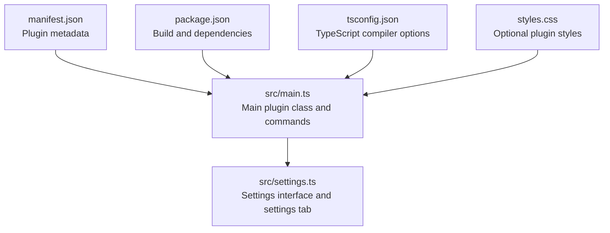
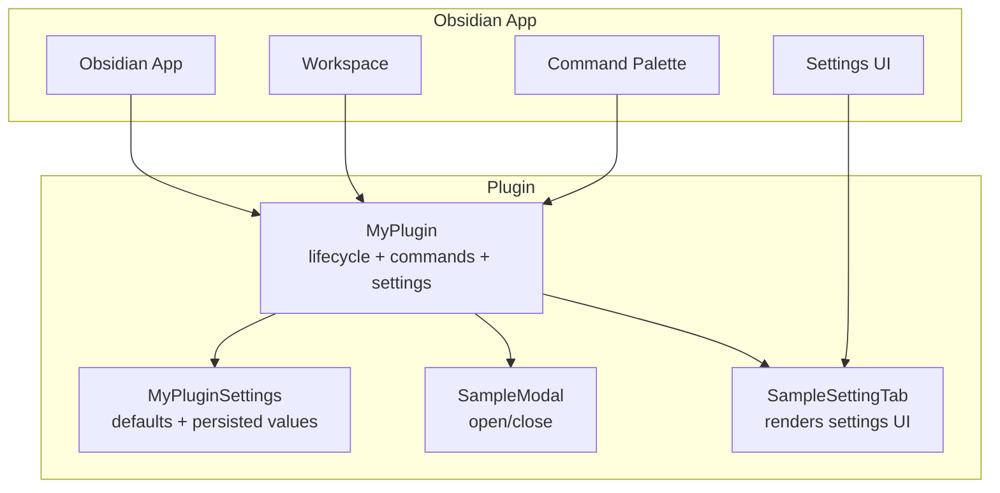
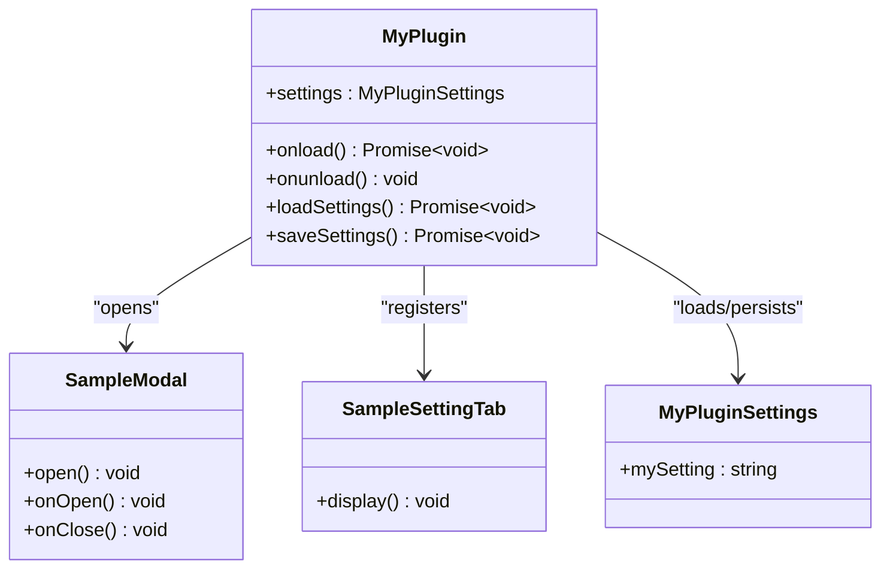
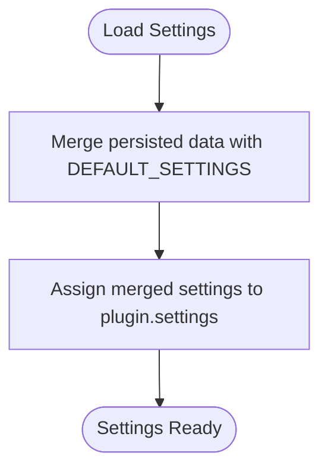
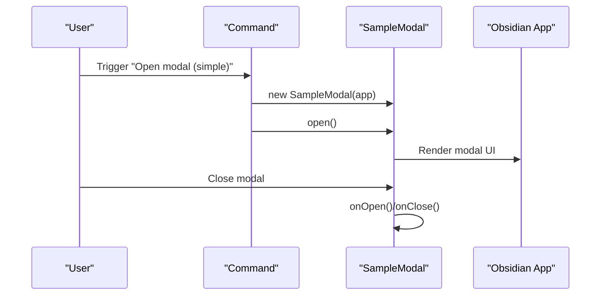
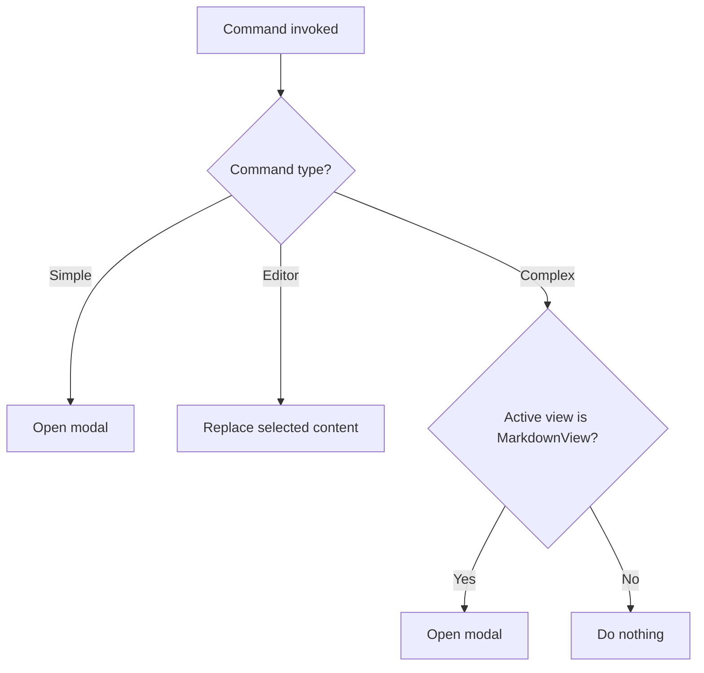
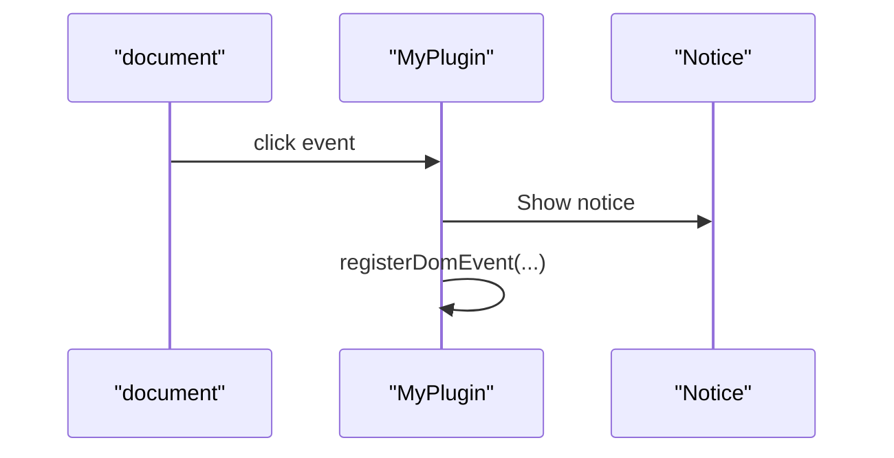
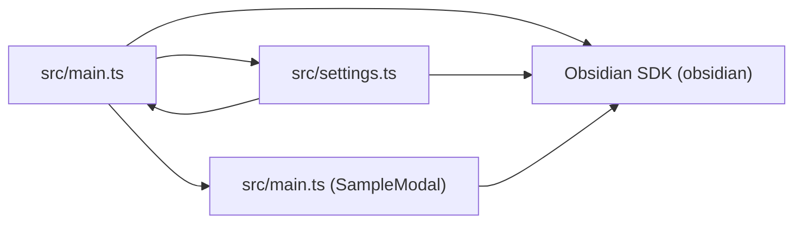

# API Reference

<cite>
**Referenced Files in This Document**
- [src/main.ts](file://src/main.ts)
- [src/settings.ts](file://src/settings.ts)
- [manifest.json](file://manifest.json)
- [package.json](file://package.json)
- [README.md](file://README.md)
- [tsconfig.json](file://tsconfig.json)
- [styles.css](file://styles.css)
</cite>

## Table of Contents
1. [Introduction](#introduction)
2. [Project Structure](#project-structure)
3. [Core Components](#core-components)
4. [Architecture Overview](#architecture-overview)
5. [Detailed Component Analysis](#detailed-component-analysis)
6. [Dependency Analysis](#dependency-analysis)
7. [Performance Considerations](#performance-considerations)
8. [Troubleshooting Guide](#troubleshooting-guide)
9. [Conclusion](#conclusion)
10. [Appendices](#appendices)

## Introduction
This document provides a comprehensive API reference for the Obsidian Sample Plugin. It focuses on the public interfaces and components exposed by the plugin, including the main plugin class, settings model, command registration patterns, modal creation API, and event handling mechanisms. It also documents lifecycle hooks, state management, and integration patterns with Obsidian’s plugin framework.

## Project Structure
The plugin is organized around a minimal TypeScript codebase with a small set of files:
- A main plugin module that defines the plugin class and registers commands, UI elements, and settings.
- A settings module that defines the settings interface, defaults, and a settings tab UI.
- A manifest and package configuration that define metadata and build scripts.
- A CSS file for optional styling.
- A README with developer guidance and links to Obsidian documentation.

**Diagram sources**
- [src/main.ts:1-100](file://src/main.ts#L1-L100)
- [src/settings.ts:1-37](file://src/settings.ts#L1-L37)
- [manifest.json:1-12](file://manifest.json#L1-L12)
- [package.json:1-30](file://package.json#L1-L30)
- [tsconfig.json:1-31](file://tsconfig.json#L1-L31)
- [styles.css:1-9](file://styles.css#L1-L9)

**Section sources**
- [src/main.ts:1-100](file://src/main.ts#L1-L100)
- [src/settings.ts:1-37](file://src/settings.ts#L1-L37)
- [manifest.json:1-12](file://manifest.json#L1-L12)
- [package.json:1-30](file://package.json#L1-L30)
- [tsconfig.json:1-31](file://tsconfig.json#L1-L31)
- [styles.css:1-9](file://styles.css#L1-L9)

## Core Components
This section documents the primary public APIs exposed by the plugin.

- Main plugin class
  - Purpose: Initializes the plugin, registers UI elements, commands, and settings; manages state persistence.
  - Lifecycle hooks:
    - onload(): Called when the plugin is loaded. Registers ribbon icon, status bar item, commands, settings tab, DOM event listeners, and intervals.
    - onunload(): Called when the plugin is unloaded. Currently empty; intended for cleanup.
  - State management:
    - loadSettings(): Loads persisted settings and merges with defaults.
    - saveSettings(): Persists current settings to storage.
  - Properties:
    - settings: An instance of MyPluginSettings containing user-configurable values.

- Settings interface and defaults
  - MyPluginSettings: Defines the shape of plugin settings.
  - DEFAULT_SETTINGS: Provides default values for settings.
  - SampleSettingTab: A settings tab UI that renders a text input bound to settings and persists changes.

- Modal creation API
  - SampleModal: A simple modal that displays content during open/close lifecycle.

- Event handling
  - registerDomEvent(): Registers a global DOM event listener scoped to the plugin lifecycle.
  - registerInterval(): Registers a periodic interval that is cleared automatically on unload.

**Section sources**
- [src/main.ts:6-83](file://src/main.ts#L6-L83)
- [src/settings.ts:4-36](file://src/settings.ts#L4-L36)

## Architecture Overview
The plugin integrates with Obsidian through the Plugin base class and exposes a settings tab, commands, and a modal. The following diagram shows the high-level interactions among the main plugin class, settings, commands, and modal.

**Diagram sources**
- [src/main.ts:6-83](file://src/main.ts#L6-L83)
- [src/settings.ts:4-36](file://src/settings.ts#L4-L36)

## Detailed Component Analysis

### Main Plugin Class: MyPlugin
The MyPlugin class extends Obsidian’s Plugin and implements the plugin lifecycle and integrations.

- Public methods and properties
  - settings: MyPluginSettings
  - onload(): Promise<void>
  - onunload(): void
  - loadSettings(): Promise<void>
  - saveSettings(): Promise<void>

- Lifecycle hook: onload
  - Responsibilities:
    - Load persisted settings and merge with defaults.
    - Add a ribbon icon with a click handler that triggers a notice.
    - Add a status bar item with static text.
    - Register three commands:
      - Simple command: opens a modal.
      - Editor command: replaces selected content in the active editor.
      - Complex command: conditionally shows and executes based on active view type.
    - Add a settings tab.
    - Register a global DOM click event listener scoped to the plugin.
    - Register a periodic interval that logs to the console.
  - Parameters: None
  - Return value: None
  - Usage example: See the onload method in [src/main.ts:9-71](file://src/main.ts#L9-L71).

- Lifecycle hook: onunload
  - Responsibilities: Placeholder for cleanup tasks.
  - Parameters: None
  - Return value: None
  - Usage example: See the onunload method in [src/main.ts:73-74](file://src/main.ts#L73-L74).

- State management: loadSettings
  - Responsibilities: Merge persisted data with DEFAULT_SETTINGS to populate settings.
  - Parameters: None
  - Return value: Promise resolving when settings are loaded.
  - Usage example: See the loadSettings method in [src/main.ts:76-78](file://src/main.ts#L76-L78).

- State management: saveSettings
  - Responsibilities: Persist current settings to storage.
  - Parameters: None
  - Return value: Promise resolving when settings are saved.
  - Usage example: See the saveSettings method in [src/main.ts:80-82](file://src/main.ts#L80-L82).

- Event handling: registerDomEvent
  - Responsibilities: Attach a DOM event listener to document scoped to the plugin lifecycle.
  - Parameters: target, eventType, handler
  - Return value: None
  - Usage example: See the registerDomEvent call in [src/main.ts:64-66](file://src/main.ts#L64-L66).

- Interval handling: registerInterval
  - Responsibilities: Schedule a periodic interval cleared automatically on unload.
  - Parameters: intervalId returned by setInterval
  - Return value: None
  - Usage example: See the registerInterval call in [src/main.ts:68-69](file://src/main.ts#L68-L69).

- Ribbon icon and status bar
  - Responsibilities: Add UI affordances to the Obsidian interface.
  - Usage examples:
    - Ribbon icon: [src/main.ts:12-16](file://src/main.ts#L12-L16)
    - Status bar item: [src/main.ts:18-20](file://src/main.ts#L18-L20)

- Commands
  - Simple command: opens a modal.
    - Registration: [src/main.ts:22-29](file://src/main.ts#L22-L29)
    - Execution context: Global command palette.
  - Editor command: replaces selected content.
    - Registration: [src/main.ts:30-37](file://src/main.ts#L30-L37)
    - Execution context: Active editor.
  - Complex command: conditionally available based on active view type.
    - Registration: [src/main.ts:38-57](file://src/main.ts#L38-L57)
    - Execution context: Global command palette with availability checks.

- Settings integration
  - Registration: [src/main.ts:59-60](file://src/main.ts#L59-L60)
  - Settings tab: [src/settings.ts:12-36](file://src/settings.ts#L12-L36)

**Diagram sources**
- [src/main.ts:6-83](file://src/main.ts#L6-L83)
- [src/settings.ts:4-36](file://src/settings.ts#L4-L36)

**Section sources**
- [src/main.ts:6-83](file://src/main.ts#L6-L83)
- [src/settings.ts:4-36](file://src/settings.ts#L4-L36)

### Settings Interface: MyPluginSettings
The settings interface defines the plugin’s configurable properties and their types.

- Interface definition
  - MyPluginSettings:
    - mySetting: string
  - Defaults:
    - DEFAULT_SETTINGS:
      - mySetting: "default"

- Settings tab
  - SampleSettingTab:
    - Renders a text input bound to settings.
    - Updates settings and persists changes on change.

- Parameter specifications
  - MyPluginSettings.mySetting
    - Type: string
    - Default: "default"
    - Description: A user-configurable string value.

- Usage examples
  - Loading defaults: [src/main.ts:76-78](file://src/main.ts#L76-L78)
  - Persisting changes: [src/main.ts:80-82](file://src/main.ts#L80-L82)
  - Rendering and binding: [src/settings.ts:20-35](file://src/settings.ts#L20-L35)

**Diagram sources**
- [src/main.ts:76-78](file://src/main.ts#L76-L78)

**Section sources**
- [src/settings.ts:4-10](file://src/settings.ts#L4-L10)
- [src/main.ts:76-82](file://src/main.ts#L76-L82)
- [src/settings.ts:20-35](file://src/settings.ts#L20-L35)

### Modal Creation API: SampleModal
The plugin defines a simple modal class for demonstration.

- Class definition
  - SampleModal extends Obsidian’s Modal.
  - Methods:
    - onOpen(): Sets content text when the modal opens.
    - onClose(): Empties content when the modal closes.

- Usage examples
  - Opening the modal from a command: [src/main.ts:26-28](file://src/main.ts#L26-L28)
  - Opening the modal from a complex command: [src/main.ts:48-50](file://src/main.ts#L48-L50)

**Diagram sources**
- [src/main.ts:22-29](file://src/main.ts#L22-L29)
- [src/main.ts:85-99](file://src/main.ts#L85-L99)

**Section sources**
- [src/main.ts:85-99](file://src/main.ts#L85-L99)

### Command Registration Patterns
The plugin registers three distinct command types demonstrating different execution contexts.

- Simple command
  - Registration: [src/main.ts:22-29](file://src/main.ts#L22-L29)
  - Execution context: Global command palette.
  - Behavior: Opens a modal.

- Editor command
  - Registration: [src/main.ts:30-37](file://src/main.ts#L30-L37)
  - Execution context: Active editor.
  - Behavior: Replaces selected content.

- Complex command
  - Registration: [src/main.ts:38-57](file://src/main.ts#L38-L57)
  - Execution context: Global command palette with availability checks.
  - Availability: Only shown when the active view is MarkdownView.
  - Behavior: Opens a modal when executed.

**Diagram sources**
- [src/main.ts:22-57](file://src/main.ts#L22-L57)

**Section sources**
- [src/main.ts:22-57](file://src/main.ts#L22-L57)

### Event Handling Interfaces
The plugin demonstrates two event handling patterns integrated with the plugin lifecycle.

- Global DOM event listener
  - Registration: [src/main.ts:64-66](file://src/main.ts#L64-L66)
  - Scope: document
  - Behavior: Triggers a notice on click.

- Periodic interval
  - Registration: [src/main.ts:68-69](file://src/main.ts#L68-L69)
  - Scope: window
  - Behavior: Logs to console every five minutes.

**Diagram sources**
- [src/main.ts:64-66](file://src/main.ts#L64-L66)

**Section sources**
- [src/main.ts:64-69](file://src/main.ts#L64-L69)

## Dependency Analysis
This section outlines the dependencies and relationships among the plugin’s components and external frameworks.

- Internal dependencies
  - MyPlugin depends on:
    - MyPluginSettings and DEFAULT_SETTINGS for state.
    - SampleSettingTab for rendering settings UI.
    - SampleModal for UI interactions.
  - SampleSettingTab depends on:
    - MyPlugin to read/write settings.
    - Obsidian Setting component for building UI.

- External dependencies
  - Obsidian plugin SDK (obsidian): Provides Plugin base class, Modal, Notice, App, Editor, MarkdownView, Workspace, and other UI primitives.
  - Package manager and build toolchain: npm scripts and esbuild configuration.

**Diagram sources**
- [src/main.ts:1-100](file://src/main.ts#L1-L100)
- [src/settings.ts:1-37](file://src/settings.ts#L1-L37)

**Section sources**
- [src/main.ts:1-2](file://src/main.ts#L1-L2)
- [src/settings.ts:1](file://src/settings.ts#L1)
- [package.json:26-28](file://package.json#L26-L28)

## Performance Considerations
- Avoid heavy synchronous operations in onload to prevent blocking Obsidian startup.
- Prefer lightweight DOM event handlers and limit global listeners to essential interactions.
- Use registerInterval judiciously; long-running intervals can impact performance.
- Persist settings asynchronously to avoid UI stalls.

## Troubleshooting Guide
- Commands not appearing
  - Ensure complex commands return true when conditions are met and false otherwise. See [src/main.ts:42-56](file://src/main.ts#L42-L56).
- Settings not saving
  - Verify onChange handlers call saveSettings and that loadSettings merges defaults. See [src/settings.ts:31-34](file://src/settings.ts#L31-L34) and [src/main.ts:76-82](file://src/main.ts#L76-L82).
- Modal not opening
  - Confirm the command callback invokes SampleModal.open(). See [src/main.ts:26-28](file://src/main.ts#L26-L28).
- Events not firing
  - Confirm registerDomEvent is called with correct parameters and that the plugin is enabled. See [src/main.ts:64-66](file://src/main.ts#L64-L66).
- Intervals not clearing
  - Ensure registerInterval is used with the return value of setInterval. See [src/main.ts:68-69](file://src/main.ts#L68-L69).

**Section sources**
- [src/main.ts:42-56](file://src/main.ts#L42-L56)
- [src/settings.ts:31-34](file://src/settings.ts#L31-L34)
- [src/main.ts:26-28](file://src/main.ts#L26-L28)
- [src/main.ts:64-66](file://src/main.ts#L64-L66)
- [src/main.ts:68-69](file://src/main.ts#L68-L69)

## Conclusion
The Obsidian Sample Plugin demonstrates core plugin integration patterns: lifecycle management, settings persistence, command registration across contexts, modal UI, and event handling. The APIs are intentionally minimal, enabling developers to understand and extend the plugin safely.

## Appendices

### Manifest and Build Metadata
- Plugin identity and compatibility
  - ID: sample-plugin
  - Name: Sample Plugin
  - Version: 1.0.0
  - Minimum Obsidian version: 0.15.0
  - Desktop-only flag: false
  - Funding URL: https://obsidian.md/pricing
- Build scripts and dependencies
  - Scripts: dev, build, version, lint
  - Dependencies: obsidian (latest)
  - Dev dependencies: TypeScript, esbuild, ESLint, and related plugins

**Section sources**
- [manifest.json:1-12](file://manifest.json#L1-L12)
- [package.json:1-30](file://package.json#L1-L30)

### TypeScript Configuration
- Compiler options emphasize strictness and modern ECMAScript targets.
- Includes DOM and ES libraries for browser-like environments.

**Section sources**
- [tsconfig.json:1-31](file://tsconfig.json#L1-L31)

### CSS Notes
- Optional stylesheet included with the plugin; can be removed if not needed.

**Section sources**
- [styles.css:1-9](file://styles.css#L1-L9)