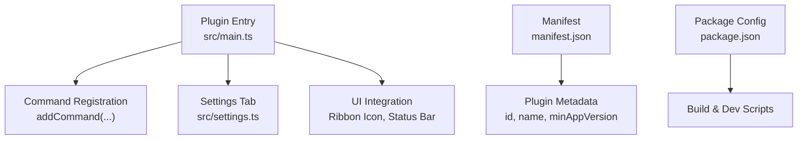
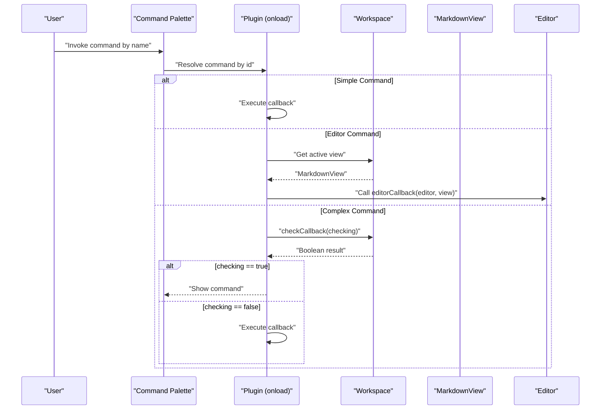
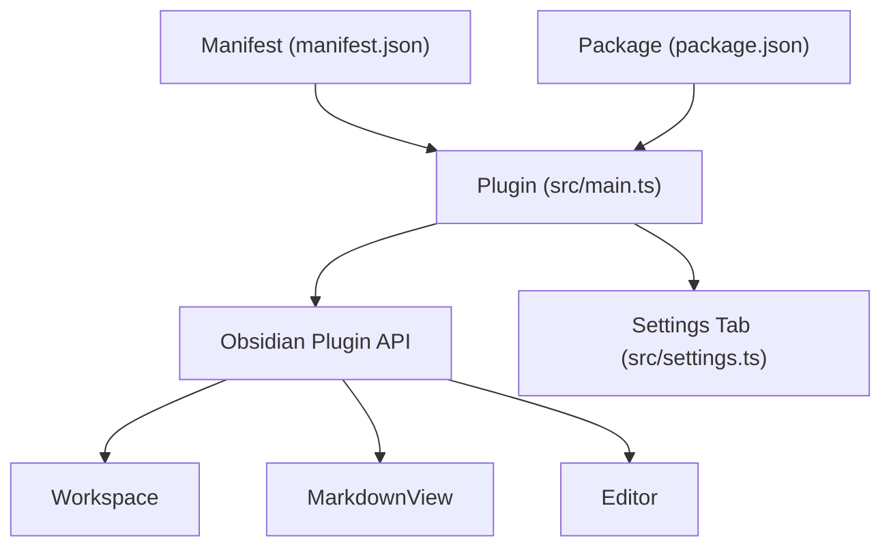

# Command System

<cite>
**Referenced Files in This Document**
- [src/main.ts](file://src/main.ts)
- [src/settings.ts](file://src/settings.ts)
- [manifest.json](file://manifest.json)
- [package.json](file://package.json)
- [README.md](file://README.md)
- [AGENTS.md](file://AGENTS.md)
</cite>

## Table of Contents
1. [Introduction](#introduction)
2. [Project Structure](#project-structure)
3. [Core Components](#core-components)
4. [Architecture Overview](#architecture-overview)
5. [Detailed Component Analysis](#detailed-component-analysis)
6. [Dependency Analysis](#dependency-analysis)
7. [Performance Considerations](#performance-considerations)
8. [Troubleshooting Guide](#troubleshooting-guide)
9. [Conclusion](#conclusion)

## Introduction
This document explains the command system demonstrated by the sample plugin, focusing on three distinct command types:
- Simple commands: globally triggerable actions with a callback.
- Editor commands: operations that act on the current editor instance, integrating with MarkdownView.
- Complex commands: state-aware commands using a checkCallback to conditionally enable and execute.

The documentation covers command registration patterns, ID assignment, callback implementation, parameter handling, and integration with UI elements such as the Command Palette and ribbon icons.

## Project Structure
The plugin’s command system is implemented in a minimal main entry point, with settings and metadata supporting the overall plugin lifecycle.

**Diagram sources**
- [src/main.ts:9-71](file://src/main.ts#L9-L71)
- [src/settings.ts:12-36](file://src/settings.ts#L12-L36)
- [manifest.json:1-12](file://manifest.json#L1-L12)
- [package.json:1-30](file://package.json#L1-L30)

**Section sources**
- [src/main.ts:1-100](file://src/main.ts#L1-L100)
- [src/settings.ts:1-37](file://src/settings.ts#L1-L37)
- [manifest.json:1-12](file://manifest.json#L1-L12)
- [package.json:1-30](file://package.json#L1-L30)

## Core Components
- Plugin lifecycle and command registration occur during onload.
- Three commands are registered:
  - Simple command with a callback.
  - Editor command with an editorCallback operating on the current editor and MarkdownView.
  - Complex command with a checkCallback that validates state and conditionally executes.

Key implementation references:
- Simple command registration and callback: [src/main.ts:22-29](file://src/main.ts#L22-L29)
- Editor command registration and editorCallback: [src/main.ts:30-37](file://src/main.ts#L30-L37)
- Complex command registration and checkCallback: [src/main.ts:38-57](file://src/main.ts#L38-L57)

**Section sources**
- [src/main.ts:22-57](file://src/main.ts#L22-L57)

## Architecture Overview
The command system integrates with Obsidian’s workspace and view model. Commands are registered during plugin initialization and exposed to the Command Palette. Editor commands require an active MarkdownView and operate on the current Editor instance.

**Diagram sources**
- [src/main.ts:22-57](file://src/main.ts#L22-L57)

## Detailed Component Analysis

### Simple Commands
Simple commands are globally triggerable and do not depend on the active view or editor. They are ideal for actions that operate at the application level.

- Registration pattern:
  - Use addCommand with id, name, and callback.
  - Example registration: [src/main.ts:22-29](file://src/main.ts#L22-L29)
- Callback implementation:
  - The callback performs the desired action, such as opening a modal.
  - Example callback: [src/main.ts:26-28](file://src/main.ts#L26-L28)
- Parameter handling:
  - Simple callbacks receive no parameters; they rely on plugin state and app context.
- Integration with UI:
  - Simple commands appear in the Command Palette and can be bound to hotkeys.

Practical example references:
- Command registration: [src/main.ts:22-29](file://src/main.ts#L22-L29)
- Callback usage: [src/main.ts:26-28](file://src/main.ts#L26-L28)

**Section sources**
- [src/main.ts:22-29](file://src/main.ts#L22-L29)

### Editor Commands
Editor commands operate on the current editor instance and integrate with MarkdownView. They require an active MarkdownView to be executable.

- Registration pattern:
  - Use addCommand with id, name, and editorCallback.
  - Example registration: [src/main.ts:30-37](file://src/main.ts#L30-L37)
- EditorCallback signature:
  - Receives (editor: Editor, view: MarkdownView).
  - Example signature usage: [src/main.ts:34](file://src/main.ts#L34)
- Operation on selection:
  - Example modifies the selected content via editor.replaceSelection.
  - Example operation: [src/main.ts:35](file://src/main.ts#L35)
- Integration with MarkdownView:
  - The view parameter provides access to the current MarkdownView context.

Practical example references:
- Command registration: [src/main.ts:30-37](file://src/main.ts#L30-L37)
- EditorCallback usage: [src/main.ts:34](file://src/main.ts#L34)
- Selection replacement: [src/main.ts:35](file://src/main.ts#L35)

**Section sources**
- [src/main.ts:30-37](file://src/main.ts#L30-L37)

### Complex Commands with Validation (checkCallback)
Complex commands use checkCallback to validate the current state of the application before enabling or executing. This enables conditional visibility and safe execution.

- Registration pattern:
  - Use addCommand with id, name, and checkCallback.
  - Example registration: [src/main.ts:38-57](file://src/main.ts#L38-L57)
- checkCallback semantics:
  - Receives a boolean flag indicating whether it is “checking” or “executing.”
  - When checking is true, the function returns whether the command should be visible/enabled.
  - When checking is false, the function performs the actual operation.
  - Example checkCallback: [src/main.ts:42](file://src/main.ts#L42)
- State checking:
  - Example checks for an active MarkdownView using workspace.getActiveViewOfType.
  - Example state check: [src/main.ts:44](file://src/main.ts#L44)
- Conditional visibility:
  - The command appears in the Command Palette only when checkCallback returns true.
  - Example visibility logic: [src/main.ts:52-54](file://src/main.ts#L52-L54)
- Execution logic:
  - When executed, the command opens a modal.
  - Example execution: [src/main.ts:48-50](file://src/main.ts#L48-L50)

Practical example references:
- Command registration: [src/main.ts:38-57](file://src/main.ts#L38-L57)
- checkCallback logic: [src/main.ts:42-56](file://src/main.ts#L42-L56)
- State check: [src/main.ts:44](file://src/main.ts#L44)
- Execution: [src/main.ts:48-50](file://src/main.ts#L48-L50)

**Section sources**
- [src/main.ts:38-57](file://src/main.ts#L38-L57)

### Command Registration Patterns and Best Practices
- Stable IDs:
  - Assign unique, stable IDs to commands to ensure consistent keyboard shortcuts and integrations.
  - Reference: [AGENTS.md:150](file://AGENTS.md#L150)
- Minimal main.ts:
  - Keep main.ts focused on lifecycle and delegate command registration to dedicated modules.
  - Reference: [AGENTS.md:134](file://AGENTS.md#L134)
- Example registration pattern:
  - Use addCommand with id, name, and appropriate callback.
  - Reference: [AGENTS.md:209-215](file://AGENTS.md#L209-L215)

**Section sources**
- [AGENTS.md:134](file://AGENTS.md#L134)
- [AGENTS.md:150](file://AGENTS.md#L150)
- [AGENTS.md:209-215](file://AGENTS.md#L209-L215)

## Dependency Analysis
The command system relies on Obsidian’s plugin API and workspace/view model. The plugin’s metadata and package configuration support the build and distribution pipeline.

**Diagram sources**
- [src/main.ts:1-100](file://src/main.ts#L1-L100)
- [src/settings.ts:1-37](file://src/settings.ts#L1-L37)
- [manifest.json:1-12](file://manifest.json#L1-L12)
- [package.json:1-30](file://package.json#L1-L30)

**Section sources**
- [src/main.ts:1-100](file://src/main.ts#L1-L100)
- [src/settings.ts:1-37](file://src/settings.ts#L1-L37)
- [manifest.json:1-12](file://manifest.json#L1-L12)
- [package.json:1-30](file://package.json#L1-L30)

## Performance Considerations
- Keep command callbacks lightweight to avoid blocking the UI thread.
- Use checkCallback to avoid unnecessary work when the command is not applicable.
- Avoid heavy computations inside callbacks; defer to async handlers when needed.

## Troubleshooting Guide
Common issues and resolutions:
- Commands not appearing in the Command Palette:
  - Verify addCommand runs during onload and IDs are unique.
  - Reference: [AGENTS.md:241](file://AGENTS.md#L241)
- Plugin fails to load after building:
  - Ensure main.js and manifest.json are present at the top level of the plugin folder.
  - Reference: [AGENTS.md:239](file://AGENTS.md#L239)
- Editor commands not working:
  - Confirm an active MarkdownView exists before invoking editorCallback.
  - Reference: [src/main.ts:44](file://src/main.ts#L44)
- Complex command not visible:
  - Ensure checkCallback returns true when checking is true.
  - Reference: [src/main.ts:52-54](file://src/main.ts#L52-L54)

**Section sources**
- [AGENTS.md:239-242](file://AGENTS.md#L239-L242)
- [src/main.ts:44](file://src/main.ts#L44)
- [src/main.ts:52-54](file://src/main.ts#L52-L54)

## Conclusion
The sample plugin demonstrates three command types that align with Obsidian’s plugin API:
- Simple commands for global actions.
- Editor commands for editor-centric operations.
- Complex commands for state-aware, conditional execution.

By following the registration patterns and best practices shown in the codebase and AGENTS.md, developers can implement robust, user-friendly commands integrated with the Command Palette, ribbon icons, and editor contexts.