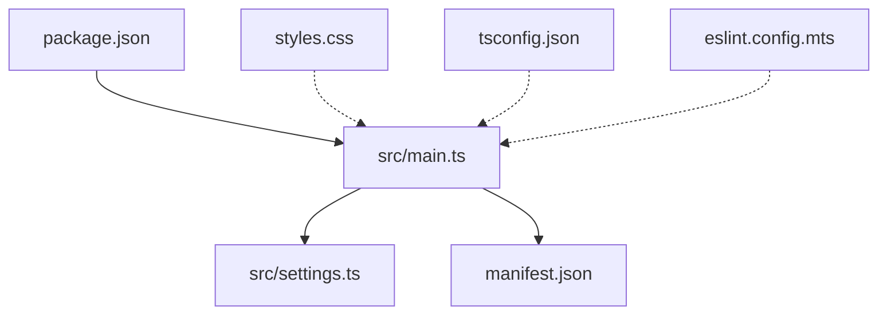
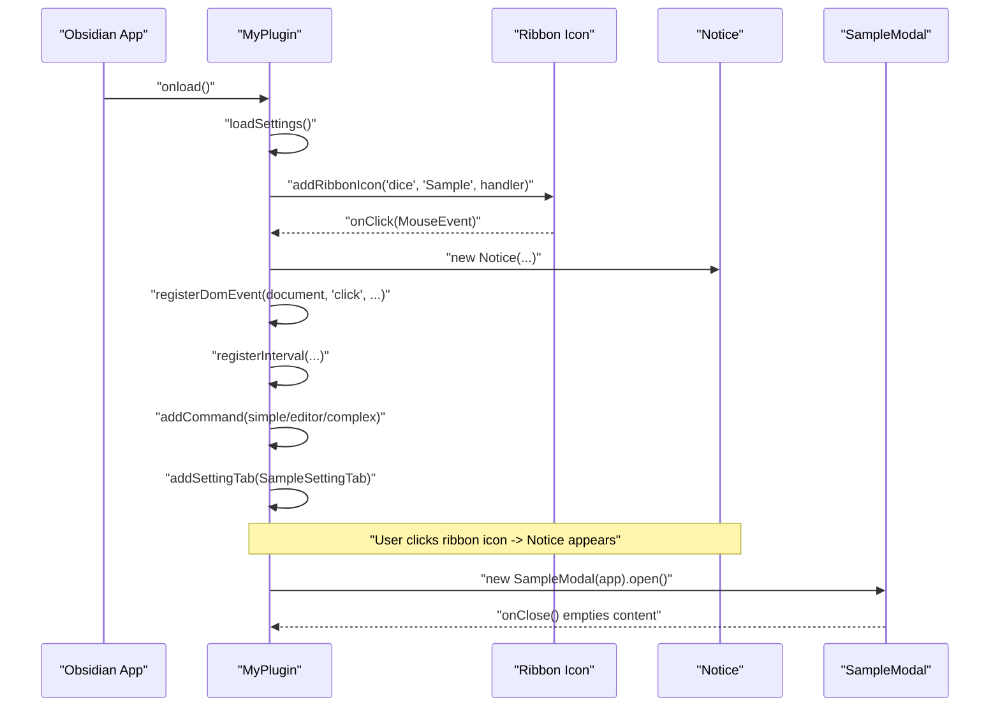
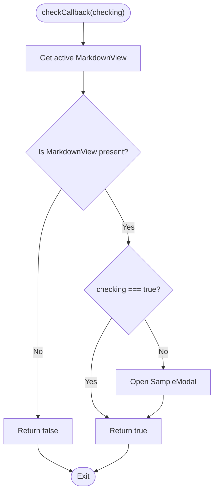
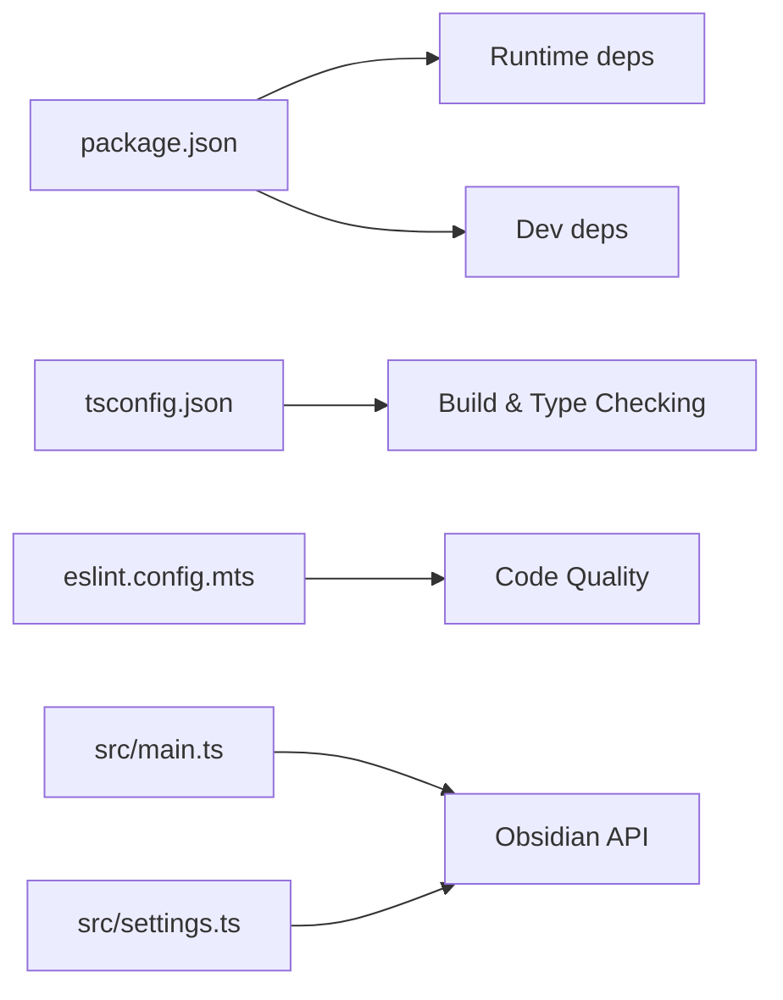

# Core Features

<cite>
**Referenced Files in This Document**
- [src/main.ts](file://src/main.ts)
- [src/settings.ts](file://src/settings.ts)
- [manifest.json](file://manifest.json)
- [package.json](file://package.json)
- [README.md](file://README.md)
- [styles.css](file://styles.css)
- [tsconfig.json](file://tsconfig.json)
- [eslint.config.mts](file://eslint.config.mts)
</cite>

## Table of Contents
1. [Introduction](#introduction)
2. [Project Structure](#project-structure)
3. [Core Components](#core-components)
4. [Architecture Overview](#architecture-overview)
5. [Detailed Component Analysis](#detailed-component-analysis)
6. [Dependency Analysis](#dependency-analysis)
7. [Performance Considerations](#performance-considerations)
8. [Troubleshooting Guide](#troubleshooting-guide)
9. [Conclusion](#conclusion)
10. [Appendices](#appendices)

## Introduction
This document explains the core plugin features demonstrated by the sample plugin. It focuses on:
- Ribbon integration: adding icons, handling clicks, and providing visual feedback
- Command system: simple, editor, and complex commands with validation
- Settings management: interface definition, defaults, settings tab, and persistence
- Modal dialog creation and lifecycle management
- Event handling patterns: global DOM events and automatic cleanup
- Practical examples drawn from the codebase

The goal is to help developers understand how to build robust, user-friendly plugins using Obsidian’s plugin API.

## Project Structure
The plugin consists of a minimal TypeScript codebase with a small set of files:
- A main plugin entry that registers UI elements, commands, settings, and event handlers
- A settings module that defines the plugin’s settings interface and a settings tab
- Manifest and package metadata
- Build and lint configuration files

**Diagram sources**
- [src/main.ts:1-100](file://src/main.ts#L1-L100)
- [src/settings.ts:1-37](file://src/settings.ts#L1-L37)
- [manifest.json:1-12](file://manifest.json#L1-L12)
- [package.json:1-30](file://package.json#L1-L30)
- [styles.css:1-9](file://styles.css#L1-L9)
- [tsconfig.json:1-31](file://tsconfig.json#L1-L31)
- [eslint.config.mts:1-35](file://eslint.config.mts#L1-L35)

**Section sources**
- [src/main.ts:1-100](file://src/main.ts#L1-L100)
- [src/settings.ts:1-37](file://src/settings.ts#L1-L37)
- [manifest.json:1-12](file://manifest.json#L1-L12)
- [package.json:1-30](file://package.json#L1-L30)
- [README.md:1-91](file://README.md#L1-L91)

## Core Components
- Plugin class: registers ribbon icon, status bar item, commands, settings tab, and event handlers
- Settings module: defines settings interface, default values, and a settings tab UI
- Modal class: a simple dialog with open/close lifecycle
- Manifest and package: define plugin identity, versioning, and build scripts

Key responsibilities:
- Ribbon integration: addRibbonIcon, click handler, Notice feedback
- Commands: addCommand with callback, editorCallback, and checkCallback
- Settings: loadSettings/saveSettings, settings tab UI, persistence
- Events: registerDomEvent, registerInterval, automatic cleanup
- Modal: onOpen/onClose lifecycle

**Section sources**
- [src/main.ts:6-83](file://src/main.ts#L6-L83)
- [src/settings.ts:4-36](file://src/settings.ts#L4-L36)

## Architecture Overview
The plugin follows a straightforward architecture:
- The plugin initializes in onload, registers UI elements and commands
- Settings are loaded and persisted via loadData/saveData
- Global events are registered with automatic cleanup on unload
- A simple modal is shown on command invocation

**Diagram sources**
- [src/main.ts:9-71](file://src/main.ts#L9-L71)
- [src/main.ts:85-99](file://src/main.ts#L85-L99)

## Detailed Component Analysis

### Ribbon Integration
- Icon addition: The plugin adds a ribbon icon with a unique icon name and tooltip
- Click handling: On click, a Notice is shown to provide immediate visual feedback
- Cleanup: No explicit removal is needed; the plugin lifecycle manages the icon

Implementation highlights:
- Icon registration and click handler
- Notice usage for feedback
- Status bar item registration (demonstrative)

Practical example paths:
- [src/main.ts:12-16](file://src/main.ts#L12-L16)
- [src/main.ts:18-21](file://src/main.ts#L18-L21)

**Section sources**
- [src/main.ts:12-21](file://src/main.ts#L12-L21)

### Command System
The plugin registers three types of commands:

1) Simple command
- Triggered from anywhere
- Opens a modal dialog
- Example path: [src/main.ts:22-29](file://src/main.ts#L22-L29)

2) Editor command
- Operates on the current editor instance
- Replaces selected content
- Example path: [src/main.ts:30-37](file://src/main.ts#L30-L37)

3) Complex command with validation
- Uses checkCallback to determine availability
- Only shows in the Command Palette when conditions are met
- Executes on demand when conditions are satisfied
- Example path: [src/main.ts:38-57](file://src/main.ts#L38-L57)

Validation logic flow:

**Diagram sources**
- [src/main.ts:42-56](file://src/main.ts#L42-L56)

**Section sources**
- [src/main.ts:22-57](file://src/main.ts#L22-L57)

### Settings Management
Interface definition and defaults:
- Settings interface defines typed keys
- Default values are provided for safe initialization
- Example paths:
  - [src/settings.ts:4-10](file://src/settings.ts#L4-L10)

Settings tab implementation:
- Extends PluginSettingTab
- Renders a Setting control with text input
- Updates plugin settings and persists immediately on change
- Example paths:
  - [src/settings.ts:12-36](file://src/settings.ts#L12-L36)

Persistence mechanism:
- loadSettings merges saved data with defaults
- saveSettings persists the current settings object
- Example paths:
  - [src/main.ts:76-82](file://src/main.ts#L76-L82)

UI integration:
- Adds the settings tab during plugin onload
- Example path:
  - [src/main.ts:59-60](file://src/main.ts#L59-L60)

**Section sources**
- [src/settings.ts:4-36](file://src/settings.ts#L4-L36)
- [src/main.ts:76-82](file://src/main.ts#L76-L82)

### Modal Dialog Creation and Lifecycle
Modal class:
- Extends Obsidian’s Modal
- Implements onOpen to render content
- Implements onClose to clean up content
- Example paths:
  - [src/main.ts:85-99](file://src/main.ts#L85-L99)

Usage:
- Invoked from simple command to demonstrate dialog behavior
- Example path:
  - [src/main.ts:26-28](file://src/main.ts#L26-L28)

**Section sources**
- [src/main.ts:85-99](file://src/main.ts#L85-L99)
- [src/main.ts:26-28](file://src/main.ts#L26-L28)

### Event Handling Patterns and Automatic Cleanup
Global DOM events:
- registerDomEvent is used to listen to document clicks
- Automatically removed when the plugin is disabled
- Example path:
  - [src/main.ts:62-66](file://src/main.ts#L62-L66)

Timers:
- registerInterval is used to schedule periodic tasks
- Automatically cleared when the plugin is disabled
- Example path:
  - [src/main.ts:68-69](file://src/main.ts#L68-L69)

Unload lifecycle:
- onunload is provided for manual cleanup if needed
- Example path:
  - [src/main.ts:73-74](file://src/main.ts#L73-L74)

**Section sources**
- [src/main.ts:62-74](file://src/main.ts#L62-L74)

### Practical Examples from the Codebase
- Ribbon icon click triggers a Notice
  - Path: [src/main.ts:12-16](file://src/main.ts#L12-L16)
- Simple command opens a modal
  - Path: [src/main.ts:22-29](file://src/main.ts#L22-L29)
- Editor command replaces selection
  - Path: [src/main.ts:30-37](file://src/main.ts#L30-L37)
- Complex command with validation
  - Path: [src/main.ts:38-57](file://src/main.ts#L38-L57)
- Settings tab with live persistence
  - Path: [src/settings.ts:12-36](file://src/settings.ts#L12-L36)
- Modal lifecycle
  - Path: [src/main.ts:85-99](file://src/main.ts#L85-L99)
- Global event registration and interval
  - Path: [src/main.ts:62-69](file://src/main.ts#L62-L69)

## Dependency Analysis
- Runtime dependencies:
  - Obsidian SDK (plugin API) is declared in package.json
  - Example path: [package.json:26-28](file://package.json#L26-L28)
- Build-time dependencies:
  - TypeScript, esbuild, ESLint, and related plugins
  - Example path: [package.json:15-25](file://package.json#L15-L25)
- TypeScript configuration:
  - Strict compiler options and ES module target
  - Example path: [tsconfig.json:2-25](file://tsconfig.json#L2-L25)
- Lint configuration:
  - ESLint with Obsidian-specific rules
  - Example path: [eslint.config.mts:1-35](file://eslint.config.mts#L1-L35)

**Diagram sources**
- [package.json:15-28](file://package.json#L15-L28)
- [tsconfig.json:2-25](file://tsconfig.json#L2-L25)
- [eslint.config.mts:1-35](file://eslint.config.mts#L1-L35)
- [src/main.ts:1-2](file://src/main.ts#L1-L2)
- [src/settings.ts:1](file://src/settings.ts#L1)

**Section sources**
- [package.json:15-28](file://package.json#L15-L28)
- [tsconfig.json:2-25](file://tsconfig.json#L2-L25)
- [eslint.config.mts:1-35](file://eslint.config.mts#L1-L35)

## Performance Considerations
- Prefer lightweight UI updates and avoid heavy computations in event handlers
- Use checkCallback for complex commands to prevent unnecessary work
- Persist settings asynchronously to avoid blocking UI
- Limit global event listeners to essential cases

## Troubleshooting Guide
Common issues and resolutions:
- Settings not persisting:
  - Ensure loadSettings merges defaults and saved data
  - Verify saveSettings is called after changes
  - Paths: [src/main.ts:76-82](file://src/main.ts#L76-L82)
- Command not appearing in Command Palette:
  - Confirm checkCallback returns true when conditions are met
  - Path: [src/main.ts:42-56](file://src/main.ts#L42-L56)
- Modal not rendering content:
  - Verify onOpen sets content and onClose clears it
  - Path: [src/main.ts:85-99](file://src/main.ts#L85-L99)
- Global events not cleaned up:
  - Use registerDomEvent/registerInterval for automatic cleanup
  - Path: [src/main.ts:62-69](file://src/main.ts#L62-L69)
- Ribbon icon missing:
  - Confirm addRibbonIcon is called during onload
  - Path: [src/main.ts:12-16](file://src/main.ts#L12-L16)

**Section sources**
- [src/main.ts:76-99](file://src/main.ts#L76-L99)
- [src/main.ts:12-16](file://src/main.ts#L12-L16)
- [src/main.ts:42-56](file://src/main.ts#L42-L56)

## Conclusion
This sample plugin demonstrates the essential building blocks of an Obsidian plugin:
- Ribbon integration with immediate feedback
- A flexible command system covering simple, editor, and validated commands
- A clean settings interface with defaults and persistence
- Modal dialogs with lifecycle management
- Robust event handling with automatic cleanup

These patterns provide a solid foundation for extending functionality while maintaining a responsive and user-friendly experience.

## Appendices

### Manifest and Package Metadata
- Identity and compatibility:
  - Plugin ID, name, version, minimum app version
  - Paths: [manifest.json:1-12](file://manifest.json#L1-L12)
- Build scripts and dependencies:
  - Development and production builds, linting
  - Paths: [package.json:7-12](file://package.json#L7-L12), [package.json:26-28](file://package.json#L26-L28)

**Section sources**
- [manifest.json:1-12](file://manifest.json#L1-L12)
- [package.json:7-12](file://package.json#L7-L12)
- [package.json:26-28](file://package.json#L26-L28)

### Styles and Build Configuration
- CSS inclusion:
  - Styles are included when the plugin is enabled
  - Path: [styles.css:1-9](file://styles.css#L1-L9)
- TypeScript strictness and targets:
  - ES module target, strict null checks, and modern libs
  - Path: [tsconfig.json:2-25](file://tsconfig.json#L2-L25)
- ESLint configuration:
  - Obsidian-specific rules and ignored files
  - Path: [eslint.config.mts:1-35](file://eslint.config.mts#L1-L35)

**Section sources**
- [styles.css:1-9](file://styles.css#L1-L9)
- [tsconfig.json:2-25](file://tsconfig.json#L2-L25)
- [eslint.config.mts:1-35](file://eslint.config.mts#L1-L35)