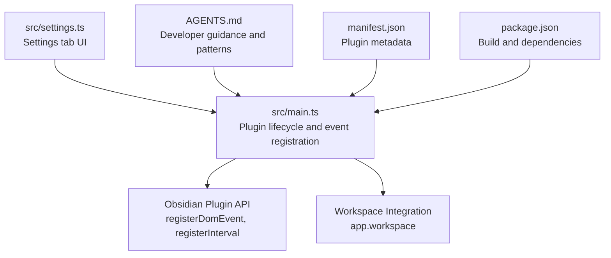
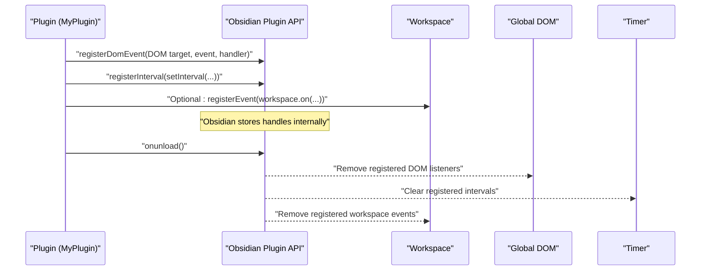
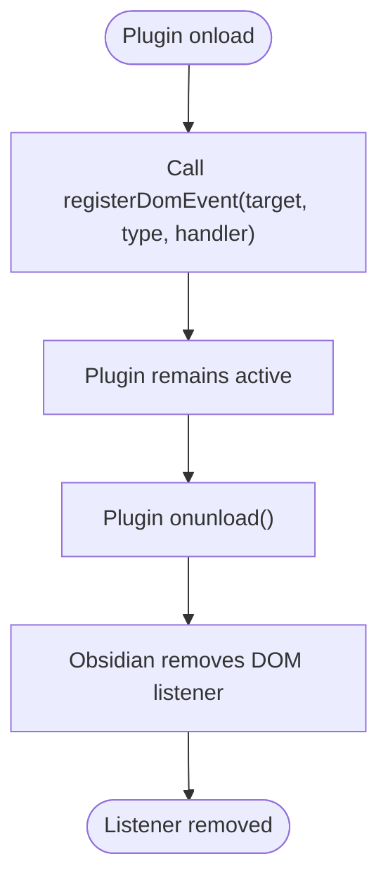
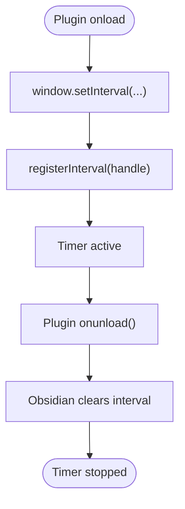
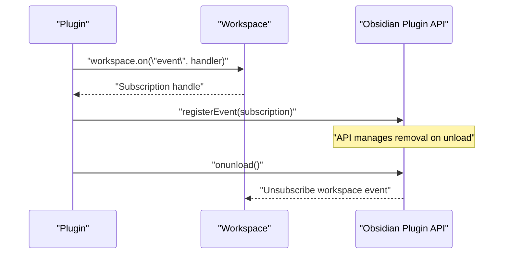
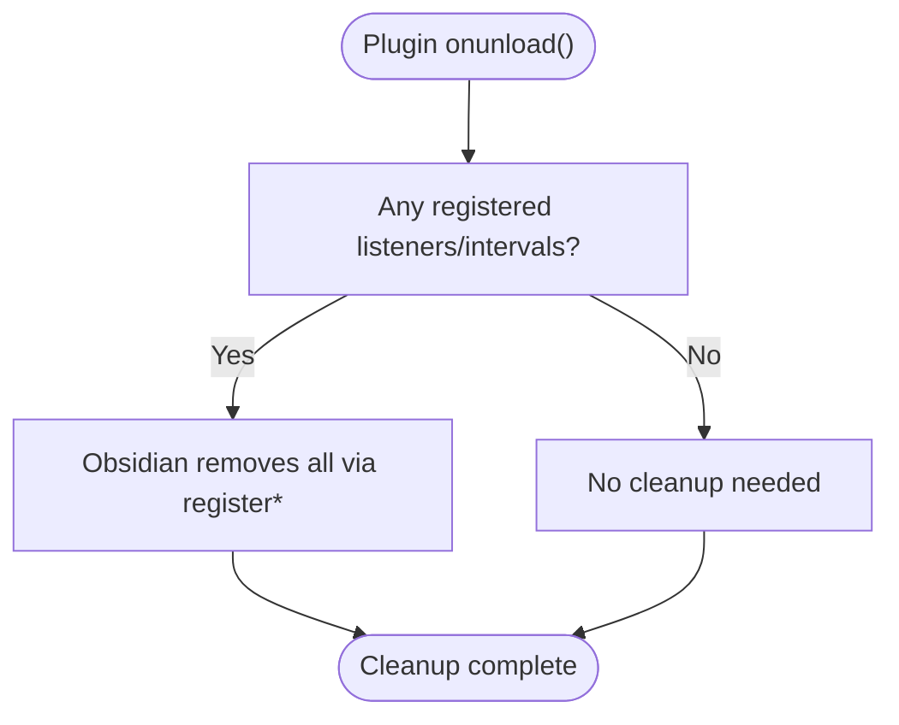
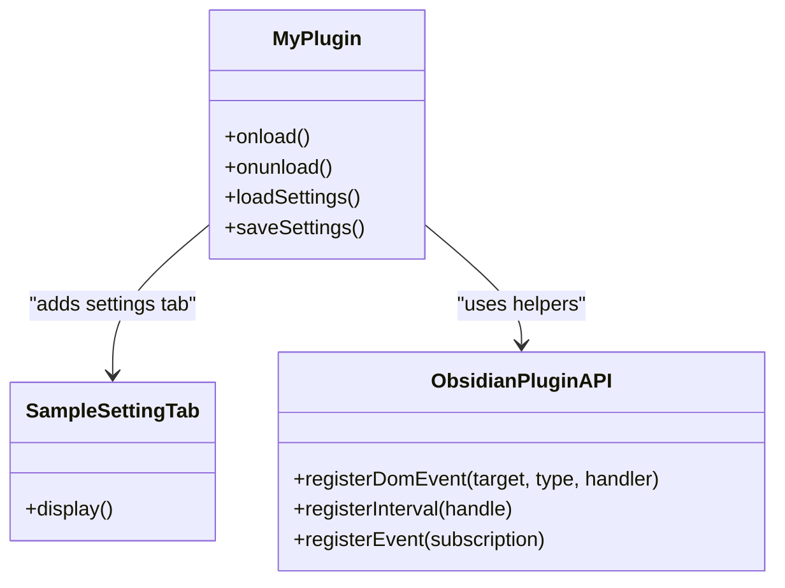
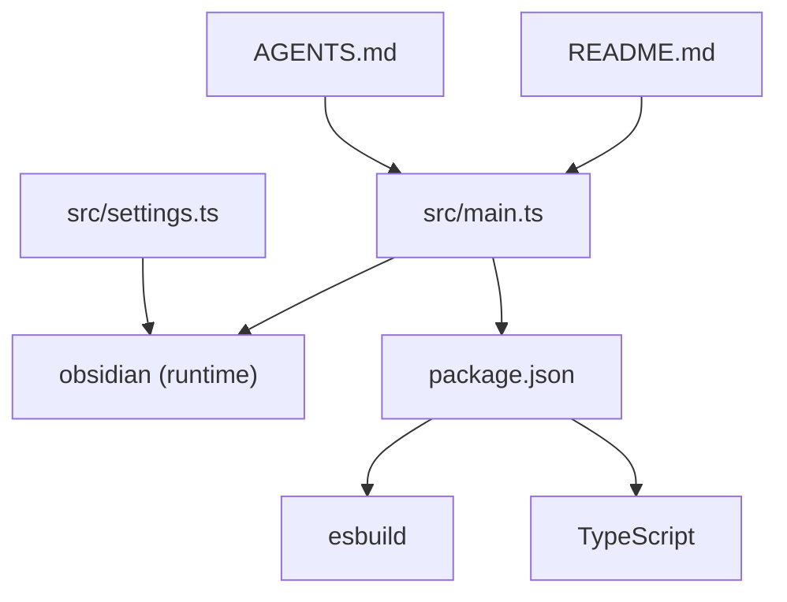

# Event Handling

<cite>
**Referenced Files in This Document**
- [src/main.ts](file://src/main.ts)
- [src/settings.ts](file://src/settings.ts)
- [AGENTS.md](file://AGENTS.md)
- [manifest.json](file://manifest.json)
- [package.json](file://package.json)
- [README.md](file://README.md)
</cite>

## Table of Contents
1. [Introduction](#introduction)
2. [Project Structure](#project-structure)
3. [Core Components](#core-components)
4. [Architecture Overview](#architecture-overview)
5. [Detailed Component Analysis](#detailed-component-analysis)
6. [Dependency Analysis](#dependency-analysis)
7. [Performance Considerations](#performance-considerations)
8. [Troubleshooting Guide](#troubleshooting-guide)
9. [Conclusion](#conclusion)

## Introduction
This document explains the event handling system in the plugin, focusing on:
- Global event registration using registerDomEvent
- Timer management using registerInterval
- Automatic cleanup during plugin unload
- Event listener registration patterns
- Cleanup procedures and integration with Obsidian’s workspace system
- Best practices for memory management and lifecycle management

The repository demonstrates practical usage of Obsidian’s Plugin API helpers to register global DOM events and intervals, and to ensure automatic cleanup when the plugin is disabled or unloaded.

## Project Structure
The plugin follows a minimal structure with a single entry point and a settings tab. The event handling patterns are implemented in the main plugin class and referenced in the developer guidance.

**Diagram sources**
- [src/main.ts:9-71](file://src/main.ts#L9-L71)
- [src/settings.ts:12-36](file://src/settings.ts#L12-L36)
- [AGENTS.md:232-235](file://AGENTS.md#L232-L235)
- [manifest.json:1-12](file://manifest.json#L1-L12)
- [package.json:1-30](file://package.json#L1-L30)

**Section sources**
- [src/main.ts:1-100](file://src/main.ts#L1-L100)
- [src/settings.ts:1-37](file://src/settings.ts#L1-L37)
- [AGENTS.md:160-235](file://AGENTS.md#L160-L235)
- [manifest.json:1-12](file://manifest.json#L1-L12)
- [package.json:1-30](file://package.json#L1-L30)

## Core Components
- Plugin lifecycle: The plugin initializes settings, registers commands, a settings tab, a global DOM event, and a periodic interval in onload. It currently leaves onunload empty, which means cleanup is deferred to Obsidian’s built-in helpers.
- Workspace integration: The plugin accesses the active view via the workspace to conditionally enable commands.
- Settings tab: Provides a UI to manage plugin settings and persists changes.

Key event handling references:
- Global DOM event registration with automatic cleanup: [src/main.ts:64-66](file://src/main.ts#L64-L66)
- Interval registration with automatic cleanup: [src/main.ts:68-69](file://src/main.ts#L68-L69)
- Workspace view access for command gating: [src/main.ts:44](file://src/main.ts#L44)
- Developer guidance for safe registration: [AGENTS.md:232-235](file://AGENTS.md#L232-L235)

**Section sources**
- [src/main.ts:9-71](file://src/main.ts#L9-L71)
- [src/settings.ts:12-36](file://src/settings.ts#L12-L36)
- [AGENTS.md:232-235](file://AGENTS.md#L232-L235)

## Architecture Overview
The event handling architecture centers on Obsidian’s Plugin API helpers that automatically manage cleanup:
- registerDomEvent: Wraps global DOM listeners and removes them when the plugin is disabled.
- registerInterval: Wraps timers and clears them when the plugin is disabled.
- registerEvent: Used for workspace events (as shown in developer guidance) to ensure removal on unload.

**Diagram sources**
- [src/main.ts:64-69](file://src/main.ts#L64-L69)
- [AGENTS.md:232-235](file://AGENTS.md#L232-L235)

## Detailed Component Analysis

### Global DOM Event Registration (registerDomEvent)
- Purpose: Register a global DOM event listener that targets areas outside the plugin’s own UI.
- Behavior: The plugin registers a click listener on the document. Because it uses registerDomEvent, Obsidian ensures the listener is removed when the plugin is disabled.
- Pattern: Use registerDomEvent with the target element, event type, and handler.

**Diagram sources**
- [src/main.ts:64-66](file://src/main.ts#L64-L66)

**Section sources**
- [src/main.ts:64-66](file://src/main.ts#L64-L66)
- [AGENTS.md:232-235](file://AGENTS.md#L232-L235)

### Timer Management (registerInterval)
- Purpose: Register periodic timers that should be automatically cleared when the plugin is disabled.
- Behavior: The plugin registers a repeating interval and passes the timer handle to registerInterval. On unload, Obsidian clears the interval.
- Pattern: Wrap setInterval return value with registerInterval.

**Diagram sources**
- [src/main.ts:68-69](file://src/main.ts#L68-L69)

**Section sources**
- [src/main.ts:68-69](file://src/main.ts#L68-L69)
- [AGENTS.md:234](file://AGENTS.md#L234)

### Workspace-Specific Events (registerEvent)
- Purpose: Register workspace events (e.g., file-open) and ensure cleanup on unload.
- Pattern: Use registerEvent with the event subscription returned by workspace.on(...). The developer guidance shows this pattern.

**Diagram sources**
- [AGENTS.md:232](file://AGENTS.md#L232)

**Section sources**
- [AGENTS.md:232](file://AGENTS.md#L232)

### Automatic Cleanup During Plugin Unload
- Current state: The plugin’s onunload is empty. Cleanup for DOM events and intervals is handled by Obsidian’s register* helpers.
- Guidance: Even if onunload is empty, ensure all listeners and intervals are registered via registerDomEvent/registerInterval/registerEvent so they are removed automatically.

**Diagram sources**
- [src/main.ts:73-74](file://src/main.ts#L73-L74)
- [AGENTS.md:232-235](file://AGENTS.md#L232-L235)

**Section sources**
- [src/main.ts:73-74](file://src/main.ts#L73-L74)
- [AGENTS.md:232-235](file://AGENTS.md#L232-L235)

### Event Listener Registration Patterns and Best Practices
- Use registerDomEvent for global DOM listeners.
- Use registerInterval for timers.
- Use registerEvent for workspace events.
- Keep main.ts minimal and delegate feature logic to separate modules.
- Ensure idempotency so reload/unload does not leak listeners or intervals.

**Diagram sources**
- [src/main.ts:9-71](file://src/main.ts#L9-L71)
- [src/settings.ts:12-36](file://src/settings.ts#L12-L36)
- [AGENTS.md:232-235](file://AGENTS.md#L232-L235)

**Section sources**
- [src/main.ts:9-71](file://src/main.ts#L9-L71)
- [src/settings.ts:12-36](file://src/settings.ts#L12-L36)
- [AGENTS.md:134-153](file://AGENTS.md#L134-L153)

## Dependency Analysis
- Runtime dependencies: The plugin relies on the Obsidian plugin API for event registration and cleanup helpers.
- Build-time dependencies: The project uses esbuild and TypeScript for bundling and type checking.

**Diagram sources**
- [src/main.ts:1](file://src/main.ts#L1)
- [src/settings.ts:1](file://src/settings.ts#L1)
- [package.json:26-28](file://package.json#L26-L28)
- [package.json:15-25](file://package.json#L15-L25)

**Section sources**
- [package.json:1-30](file://package.json#L1-L30)
- [README.md:1-91](file://README.md#L1-L91)

## Performance Considerations
- Keep startup lightweight; defer heavy work until needed.
- Avoid long-running tasks during onload; use lazy initialization.
- Batch disk access and avoid excessive vault scans.
- Debounce/throttle expensive operations in response to file system events.

[No sources needed since this section provides general guidance]

## Troubleshooting Guide
Common issues and resolutions:
- Plugin does not load after build: ensure main.js and manifest.json are at the top level of the plugin folder under the vault.
- Build issues: if main.js is missing, run the build script to compile TypeScript.
- Commands not appearing: verify addCommand runs after onload and IDs are unique.
- Settings not persisting: ensure loadData/saveData are awaited and you re-render the UI after changes.
- Mobile-only issues: confirm you are not using desktop-only APIs; check isDesktopOnly and adjust.

**Section sources**
- [AGENTS.md:237-244](file://AGENTS.md#L237-L244)

## Conclusion
The plugin demonstrates safe event handling by leveraging Obsidian’s register* helpers:
- registerDomEvent for global DOM listeners
- registerInterval for timers
- registerEvent for workspace events

Automatic cleanup is ensured by these helpers, and the plugin’s onunload remains empty while still maintaining safety. Following the documented patterns and best practices helps prevent leaks and ensures robust lifecycle management.