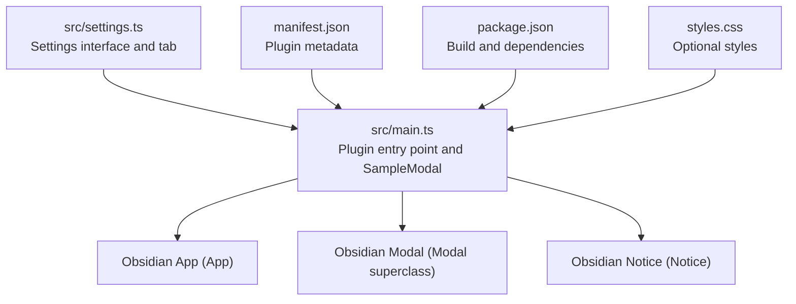
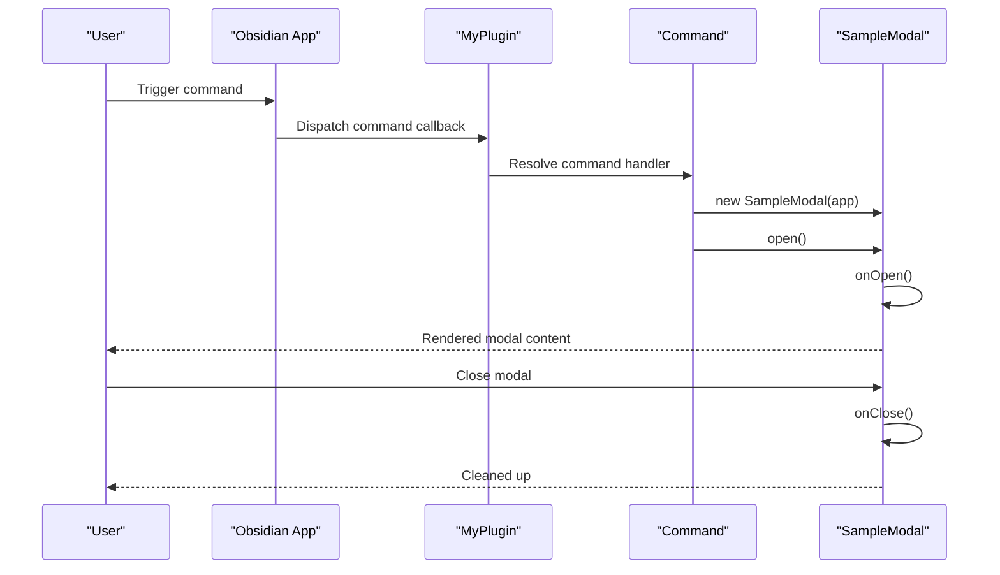
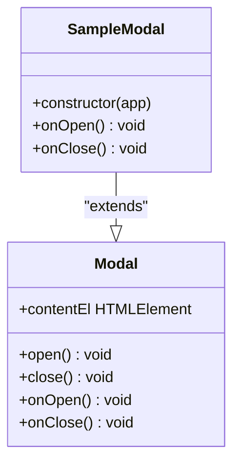
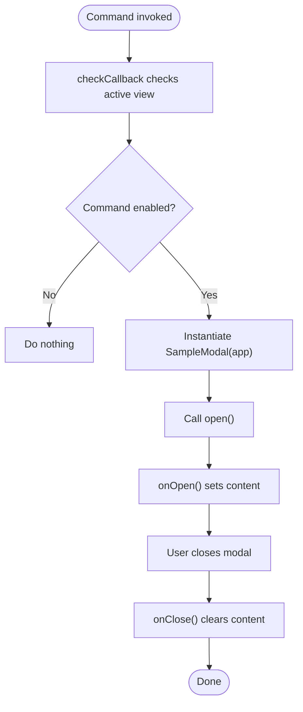
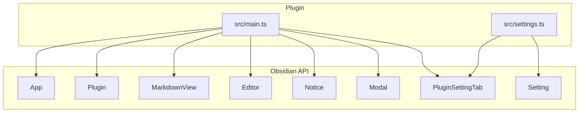

# Modal Dialogs

<cite>
**Referenced Files in This Document**
- [src/main.ts](file://src/main.ts)
- [src/settings.ts](file://src/settings.ts)
- [README.md](file://README.md)
- [manifest.json](file://manifest.json)
- [package.json](file://package.json)
- [styles.css](file://styles.css)
- [AGENTS.md](file://AGENTS.md)
</cite>

## Table of Contents
1. [Introduction](#introduction)
2. [Project Structure](#project-structure)
3. [Core Components](#core-components)
4. [Architecture Overview](#architecture-overview)
5. [Detailed Component Analysis](#detailed-component-analysis)
6. [Dependency Analysis](#dependency-analysis)
7. [Performance Considerations](#performance-considerations)
8. [Troubleshooting Guide](#troubleshooting-guide)
9. [Conclusion](#conclusion)

## Introduction
This document explains the modal dialog creation and management system used in the plugin. It focuses on the SampleModal class implementation, including its constructor, onOpen and onClose lifecycle methods, and content management. It also covers modal instantiation patterns, integration with commands, and user interaction handling. Practical examples demonstrate modal content creation, event handling within modals, and proper cleanup procedures. Finally, it outlines best practices for modal design, accessibility considerations, and integration with Obsidian’s modal system.

## Project Structure
The plugin follows a minimal structure with a single-file implementation for the plugin entry point and a dedicated settings module. The modal is defined inline within the plugin entry point file alongside command registration and settings integration.

**Diagram sources**
- [src/main.ts:1-100](file://src/main.ts#L1-L100)
- [src/settings.ts:1-37](file://src/settings.ts#L1-L37)
- [manifest.json:1-12](file://manifest.json#L1-L12)
- [package.json:1-30](file://package.json#L1-L30)
- [styles.css:1-9](file://styles.css#L1-L9)

**Section sources**
- [src/main.ts:1-100](file://src/main.ts#L1-L100)
- [src/settings.ts:1-37](file://src/settings.ts#L1-L37)
- [manifest.json:1-12](file://manifest.json#L1-L12)
- [package.json:1-30](file://package.json#L1-L30)
- [styles.css:1-9](file://styles.css#L1-L9)

## Core Components
- SampleModal: A simple modal subclass of Obsidian’s Modal. It sets content in onOpen and clears it in onClose.
- Plugin commands: Two commands trigger SampleModal instantiation and open the modal. One uses a simple callback; the other uses a checkCallback to conditionally enable itself based on the active view type.
- Settings integration: A settings tab is registered to manage plugin settings.

Key responsibilities:
- Modal lifecycle: Initialize content in onOpen, clean up in onClose.
- Command triggers: Instantiate and open the modal from plugin commands.
- Settings tab: Provides a UI to manage persisted settings.

**Section sources**
- [src/main.ts:85-99](file://src/main.ts#L85-L99)
- [src/main.ts:22-57](file://src/main.ts#L22-L57)
- [src/settings.ts:12-36](file://src/settings.ts#L12-L36)

## Architecture Overview
The modal system integrates with Obsidian’s plugin lifecycle and command framework. The plugin registers commands during onload. When a command is executed, it instantiates SampleModal and calls open(). The modal’s onOpen populates content, and onClose ensures cleanup.

**Diagram sources**
- [src/main.ts:22-57](file://src/main.ts#L22-L57)
- [src/main.ts:85-99](file://src/main.ts#L85-L99)

## Detailed Component Analysis

### SampleModal Class
SampleModal extends Obsidian’s Modal and implements the minimal lifecycle required for a modal dialog.

- Constructor: Calls the superclass constructor with the Obsidian App instance.
- onOpen: Receives the modal’s content element and sets its text content.
- onClose: Clears the content element to prevent stale content on subsequent opens.

**Diagram sources**
- [src/main.ts:85-99](file://src/main.ts#L85-L99)

Implementation highlights:
- Minimal content population in onOpen keeps the modal lightweight.
- onClose empties the content element to avoid content leakage across modal instances.

Best practices derived from this implementation:
- Always empty content in onClose to ensure clean state.
- Keep onOpen logic simple; defer complex rendering to later stages if needed.

**Section sources**
- [src/main.ts:85-99](file://src/main.ts#L85-L99)

### Modal Instantiation Patterns
There are two primary patterns demonstrated in the plugin:

- Simple command pattern: A straightforward addCommand callback instantiates SampleModal and calls open().
- Conditional command pattern: A checkCallback evaluates the active view type and only enables the command when appropriate. When executed, it instantiates and opens the modal.

**Diagram sources**
- [src/main.ts:22-57](file://src/main.ts#L22-L57)
- [src/main.ts:85-99](file://src/main.ts#L85-L99)

**Section sources**
- [src/main.ts:22-57](file://src/main.ts#L22-L57)

### Integration with Commands
- Simple command: Adds a command with a callback that instantiates and opens the modal.
- Complex command: Uses checkCallback to ensure the command appears only when the active view is a MarkdownView. The callback then opens the modal.

Benefits:
- Prevents misuse when the modal is not applicable.
- Keeps the UI consistent and predictable.

**Section sources**
- [src/main.ts:22-57](file://src/main.ts#L22-L57)

### User Interaction Handling
- Ribbon icon: Demonstrates Notice usage when clicked, showing how user actions can trigger feedback.
- Global DOM event: Registers a click event at the document level and shows a Notice, illustrating safe event registration and cleanup.

Note: The modal itself does not define custom event handlers in this sample. Event handling within modals should be implemented carefully, following Obsidian’s event registration patterns and cleanup practices.

**Section sources**
- [src/main.ts:12-16](file://src/main.ts#L12-L16)
- [src/main.ts:64-66](file://src/main.ts#L64-L66)

### Content Management Within Modals
- onOpen: Sets the modal content element’s text to a simple message.
- onClose: Empties the content element to ensure a clean slate for future uses.

Recommended enhancements for richer modals:
- Populate contentEl with structured HTML elements.
- Add form controls, buttons, and interactive widgets.
- Use Obsidian’s Setting and other UI helpers for consistent styling and behavior.

**Section sources**
- [src/main.ts:90-98](file://src/main.ts#L90-L98)

### Cleanup Procedures
- onClose empties the content element to prevent content leakage.
- The plugin uses registerDomEvent and registerInterval to ensure automatic cleanup when the plugin is disabled.

Guidelines:
- Always empty dynamic content in onClose.
- Register any DOM or app-level listeners with registerDomEvent/registerEvent to ensure they are removed on unload.
- Avoid manual DOM manipulation outside Obsidian’s UI helpers when possible.

**Section sources**
- [src/main.ts:95-98](file://src/main.ts#L95-L98)
- [src/main.ts:64-69](file://src/main.ts#L64-L69)

## Dependency Analysis
The plugin depends on Obsidian’s core modules and registers UI components and commands during plugin lifecycle.

**Diagram sources**
- [src/main.ts:1-100](file://src/main.ts#L1-L100)
- [src/settings.ts:1-37](file://src/settings.ts#L1-L37)

**Section sources**
- [src/main.ts:1-100](file://src/main.ts#L1-L100)
- [src/settings.ts:1-37](file://src/settings.ts#L1-L37)

## Performance Considerations
- Keep modal content lightweight. Avoid heavy computations in onOpen; defer if necessary.
- Use Obsidian’s built-in UI helpers to minimize DOM overhead.
- Ensure cleanup in onClose and rely on register* helpers for automatic cleanup on unload.

[No sources needed since this section provides general guidance]

## Troubleshooting Guide
Common issues and resolutions:
- Modal not opening: Verify the command is registered after onload and IDs are unique.
- Content not persisting across sessions: Ensure settings are loaded via loadData and saved via saveData.
- Events not cleaning up: Use registerDomEvent/registerEvent to ensure automatic removal on unload.
- Mobile compatibility: Confirm isDesktopOnly is set appropriately and avoid desktop-only APIs.

**Section sources**
- [src/main.ts:73-74](file://src/main.ts#L73-L74)
- [src/main.ts:64-69](file://src/main.ts#L64-L69)
- [AGENTS.md:237-243](file://AGENTS.md#L237-L243)

## Conclusion
The plugin demonstrates a minimal yet effective modal dialog system. SampleModal provides a clean lifecycle with onOpen and onClose handling, while commands integrate seamlessly with Obsidian’s command framework. By following the cleanup and registration patterns shown here, developers can build robust, accessible modals that integrate smoothly with Obsidian’s ecosystem.