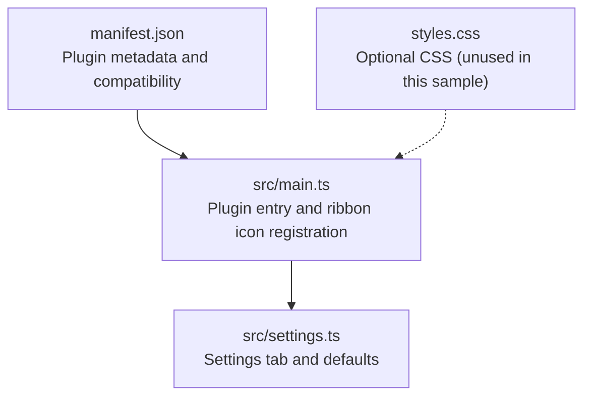
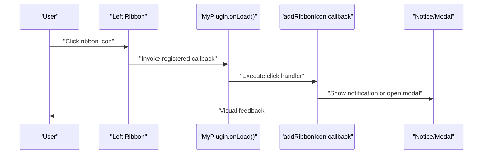
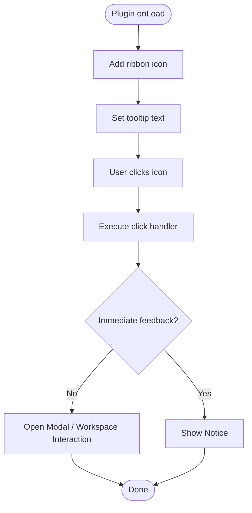
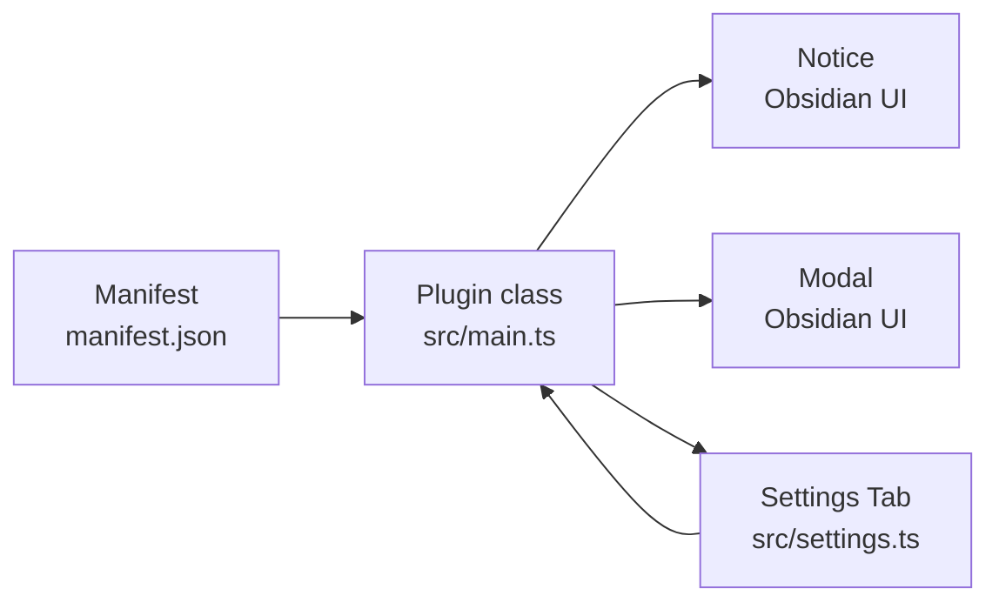

# Ribbon Integration

<cite>
**Referenced Files in This Document**
- [main.ts](file://src/main.ts)
- [settings.ts](file://src/settings.ts)
- [manifest.json](file://manifest.json)
- [README.md](file://README.md)
- [styles.css](file://styles.css)
</cite>

## Table of Contents
1. [Introduction](#introduction)
2. [Project Structure](#project-structure)
3. [Core Components](#core-components)
4. [Architecture Overview](#architecture-overview)
5. [Detailed Component Analysis](#detailed-component-analysis)
6. [Dependency Analysis](#dependency-analysis)
7. [Performance Considerations](#performance-considerations)
8. [Troubleshooting Guide](#troubleshooting-guide)
9. [Conclusion](#conclusion)
10. [Appendices](#appendices)

## Introduction
This document explains how the plugin integrates clickable icons into Obsidian’s left ribbon area using the addRibbonIcon method. It covers icon selection, tooltip text, click event handling, visual feedback mechanisms, and best practices for designing ribbon icons. Practical examples demonstrate how to implement ribbon icons for notifications, modal triggers, and workspace interactions. It also outlines event handling patterns and integration with other plugin features such as commands, settings tabs, and status bar items.

## Project Structure
The plugin follows a minimal structure typical of Obsidian plugin templates:
- Entry point initializes the plugin lifecycle and registers UI elements.
- Settings module provides a settings tab for user configuration.
- Manifest defines metadata and compatibility.
- Styles file is present but currently unused in this sample.

**Diagram sources**
- [main.ts:1-100](file://src/main.ts#L1-L100)
- [settings.ts:1-37](file://src/settings.ts#L1-L37)
- [manifest.json:1-12](file://manifest.json#L1-L12)
- [styles.css:1-9](file://styles.css#L1-L9)

**Section sources**
- [main.ts:1-100](file://src/main.ts#L1-L100)
- [settings.ts:1-37](file://src/settings.ts#L1-L37)
- [manifest.json:1-12](file://manifest.json#L1-L12)
- [styles.css:1-9](file://styles.css#L1-L9)

## Core Components
- Plugin class: Implements the plugin lifecycle and registers UI elements.
- Settings tab: Provides a settings UI and persists user preferences.
- Manifest: Declares plugin identity, version, and minimum app version.
- Ribbon icon: Registered via addRibbonIcon in the plugin’s onload routine.

Key implementation reference:
- Ribbon icon registration and click handler: [main.ts:12-16](file://src/main.ts#L12-L16)

**Section sources**
- [main.ts:12-16](file://src/main.ts#L12-L16)
- [settings.ts:12-37](file://src/settings.ts#L12-L37)
- [manifest.json:1-12](file://manifest.json#L1-L12)

## Architecture Overview
The plugin’s ribbon integration is part of the plugin lifecycle. During onload, the plugin registers a ribbon icon with an icon identifier, tooltip text, and a click handler. Clicking the icon triggers the handler, enabling immediate user feedback (e.g., a notice) or launching other UI flows (e.g., modals).

**Diagram sources**
- [main.ts:12-16](file://src/main.ts#L12-L16)

## Detailed Component Analysis

### Ribbon Icon Registration
- Method: addRibbonIcon
- Parameters:
  - Icon identifier: a string representing the icon to display.
  - Tooltip text: a string shown when hovering over the icon.
  - Click handler: a function invoked on click, receiving the mouse event.
- Behavior:
  - The icon appears in the left ribbon.
  - The tooltip text is displayed on hover.
  - On click, the handler runs immediately.

Implementation reference:
- [main.ts:12-16](file://src/main.ts#L12-L16)

Best practices:
- Choose an icon identifier that aligns with Obsidian’s icon set.
- Keep tooltip text concise and descriptive.
- Keep click handlers lightweight; delegate heavy work to background tasks if needed.

**Section sources**
- [main.ts:12-16](file://src/main.ts#L12-L16)

### Visual Feedback Mechanisms
- Immediate feedback: Use Notice to inform the user upon clicking the ribbon icon.
- Modal feedback: Open a modal dialog to present detailed information or controls.
- Status bar integration: Add a status bar item to complement ribbon actions.

Implementation references:
- Notice usage in click handler: [main.ts:15](file://src/main.ts#L15)
- Status bar item registration: [main.ts:18-20](file://src/main.ts#L18-L20)
- Modal class definition: [main.ts:85-99](file://src/main.ts#L85-L99)

**Section sources**
- [main.ts:15](file://src/main.ts#L15)
- [main.ts:18-20](file://src/main.ts#L18-L20)
- [main.ts:85-99](file://src/main.ts#L85-L99)

### Event Handling Patterns
- Mouse event handling: The click handler receives the MouseEvent, allowing access to coordinates, modifiers, and target element if needed.
- Global DOM events: The plugin registers a global click event to demonstrate event cleanup and lifecycle safety.
- Interval handling: The plugin registers an interval and relies on the framework to clear it on unload.

Implementation references:
- Ribbon click handler signature: [main.ts:13](file://src/main.ts#L13)
- Global DOM event registration: [main.ts:64-66](file://src/main.ts#L64-L66)
- Interval registration: [main.ts:68-69](file://src/main.ts#L68-L69)

**Section sources**
- [main.ts:13](file://src/main.ts#L13)
- [main.ts:64-66](file://src/main.ts#L64-L66)
- [main.ts:68-69](file://src/main.ts#L68-L69)

### Integration with Other Plugin Features
- Commands: The plugin registers multiple commands (simple, editor, and complex) to demonstrate different callback patterns and conditions.
- Settings tab: A settings tab is added to allow user configuration and persistence.
- Workspace interactions: The complex command checks the active view type before executing, illustrating workspace-awareness.

Implementation references:
- Simple command: [main.ts:22-29](file://src/main.ts#L22-L29)
- Editor command: [main.ts:30-37](file://src/main.ts#L30-L37)
- Complex command: [main.ts:38-57](file://src/main.ts#L38-L57)
- Settings tab registration: [main.ts:59-60](file://src/main.ts#L59-L60)

**Section sources**
- [main.ts:22-29](file://src/main.ts#L22-L29)
- [main.ts:30-37](file://src/main.ts#L30-L37)
- [main.ts:38-57](file://src/main.ts#L38-L57)
- [main.ts:59-60](file://src/main.ts#L59-L60)

### Practical Examples

#### Example 1: Notification on Click
- Purpose: Show a brief notice when the ribbon icon is clicked.
- Implementation reference: [main.ts:12-16](file://src/main.ts#L12-L16)

#### Example 2: Modal Trigger
- Purpose: Open a modal dialog on click.
- Implementation references:
  - Ribbon icon click handler: [main.ts:12-16](file://src/main.ts#L12-L16)
  - Modal class: [main.ts:85-99](file://src/main.ts#L85-L99)

#### Example 3: Workspace Interaction
- Purpose: Conditionally open a modal only when a Markdown view is active.
- Implementation reference: [main.ts:38-57](file://src/main.ts#L38-L57)

#### Example 4: Status Bar Complement
- Purpose: Provide contextual status information alongside the ribbon icon.
- Implementation reference: [main.ts:18-20](file://src/main.ts#L18-L20)

**Section sources**
- [main.ts:12-16](file://src/main.ts#L12-L16)
- [main.ts:85-99](file://src/main.ts#L85-L99)
- [main.ts:38-57](file://src/main.ts#L38-L57)
- [main.ts:18-20](file://src/main.ts#L18-L20)

### Conceptual Overview
The ribbon integration fits into the broader plugin lifecycle. It complements other UI elements like commands, settings tabs, and status bar items. The plugin demonstrates safe event handling and resource cleanup, ensuring the UI remains responsive and the plugin unloads cleanly.

[No sources needed since this diagram shows conceptual workflow, not actual code structure]

## Dependency Analysis
- Plugin class depends on Obsidian’s Plugin base class and UI primitives (Notice, Modal).
- Settings tab depends on PluginSettingTab and persists data via the plugin’s data API.
- Manifest defines compatibility with Obsidian versions and plugin metadata.

**Diagram sources**
- [main.ts:1-100](file://src/main.ts#L1-L100)
- [settings.ts:1-37](file://src/settings.ts#L1-L37)
- [manifest.json:1-12](file://manifest.json#L1-L12)

**Section sources**
- [main.ts:1-100](file://src/main.ts#L1-L100)
- [settings.ts:1-37](file://src/settings.ts#L1-L37)
- [manifest.json:1-12](file://manifest.json#L1-L12)

## Performance Considerations
- Keep ribbon click handlers synchronous and fast to avoid blocking the UI thread.
- Defer heavy operations to background tasks or lazy initialization.
- Use registerDomEvent and registerInterval to ensure automatic cleanup on unload.

[No sources needed since this section provides general guidance]

## Troubleshooting Guide
- Icon not appearing:
  - Verify the plugin is enabled in Obsidian settings.
  - Confirm the manifest’s minimum app version is met.
- Tooltip not visible:
  - Ensure the tooltip text is a non-empty string.
- Click handler not firing:
  - Check that the handler is attached during onload.
  - Verify there are no global event listeners interfering.
- Visual feedback not shown:
  - Confirm Notice is constructed and displayed in the handler.
  - For modals, ensure the modal class is defined and the open method is called.

**Section sources**
- [main.ts:12-16](file://src/main.ts#L12-L16)
- [main.ts:15](file://src/main.ts#L15)
- [main.ts:85-99](file://src/main.ts#L85-L99)
- [manifest.json:1-12](file://manifest.json#L1-L12)

## Conclusion
The ribbon integration in this plugin demonstrates a straightforward pattern for adding clickable icons to Obsidian’s left ribbon. By combining addRibbonIcon with Notice, Modal, and workspace-aware commands, developers can build responsive and user-friendly UIs. Following the best practices outlined here ensures consistent behavior, reliable event handling, and a polished user experience.

[No sources needed since this section summarizes without analyzing specific files]

## Appendices

### Appendix A: Manifest Metadata
- Identifier and name define the plugin’s identity.
- Version and minAppVersion ensure compatibility.
- isDesktopOnly indicates platform constraints.

**Section sources**
- [manifest.json:1-12](file://manifest.json#L1-L12)

### Appendix B: Settings Defaults and Persistence
- Default settings provide baseline configuration.
- Settings tab reads and writes values via the plugin’s data API.

**Section sources**
- [settings.ts:4-10](file://src/settings.ts#L4-L10)
- [settings.ts:20-35](file://src/settings.ts#L20-L35)

### Appendix C: CSS Notes
- The styles.css file is present but not used in this sample.
- If custom styling is needed, add CSS rules targeting plugin-specific elements.

**Section sources**
- [styles.css:1-9](file://styles.css#L1-L9)