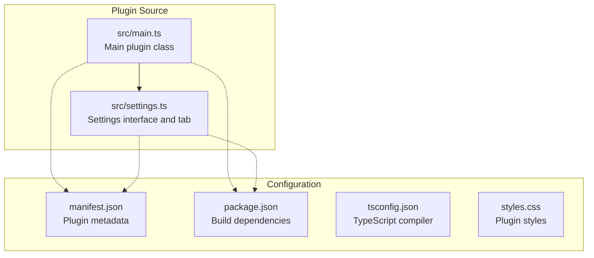
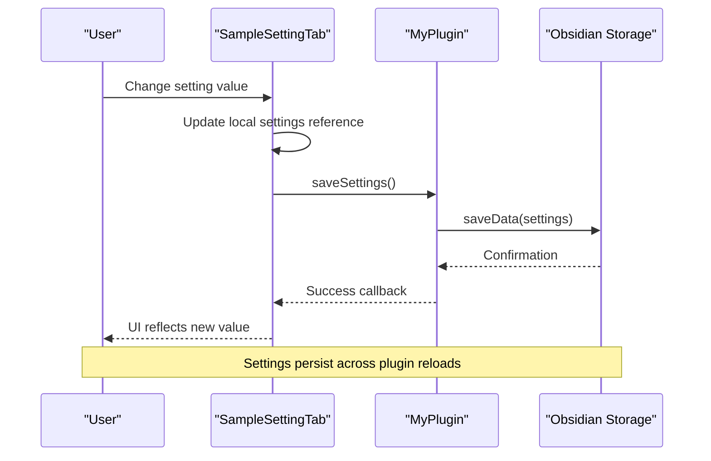
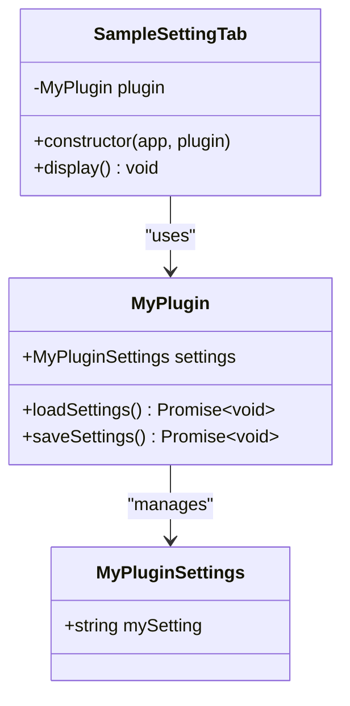
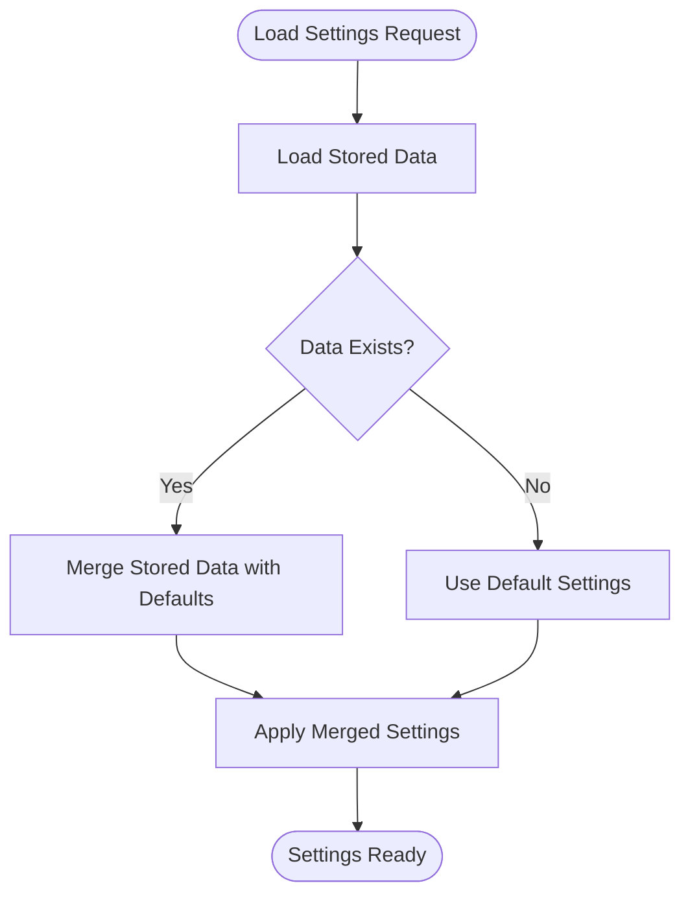
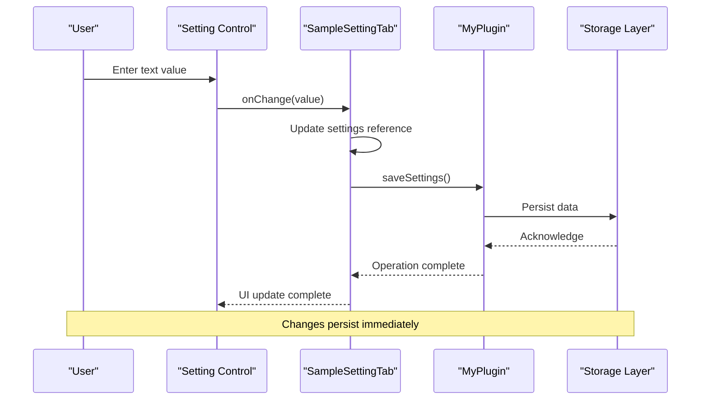
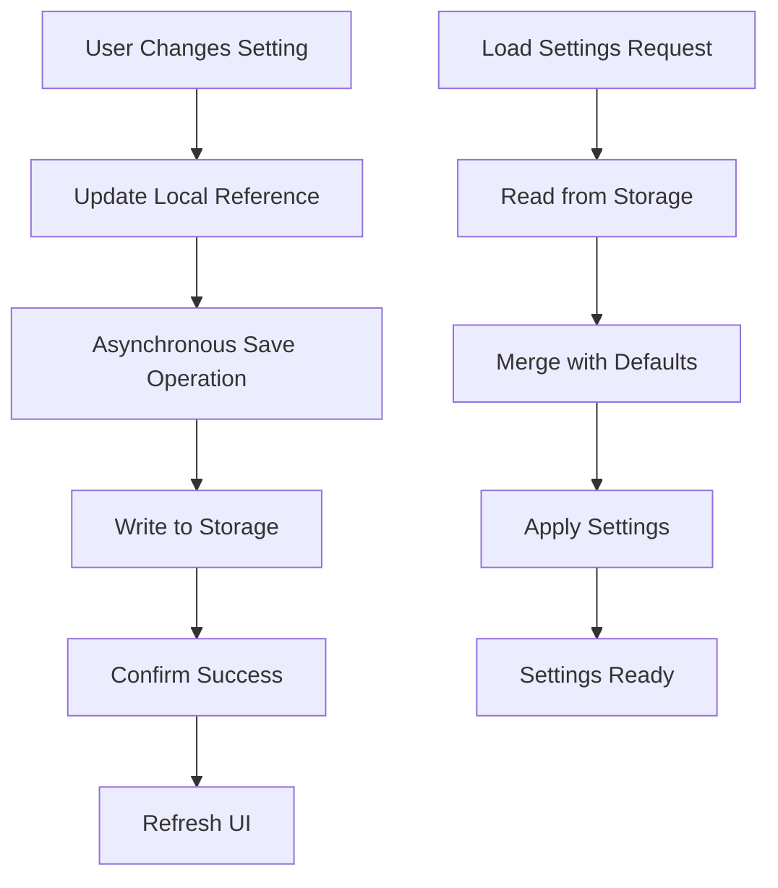
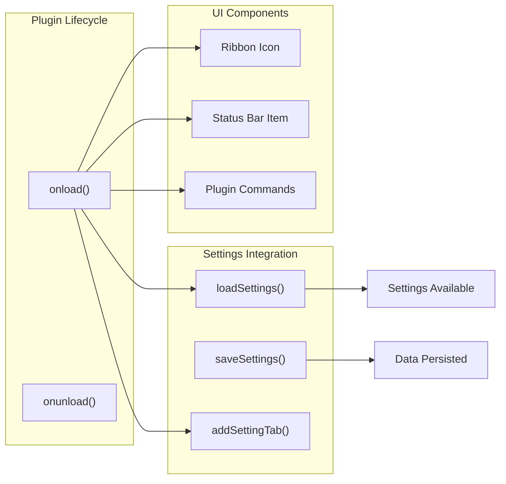
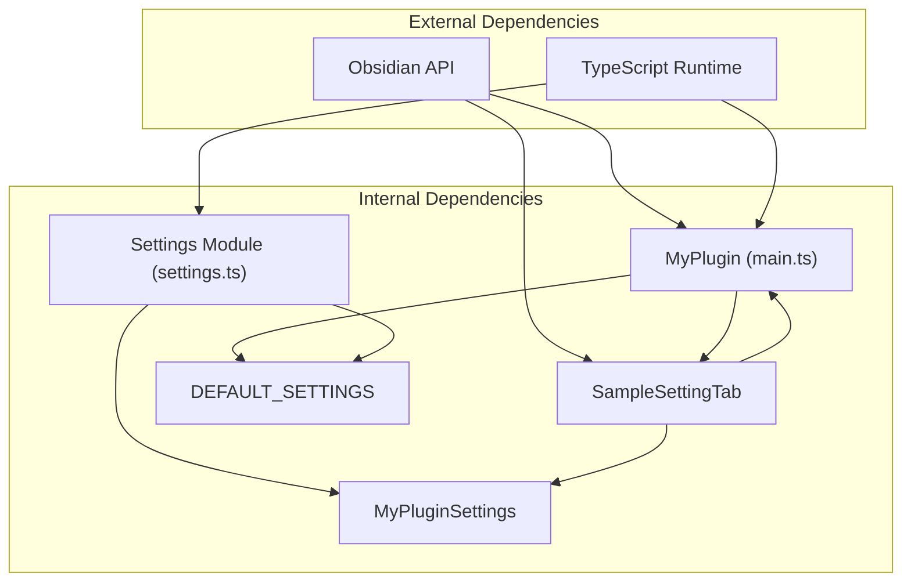

# Settings Management

<cite>
**Referenced Files in This Document**
- [src/settings.ts](file://src/settings.ts)
- [src/main.ts](file://src/main.ts)
- [manifest.json](file://manifest.json)
- [package.json](file://package.json)
- [README.md](file://README.md)
- [tsconfig.json](file://tsconfig.json)
- [styles.css](file://styles.css)
</cite>

## Table of Contents
1. [Introduction](#introduction)
2. [Project Structure](#project-structure)
3. [Core Components](#core-components)
4. [Architecture Overview](#architecture-overview)
5. [Detailed Component Analysis](#detailed-component-analysis)
6. [Dependency Analysis](#dependency-analysis)
7. [Performance Considerations](#performance-considerations)
8. [Troubleshooting Guide](#troubleshooting-guide)
9. [Conclusion](#conclusion)

## Introduction
This document provides comprehensive documentation for the settings management system in the Obsidian plugin. It covers the interface definition, default values configuration, settings tab implementation, and persistence mechanisms. The system follows Obsidian's plugin architecture patterns and demonstrates how to implement settings with validation, user input handling, and dynamic UI updates.

## Project Structure
The settings management system is implemented across two primary files within the `src` directory, complemented by configuration files that define the plugin metadata and build process.

**Diagram sources**
- [src/main.ts:1-100](file://src/main.ts#L1-L100)
- [src/settings.ts:1-37](file://src/settings.ts#L1-L37)
- [manifest.json:1-12](file://manifest.json#L1-L12)
- [package.json:1-30](file://package.json#L1-L30)

**Section sources**
- [src/main.ts:1-100](file://src/main.ts#L1-L100)
- [src/settings.ts:1-37](file://src/settings.ts#L1-L37)
- [manifest.json:1-12](file://manifest.json#L1-L12)
- [package.json:1-30](file://package.json#L1-L30)

## Core Components
The settings management system consists of three fundamental components that work together to provide persistent configuration storage and user interface integration.

### MyPluginSettings Interface
The `MyPluginSettings` interface defines the contract for all plugin configuration properties. It establishes a strongly-typed structure that ensures type safety throughout the application.

Key characteristics:
- Defines a single configuration property `mySetting` of type string
- Serves as the foundation for all settings-related operations
- Enables compile-time validation of settings access patterns

### DEFAULT_SETTINGS Configuration
The `DEFAULT_SETTINGS` constant provides baseline configuration values that are applied when no persisted settings exist or when specific properties are missing from stored data.

Implementation details:
- Contains a single property `mySetting` with default value 'default'
- Used as the fallback when loading settings from storage
- Ensures consistent initialization behavior across plugin instances

### SampleSettingTab Implementation
The `SampleSettingTab` class extends Obsidian's `PluginSettingTab` to create a custom settings interface within the Obsidian settings panel.

Core functionality:
- Inherits from `PluginSettingTab` to integrate with Obsidian's settings framework
- Provides a `display` method that renders the settings UI
- Implements real-time input handling with immediate persistence
- Maintains a reference to the parent plugin instance for data synchronization

**Section sources**
- [src/settings.ts:4-10](file://src/settings.ts#L4-L10)
- [src/settings.ts:12-36](file://src/settings.ts#L12-L36)

## Architecture Overview
The settings management system follows a layered architecture that separates concerns between data persistence, user interface, and plugin integration.

**Diagram sources**
- [src/settings.ts:20-35](file://src/settings.ts#L20-L35)
- [src/main.ts:76-82](file://src/main.ts#L76-L82)

The architecture ensures that:
- Settings changes are immediately reflected in the UI
- Data persistence occurs asynchronously to prevent blocking the UI thread
- The system maintains backward compatibility with default values

## Detailed Component Analysis

### Settings Interface Definition
The `MyPluginSettings` interface serves as the type-safe contract for all plugin configuration data. This interface-based approach provides several benefits:

**Diagram sources**
- [src/settings.ts:4-6](file://src/settings.ts#L4-L6)
- [src/settings.ts:12-18](file://src/settings.ts#L12-L18)
- [src/main.ts:6-8](file://src/main.ts#L6-L8)

**Section sources**
- [src/settings.ts:4-6](file://src/settings.ts#L4-L6)

### Default Values Configuration
The `DEFAULT_SETTINGS` constant provides a structured approach to managing default configuration values:

**Diagram sources**
- [src/main.ts:76-78](file://src/main.ts#L76-L78)
- [src/settings.ts:8-10](file://src/settings.ts#L8-L10)

The merge strategy ensures that:
- Missing properties receive default values
- Existing user preferences are preserved
- Type safety is maintained throughout the process

**Section sources**
- [src/settings.ts:8-10](file://src/settings.ts#L8-L10)
- [src/main.ts:76-78](file://src/main.ts#L76-L78)

### Settings Tab Implementation
The `SampleSettingTab` class implements a sophisticated settings interface that demonstrates modern UI patterns:

**Diagram sources**
- [src/settings.ts:20-35](file://src/settings.ts#L20-L35)
- [src/main.ts:76-82](file://src/main.ts#L76-L82)

Key implementation patterns:
- Real-time input validation and persistence
- Immediate UI feedback for user actions
- Asynchronous storage operations to maintain responsiveness
- Strong typing for all user interactions

**Section sources**
- [src/settings.ts:20-35](file://src/settings.ts#L20-L35)

### Persistence Mechanisms
The settings persistence system utilizes Obsidian's built-in data management capabilities:

**Diagram sources**
- [src/main.ts:76-82](file://src/main.ts#L76-L82)

The persistence mechanism ensures:
- Non-blocking user interactions during save operations
- Automatic conflict resolution through merge strategy
- Reliable data recovery across plugin reloads

**Section sources**
- [src/main.ts:76-82](file://src/main.ts#L76-L82)

### Integration with Main Plugin Class
The main plugin class integrates settings management through lifecycle methods and command registration:

**Diagram sources**
- [src/main.ts:9-71](file://src/main.ts#L9-L71)
- [src/main.ts:76-82](file://src/main.ts#L76-L82)

**Section sources**
- [src/main.ts:9-71](file://src/main.ts#L9-L71)
- [src/main.ts:76-82](file://src/main.ts#L76-L82)

## Dependency Analysis
The settings management system exhibits clean dependency relationships that promote maintainability and extensibility.

**Diagram sources**
- [src/main.ts:1-100](file://src/main.ts#L1-L100)
- [src/settings.ts:1-37](file://src/settings.ts#L1-L37)

The dependency structure ensures:
- Loose coupling between components
- Clear separation of concerns
- Easy extensibility for additional settings
- Minimal external dependencies

**Section sources**
- [src/main.ts:1-100](file://src/main.ts#L1-L100)
- [src/settings.ts:1-37](file://src/settings.ts#L1-L37)

## Performance Considerations
The settings management system incorporates several performance optimizations:

### Asynchronous Operations
- Settings saves occur asynchronously to prevent UI blocking
- Load operations use merge strategy to minimize computation overhead
- Storage operations leverage Obsidian's optimized persistence layer

### Memory Management
- Settings are loaded once during plugin initialization
- References to settings are maintained throughout plugin lifecycle
- No unnecessary data duplication or caching

### User Experience
- Immediate UI feedback for user interactions
- Non-blocking operations during settings changes
- Consistent state management across plugin reloads

## Troubleshooting Guide

### Common Issues and Solutions

**Settings Not Persisting**
- Verify that `saveSettings()` is being called after user input changes
- Check that the settings tab is properly integrated with the main plugin class
- Ensure that storage permissions are available in the Obsidian environment

**Default Values Not Applied**
- Confirm that `DEFAULT_SETTINGS` contains all required properties
- Verify that the merge strategy in `loadSettings()` is functioning correctly
- Check for typos in property names that might cause mismatches

**UI Not Updating**
- Ensure that the settings tab's `onChange` handler updates the plugin's settings reference
- Verify that `saveSettings()` is awaited appropriately
- Check that the container element is properly emptied before re-rendering

**Type Safety Errors**
- Confirm that all settings properties are defined in the `MyPluginSettings` interface
- Verify that default values match the expected data types
- Ensure that TypeScript compilation succeeds without errors

**Section sources**
- [src/settings.ts:20-35](file://src/settings.ts#L20-L35)
- [src/main.ts:76-82](file://src/main.ts#L76-L82)

## Conclusion
The settings management system demonstrates a robust implementation of Obsidian plugin configuration that balances simplicity with functionality. The system provides:

- **Type Safety**: Strongly-typed interfaces ensure reliable settings access
- **Persistence**: Automatic data storage and retrieval across plugin sessions
- **User Experience**: Immediate feedback and responsive UI interactions
- **Extensibility**: Clean architecture that supports easy addition of new settings
- **Maintainability**: Clear separation of concerns and minimal dependencies

The implementation follows Obsidian's recommended patterns while providing a solid foundation for more complex settings scenarios. The modular design allows for easy extension with additional settings categories, validation rules, and advanced UI controls.