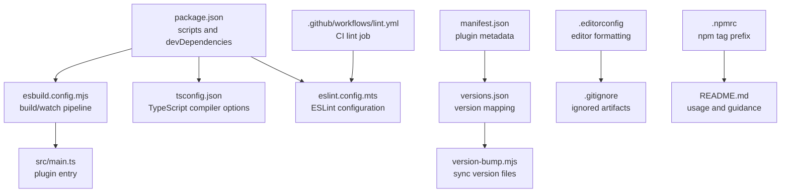
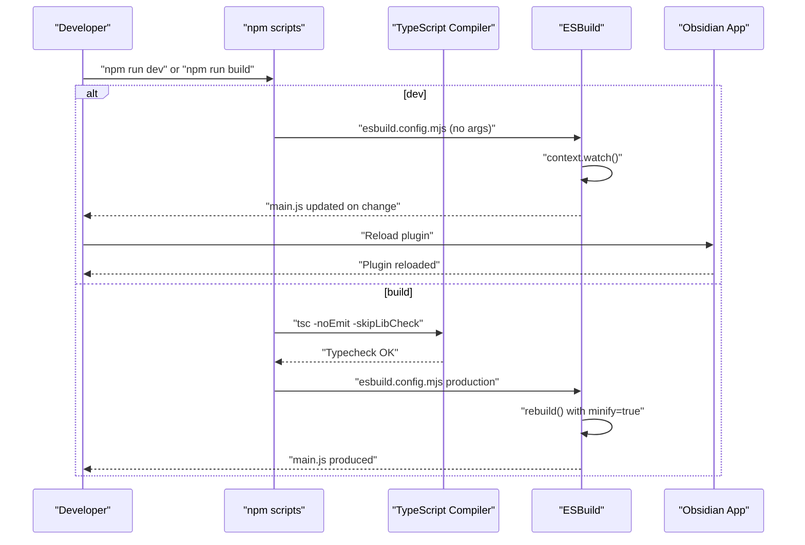
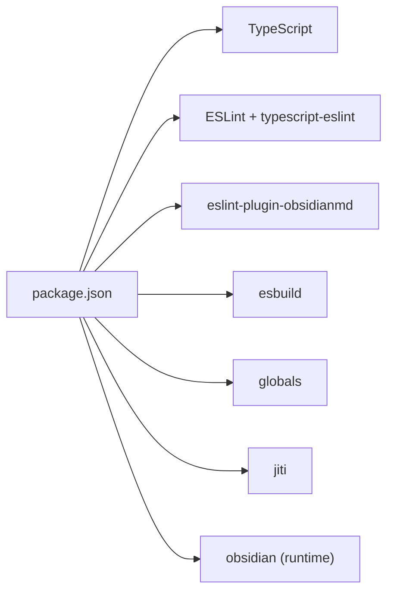

# Development Tools & Configuration

<cite>
**Referenced Files in This Document**
- [package.json](file://package.json)
- [tsconfig.json](file://tsconfig.json)
- [esbuild.config.mjs](file://esbuild.config.mjs)
- [eslint.config.mts](file://eslint.config.mts)
- [.github/workflows/lint.yml](file://.github/workflows/lint.yml)
- [manifest.json](file://manifest.json)
- [version-bump.mjs](file://version-bump.mjs)
- [versions.json](file://versions.json)
- [src/main.ts](file://src/main.ts)
- [src/settings.ts](file://src/settings.ts)
- [.editorconfig](file://.editorconfig)
- [.gitignore](file://.gitignore)
- [.npmrc](file://.npmrc)
- [README.md](file://README.md)
</cite>

## Table of Contents
1. [Introduction](#introduction)
2. [Project Structure](#project-structure)
3. [Core Components](#core-components)
4. [Architecture Overview](#architecture-overview)
5. [Detailed Component Analysis](#detailed-component-analysis)
6. [Dependency Analysis](#dependency-analysis)
7. [Performance Considerations](#performance-considerations)
8. [Troubleshooting Guide](#troubleshooting-guide)
9. [Conclusion](#conclusion)
10. [Appendices](#appendices)

## Introduction
This document explains the development infrastructure and tooling used in the sample Obsidian plugin. It covers the build system (TypeScript compilation and ESBuild bundling), code quality tools (ESLint with Obsidian-specific rules), development workflow (watch mode and hot reloading), GitHub Actions automation, and configuration options for different environments. It also provides guidance on extending the toolchain for additional needs.

## Project Structure
The repository follows a minimal, focused layout typical of an Obsidian plugin:
- Source code resides under src/, including the main plugin entry and settings UI.
- Build and linting configurations live at the repository root.
- CI is configured via a GitHub Actions workflow.
- Versioning metadata is managed by manifest.json and versions.json, with a small script to keep them synchronized.

**Diagram sources**
- [package.json:1-30](file://package.json#L1-L30)
- [esbuild.config.mjs:1-50](file://esbuild.config.mjs#L1-L50)
- [tsconfig.json:1-31](file://tsconfig.json#L1-L31)
- [eslint.config.mts:1-35](file://eslint.config.mts#L1-L35)
- [.github/workflows/lint.yml:1-29](file://.github/workflows/lint.yml#L1-L29)
- [manifest.json:1-12](file://manifest.json#L1-L12)
- [versions.json:1-4](file://versions.json#L1-L4)
- [version-bump.mjs:1-18](file://version-bump.mjs#L1-L18)
- [.editorconfig:1-11](file://.editorconfig#L1-L11)
- [.gitignore:1-23](file://.gitignore#L1-L23)
- [.npmrc:1-1](file://.npmrc#L1-L1)
- [README.md:1-91](file://README.md#L1-L91)

**Section sources**
- [package.json:1-30](file://package.json#L1-L30)
- [README.md:1-91](file://README.md#L1-L91)

## Core Components
- Build system: TypeScript compilation and ESBuild bundling with watch mode for development and production minification.
- Code quality: ESLint with TypeScript and Obsidian-specific rules, plus CI enforcement.
- Versioning: Automated synchronization between manifest.json and versions.json.
- Environment configuration: EditorConfig, Git ignore, and NPM settings.

Key responsibilities:
- package.json: Defines scripts, devDependencies, and runtime dependency on obsidian.
- tsconfig.json: Configures TypeScript strictness and module resolution.
- esbuild.config.mjs: Orchestrates bundling, externalization of Electron/Codemirror modules, and watch/rebuild modes.
- eslint.config.mts: Sets up ESLint with Obsidian plugin rules and ignores generated/bundled files.
- .github/workflows/lint.yml: Runs lint checks on multiple Node.js versions.
- version-bump.mjs and versions.json: Keep version metadata consistent across files.

**Section sources**
- [package.json:1-30](file://package.json#L1-L30)
- [tsconfig.json:1-31](file://tsconfig.json#L1-L31)
- [esbuild.config.mjs:1-50](file://esbuild.config.mjs#L1-L50)
- [eslint.config.mts:1-35](file://eslint.config.mts#L1-L35)
- [.github/workflows/lint.yml:1-29](file://.github/workflows/lint.yml#L1-L29)
- [version-bump.mjs:1-18](file://version-bump.mjs#L1-L18)
- [versions.json:1-4](file://versions.json#L1-L4)

## Architecture Overview
The development workflow centers around a single ESBuild context that either watches for changes (development) or performs a one-off production build (production). TypeScript compiles sources to JavaScript, while ESBuild bundles and externalizes heavy dependencies to reduce bundle size and align with Obsidian’s runtime.

**Diagram sources**
- [package.json:7-12](file://package.json#L7-L12)
- [esbuild.config.mjs:12-49](file://esbuild.config.mjs#L12-L49)
- [tsconfig.json:1-31](file://tsconfig.json#L1-L31)

## Detailed Component Analysis

### TypeScript Compilation Settings
- Module and target: ESNext module with ES6 target for broad compatibility.
- Strictness: Enabled strict null checks, strict bind/call/apply, and catch-all unknowns in catch blocks.
- Resolution: Node module resolution for predictable imports.
- Libraries: DOM, ES5, ES6, and ES7 to match Obsidian’s runtime expectations.
- Source maps: Inline source maps enabled for development to aid debugging.

Practical impact:
- Ensures robust type safety and reduces runtime errors.
- Aligns with Obsidian’s browser-like environment and Electron constraints.

**Section sources**
- [tsconfig.json:1-31](file://tsconfig.json#L1-L31)

### ESBuild Setup and Bundling
- Entry point: src/main.ts.
- Output: main.js in CJS format for Node/Electron compatibility.
- External dependencies: obsidian, electron, and Codemirror packages are marked external to avoid bundling them.
- Target: es2018 to support older Electron versions.
- Watch vs production:
  - Development: inline sourcemaps, tree shaking, and watch mode.
  - Production: no sourcemaps, minified output, and a single rebuild.
- Banner: Generated file header discouraging manual edits.

Practical impact:
- Fast incremental builds during development.
- Smaller, compatible bundles for distribution.

**Section sources**
- [esbuild.config.mjs:1-50](file://esbuild.config.mjs#L1-L50)

### Package Scripts and Their Purposes
- dev: Starts ESBuild watch mode for rapid iteration.
- build: Type-checks with tsc, then runs ESBuild in production mode to produce a minified bundle.
- version: Runs the version-bump script and stages manifest.json and versions.json for commit.
- lint: Executes ESLint across the repository.

These scripts integrate TypeScript, ESBuild, and linting into a cohesive workflow.

**Section sources**
- [package.json:7-12](file://package.json#L7-L12)

### ESLint Configuration and Obsidian Rules
- Parser and globals: Uses TypeScript parser with browser globals.
- Project service: Enables project-service-based inference for ESLint.
- Obsidian plugin rules: Extends recommended Obsidian plugin rules.
- Ignores: Excludes node_modules, dist, generated/bundled files, and build artifacts.

CI integration:
- The GitHub Actions workflow runs lint checks on multiple Node.js versions to ensure consistent code quality.

**Section sources**
- [eslint.config.mts:1-35](file://eslint.config.mts#L1-L35)
- [.github/workflows/lint.yml:18-27](file://.github/workflows/lint.yml#L18-L27)

### Versioning and Release Metadata
- manifest.json: Contains plugin identity, version, and minimum Obsidian version.
- versions.json: Maps plugin versions to minimum Obsidian versions for compatibility.
- version-bump.mjs: Synchronizes manifest.json and versions.json when package version changes.

Release guidance:
- README documents how to bump versions and publish releases, including uploading required assets.

**Section sources**
- [manifest.json:1-12](file://manifest.json#L1-L12)
- [versions.json:1-4](file://versions.json#L1-L4)
- [version-bump.mjs:1-18](file://version-bump.mjs#L1-L18)
- [README.md:29-38](file://README.md#L29-L38)

### Development Workflow and Hot Reloading
- Development loop: npm run dev starts ESBuild watch mode; changes to src/* trigger recompilation to main.js.
- Obsidian reload: After main.js is updated, reload the plugin in Obsidian to apply changes.
- Production build: npm run build performs type-checking and a minified ESBuild build.

Environment notes:
- .editorconfig ensures consistent formatting across editors.
- .gitignore excludes compiled artifacts and IDE state to keep the repository clean.

**Section sources**
- [README.md:15-28](file://README.md#L15-L28)
- [esbuild.config.mjs:44-49](file://esbuild.config.mjs#L44-L49)
- [.gitignore:11-16](file://.gitignore#L11-L16)
- [.editorconfig:1-11](file://.editorconfig#L1-L11)

### GitHub Actions Automation
- Triggers: Runs on pushes and pull requests to all branches.
- Matrix: Tests Node.js versions 20.x and 22.x.
- Steps: Checks out code, sets up Node.js with npm caching, installs dependencies, runs build (if present), and runs lint.

Benefits:
- Enforces consistent code quality across contributions.
- Validates compatibility across Node.js versions.

**Section sources**
- [.github/workflows/lint.yml:1-29](file://.github/workflows/lint.yml#L1-L29)

### Source Modules Overview
- src/main.ts: Implements the plugin lifecycle, commands, UI integrations, and settings tab registration.
- src/settings.ts: Defines plugin settings interface, defaults, and a settings tab UI.

These files demonstrate Obsidian plugin patterns and serve as the primary targets for development.

**Section sources**
- [src/main.ts:1-100](file://src/main.ts#L1-L100)
- [src/settings.ts:1-37](file://src/settings.ts#L1-L37)

## Dependency Analysis
The toolchain relies on a small set of focused dependencies:
- TypeScript and TypeScript ESLint for type-safe linting.
- ESBuild for fast bundling and watch mode.
- Obsidian plugin rules for Obsidian-specific linting guidance.
- Globals for browser globals in ESLint.
- jiti for modern ESLint config loading.

**Diagram sources**
- [package.json:15-28](file://package.json#L15-L28)

**Section sources**
- [package.json:15-28](file://package.json#L15-L28)

## Performance Considerations
- ESBuild watch mode: Provides near-instant rebuilds during development by leveraging incremental compilation and tree shaking.
- Externalized dependencies: Marking obsidian and Codemirror as external avoids bundling large libraries, reducing bundle size and build time.
- Minification: Production builds enable minification to reduce payload size for distribution.
- Sourcemaps: Inline sourcemaps are used in development for debugging; disabled in production to reduce artifact size.

[No sources needed since this section provides general guidance]

## Troubleshooting Guide
Common issues and resolutions:
- TypeScript errors during build:
  - Cause: Strict TypeScript settings flag potential issues.
  - Fix: Review type errors reported by tsc and adjust code to satisfy strict checks.
  - Reference: [tsconfig.json:9-19](file://tsconfig.json#L9-L19)
- ESBuild fails to resolve modules:
  - Cause: Missing or incorrect external declarations.
  - Fix: Ensure obsidian and Electron-related modules remain external; verify entry points and module resolution.
  - Reference: [esbuild.config.mjs:20-34](file://esbuild.config.mjs#L20-L34)
- Lint failures:
  - Cause: Obsidian-specific or style violations.
  - Fix: Run npm run lint and address reported issues; confirm ESLint config applies to TypeScript files.
  - Reference: [eslint.config.mts:6-34](file://eslint.config.mts#L6-L34)
- Version mismatch:
  - Cause: Out-of-sync manifest.json and versions.json.
  - Fix: Use npm version to bump and run the version-bump script; stage updated files.
  - Reference: [version-bump.mjs:1-18](file://version-bump.mjs#L1-L18), [README.md:37-38](file://README.md#L37-L38)
- CI lint failures:
  - Cause: Node.js version differences or missing dependencies.
  - Fix: Ensure Node.js versions 20.x and 22.x are supported locally; run npm ci and npm run lint.
  - Reference: [.github/workflows/lint.yml:15-27](file://.github/workflows/lint.yml#L15-L27)

**Section sources**
- [tsconfig.json:9-19](file://tsconfig.json#L9-L19)
- [esbuild.config.mjs:20-34](file://esbuild.config.mjs#L20-L34)
- [eslint.config.mts:6-34](file://eslint.config.mts#L6-L34)
- [version-bump.mjs:1-18](file://version-bump.mjs#L1-L18)
- [README.md:37-38](file://README.md#L37-L38)
- [.github/workflows/lint.yml:15-27](file://.github/workflows/lint.yml#L15-L27)

## Conclusion
The sample plugin’s development infrastructure combines TypeScript for type safety, ESBuild for fast bundling and watch mode, and ESLint with Obsidian-specific rules for code quality. The GitHub Actions workflow enforces linting across Node.js versions. The versioning pipeline keeps release metadata consistent. Together, these tools provide a streamlined, reliable development experience for building Obsidian plugins.

[No sources needed since this section summarizes without analyzing specific files]

## Appendices

### Appendix A: Environment Configuration Options
- EditorConfig: Ensures consistent line endings, indentation, and encoding across editors.
  - Reference: [.editorconfig:1-11](file://.editorconfig#L1-L11)
- Git Ignore: Excludes compiled artifacts, IDE state, and temporary files.
  - Reference: [.gitignore:11-16](file://.gitignore#L11-L16)
- NPM RC: Removes the default tag version prefix for cleaner tagging.
  - Reference: [.npmrc:1-1](file://.npmrc#L1-L1)

**Section sources**
- [.editorconfig:1-11](file://.editorconfig#L1-L11)
- [.gitignore:11-16](file://.gitignore#L11-L16)
- [.npmrc:1-1](file://.npmrc#L1-L1)

### Appendix B: Extending the Toolchain
- Add new lint rules or plugins:
  - Extend eslint.config.mts with additional configs or plugins.
  - Reference: [eslint.config.mts:1-35](file://eslint.config.mts#L1-L35)
- Introduce additional build steps:
  - Add new scripts in package.json and chain them with ESBuild or TypeScript.
  - Reference: [package.json:7-12](file://package.json#L7-L12)
- Customize bundling:
  - Adjust esbuild.config.mjs entryPoints, external modules, or output format as needed.
  - Reference: [esbuild.config.mjs:14-42](file://esbuild.config.mjs#L14-L42)
- Versioning enhancements:
  - Modify version-bump.mjs to update additional metadata or integrate with CI release workflows.
  - Reference: [version-bump.mjs:1-18](file://version-bump.mjs#L1-L18)

**Section sources**
- [eslint.config.mts:1-35](file://eslint.config.mts#L1-L35)
- [package.json:7-12](file://package.json#L7-L12)
- [esbuild.config.mjs:14-42](file://esbuild.config.mjs#L14-L42)
- [version-bump.mjs:1-18](file://version-bump.mjs#L1-L18)