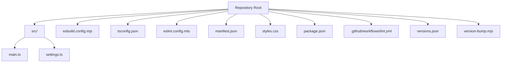

# Getting Started

<cite>
**Referenced Files in This Document**
- [README.md](file://README.md)
- [package.json](file://package.json)
- [manifest.json](file://manifest.json)
- [esbuild.config.mjs](file://esbuild.config.mjs)
- [tsconfig.json](file://tsconfig.json)
- [eslint.config.mts](file://eslint.config.mts)
- [src/main.ts](file://src/main.ts)
- [src/settings.ts](file://src/settings.ts)
- [styles.css](file://styles.css)
- [version-bump.mjs](file://version-bump.mjs)
- [versions.json](file://versions.json)
- [.github/workflows/lint.yml](file://.github/workflows/lint.yml)
</cite>

## Table of Contents
1. [Introduction](#introduction)
2. [Project Structure](#project-structure)
3. [Installation Prerequisites](#installation-prerequisites)
4. [Development Workflow](#development-workflow)
5. [Manual Installation](#manual-installation)
6. [Release Process](#release-process)
7. [Troubleshooting Guide](#troubleshooting-guide)
8. [Conclusion](#conclusion)

## Introduction
This document helps you get started with the Obsidian Sample Plugin, a learning template designed for new plugin developers. It covers everything from prerequisites and setup to development workflow, testing, manual installation, and releasing your plugin. The project demonstrates core plugin API capabilities such as adding ribbon icons, commands, a settings tab, global event registration, and periodic intervals.

## Project Structure
At a high level, the repository is organized around a minimal yet complete plugin scaffold:
- Source code lives under src/, with the main plugin entry point in src/main.ts and a settings module in src/settings.ts.
- Build and bundling are handled by esbuild via esbuild.config.mjs, producing main.js.
- TypeScript configuration is defined in tsconfig.json.
- Linting is configured with eslint.config.mts and enforced by a GitHub Actions workflow.
- The plugin metadata is defined in manifest.json, and styling is optional in styles.css.
- Version management utilities include version-bump.mjs and versions.json.

**Diagram sources**
- [package.json:1-30](file://package.json#L1-L30)
- [manifest.json:1-12](file://manifest.json#L1-L12)
- [esbuild.config.mjs:1-50](file://esbuild.config.mjs#L1-L50)
- [tsconfig.json:1-31](file://tsconfig.json#L1-L31)
- [eslint.config.mts:1-35](file://eslint.config.mts#L1-L35)
- [src/main.ts:1-100](file://src/main.ts#L1-L100)
- [src/settings.ts:1-37](file://src/settings.ts#L1-L37)
- [styles.css:1-9](file://styles.css#L1-L9)
- [versions.json:1-4](file://versions.json#L1-L4)
- [version-bump.mjs:1-18](file://version-bump.mjs#L1-L18)
- [.github/workflows/lint.yml:1-29](file://.github/workflows/lint.yml#L1-L29)

**Section sources**
- [README.md:1-91](file://README.md#L1-L91)
- [package.json:1-30](file://package.json#L1-L30)
- [manifest.json:1-12](file://manifest.json#L1-L12)
- [esbuild.config.mjs:1-50](file://esbuild.config.mjs#L1-L50)
- [tsconfig.json:1-31](file://tsconfig.json#L1-L31)
- [eslint.config.mts:1-35](file://eslint.config.mts#L1-L35)
- [src/main.ts:1-100](file://src/main.ts#L1-L100)
- [src/settings.ts:1-37](file://src/settings.ts#L1-L37)
- [styles.css:1-9](file://styles.css#L1-L9)
- [versions.json:1-4](file://versions.json#L1-L4)
- [version-bump.mjs:1-18](file://version-bump.mjs#L1-L18)
- [.github/workflows/lint.yml:1-29](file://.github/workflows/lint.yml#L1-L29)

## Installation Prerequisites
Before you begin, ensure your environment meets the following requirements:
- Node.js: The project requires a modern Node.js runtime. The quick-start guide recommends Node.js v16 or newer, and the CI workflow runs on Node.js 20.x and 22.x, indicating broader compatibility.
- Git: Required to clone the repository locally.
- Obsidian: Install Obsidian on your machine to test the plugin during development.

Key setup steps:
- Clone the repository to your local machine.
- Install dependencies using npm or yarn.
- Start the development server in watch mode to enable hot reloading.

For detailed steps, refer to the quick-start section in the repository’s README.

**Section sources**
- [README.md:47-57](file://README.md#L47-L57)
- [README.md:50-52](file://README.md#L50-L52)
- [.github/workflows/lint.yml:15-16](file://.github/workflows/lint.yml#L15-L16)

## Development Workflow
The typical development workflow follows these steps:
1. Install dependencies: run the package manager install script defined in package.json.
2. Start the development server: run the dev script to compile TypeScript to JavaScript with esbuild in watch mode.
3. Edit source files: modify src/main.ts or add new TypeScript files; changes are automatically compiled to main.js.
4. Reload Obsidian: reload Obsidian to load the updated plugin.
5. Enable the plugin: open Obsidian settings and enable your plugin.
6. Iterate: continue editing and reloading until satisfied.

Build and watch behavior:
- The dev script invokes esbuild with a configuration that bundles src/main.ts into main.js.
- Watch mode rebuilds on file changes, enabling hot reloading during development.
- Production builds can be generated using the build script, which runs TypeScript checks and then builds with minification.

TypeScript configuration:
- The tsconfig.json sets module and target to ESNext/ES6, enables strictness, and includes source maps for debugging.

Linting:
- ESLint is configured via eslint.config.mts with Obsidian-specific rules and ignores certain generated or build artifacts.
- You can run npm run lint to check code quality.

**Section sources**
- [README.md:15-27](file://README.md#L15-L27)
- [README.md:50-52](file://README.md#L50-L52)
- [package.json:7-12](file://package.json#L7-L12)
- [esbuild.config.mjs:14-49](file://esbuild.config.mjs#L14-L49)
- [tsconfig.json:2-26](file://tsconfig.json#L2-L26)
- [eslint.config.mts:6-34](file://eslint.config.mts#L6-L34)

## Manual Installation
To manually install the plugin into an Obsidian vault:
1. Build the plugin (if not already built) using the build script.
2. Copy the following files into your vault’s plugins directory under a folder named with your plugin’s ID:
   - main.js
   - styles.css
   - manifest.json
3. Restart Obsidian or reload plugins.
4. Enable the plugin in Obsidian settings.

Notes:
- The plugin ID is defined in manifest.json and used as the folder name in the vault’s plugins directory.
- If your plugin does not require custom styles, you can skip copying styles.css.

**Section sources**
- [README.md:54-57](file://README.md#L54-L57)
- [manifest.json:2-3](file://manifest.json#L2-L3)

## Release Process
When preparing a new release:
1. Update manifest.json with the new version number and the minimum Obsidian version required.
2. Update versions.json to include the new version and its minimum Obsidian version mapping.
3. Create a GitHub release with the exact version number as the tag.
4. Attach the following files to the release:
   - manifest.json
   - main.js
   - styles.css
5. Publish the release.

Automating version bumps:
- The project includes a version-bump.mjs script that updates manifest.json and versions.json when the package version changes.
- The package.json script version runs this utility and stages the updated files for commit.

**Section sources**
- [README.md:29-38](file://README.md#L29-L38)
- [version-bump.mjs:1-18](file://version-bump.mjs#L1-L18)
- [package.json:10-10](file://package.json#L10-L10)
- [versions.json:1-4](file://versions.json#L1-L4)
- [manifest.json:4-5](file://manifest.json#L4-L5)

## Troubleshooting Guide
Common setup and development issues:
- Node.js version mismatch: Ensure your Node.js version satisfies the minimum requirement. The quick-start guide recommends v16+, and the CI workflow runs on 20.x and 22.x.
- Dependencies not installed: Run the package manager install script defined in package.json to install devDependencies and dependencies.
- Build fails due to TypeScript errors: Review the TypeScript configuration in tsconfig.json and fix type-related issues.
- Hot reload not working: Confirm that the dev script is running and that esbuild is watching for changes. Check that the watch configuration is active.
- Lint errors: Run npm run lint to identify issues flagged by ESLint with Obsidian-specific rules. Fix reported issues and re-run lint.
- Plugin not loading after manual installation: Verify that main.js, styles.css, and manifest.json are present in the vault’s plugin folder named with your plugin ID. Ensure the plugin is enabled in Obsidian settings.

**Section sources**
- [README.md:50-52](file://README.md#L50-L52)
- [README.md:58-62](file://README.md#L58-L62)
- [package.json:15-28](file://package.json#L15-L28)
- [esbuild.config.mjs:44-49](file://esbuild.config.mjs#L44-L49)
- [tsconfig.json:2-26](file://tsconfig.json#L2-L26)
- [eslint.config.mts:6-34](file://eslint.config.mts#L6-L34)
- [README.md:54-57](file://README.md#L54-L57)

## Conclusion
You now have the essentials to develop, test, and release an Obsidian plugin using this sample project. Use the development workflow to iterate quickly with hot reloading, rely on the provided scripts and configurations for building and linting, and follow the release process to publish updates. As you grow, extend the plugin by adding commands, UI elements, and settings tabs, and consult the Obsidian API documentation for advanced capabilities.