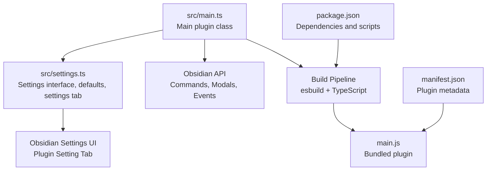
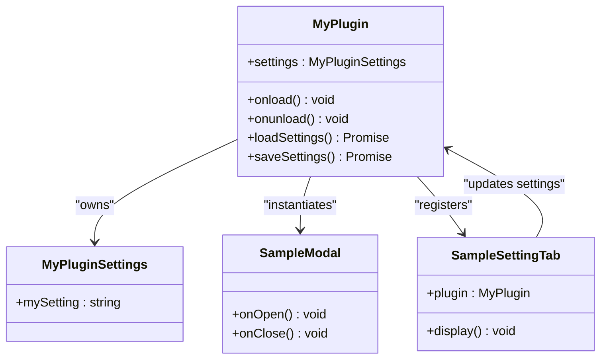
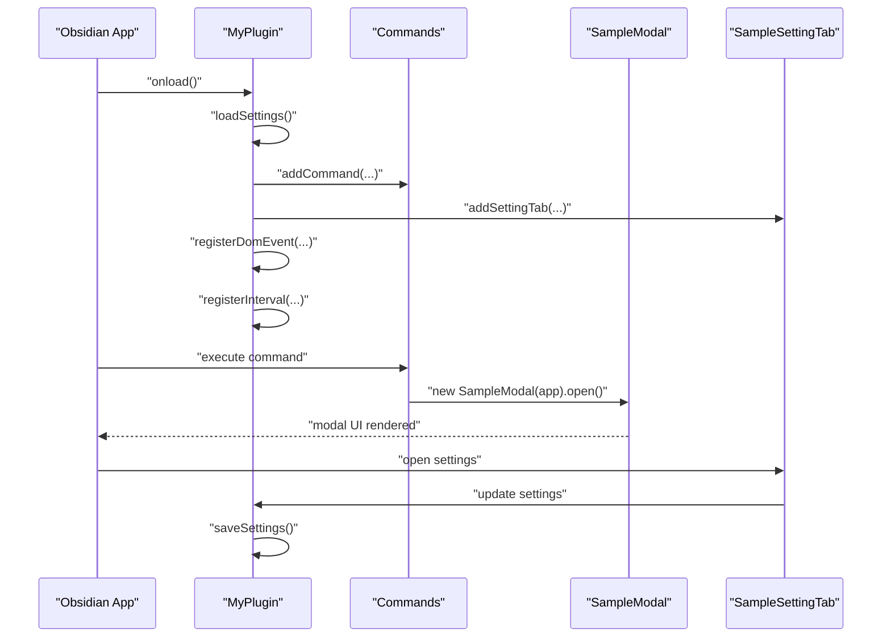
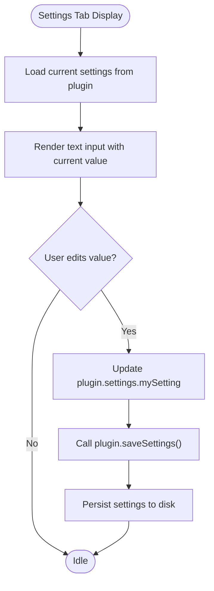
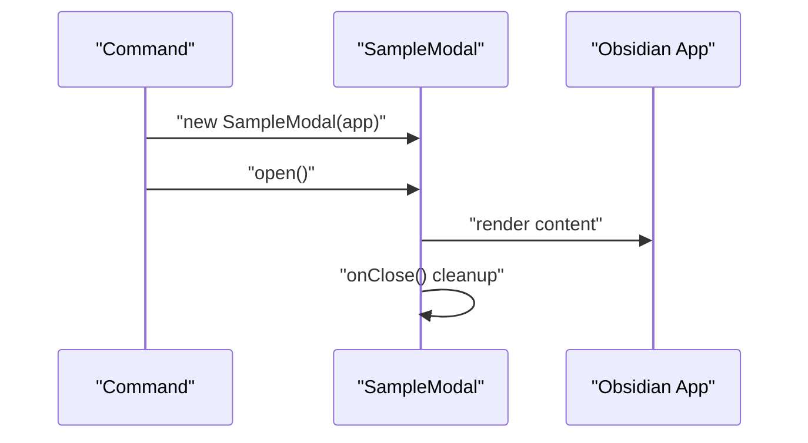
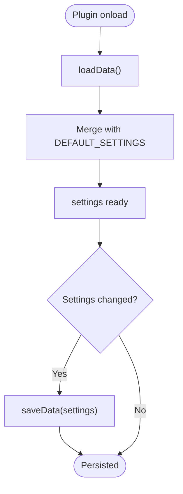
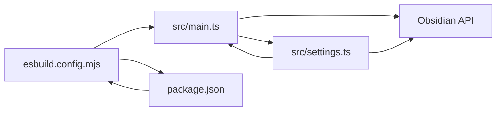

# Component Interactions

<cite>
**Referenced Files in This Document**
- [main.ts](file://src/main.ts)
- [settings.ts](file://src/settings.ts)
- [package.json](file://package.json)
- [manifest.json](file://manifest.json)
- [esbuild.config.mjs](file://esbuild.config.mjs)
- [tsconfig.json](file://tsconfig.json)
- [README.md](file://README.md)
- [AGENTS.md](file://AGENTS.md)
</cite>

## Table of Contents
1. [Introduction](#introduction)
2. [Project Structure](#project-structure)
3. [Core Components](#core-components)
4. [Architecture Overview](#architecture-overview)
5. [Detailed Component Analysis](#detailed-component-analysis)
6. [Dependency Analysis](#dependency-analysis)
7. [Performance Considerations](#performance-considerations)
8. [Troubleshooting Guide](#troubleshooting-guide)
9. [Conclusion](#conclusion)

## Introduction
This document explains how the plugin’s components interact internally, focusing on the collaboration between the main plugin class and settings management. It details the separation of concerns among UI components, settings management, and core plugin logic, and documents how commands, modals, and settings tabs integrate with the main plugin class. The goal is to help developers understand event propagation, callback mechanisms, state management, lifecycle coordination, and inter-component communication strategies.

## Project Structure
The plugin follows a minimal, layered architecture:
- Entry point: a single main plugin class that orchestrates lifecycle, commands, UI integrations, and settings registration.
- Settings module: defines the settings interface, defaults, and a settings tab UI that persists and reflects user preferences.
- Build and tooling: TypeScript compilation and bundling via esbuild, with strict compiler options and linting configuration.

**Diagram sources**
- [main.ts:1-100](file://src/main.ts#L1-L100)
- [settings.ts:1-37](file://src/settings.ts#L1-L37)
- [esbuild.config.mjs:1-50](file://esbuild.config.mjs#L1-L50)
- [package.json:1-30](file://package.json#L1-L30)
- [manifest.json:1-12](file://manifest.json#L1-L12)

**Section sources**
- [main.ts:1-100](file://src/main.ts#L1-L100)
- [settings.ts:1-37](file://src/settings.ts#L1-L37)
- [package.json:1-30](file://package.json#L1-L30)
- [manifest.json:1-12](file://manifest.json#L1-L12)
- [esbuild.config.mjs:1-50](file://esbuild.config.mjs#L1-L50)
- [tsconfig.json:1-31](file://tsconfig.json#L1-L31)

## Core Components
- Main plugin class: Implements plugin lifecycle, registers commands, integrates UI elements (ribbon icon, status bar), registers global DOM events and intervals, and manages settings persistence.
- Settings module: Defines the settings interface and defaults, and provides a settings tab UI that binds to the plugin’s settings state and persists changes.
- UI components: Includes a simple modal used by commands, demonstrating how UI components are instantiated and managed by the plugin.
- Build pipeline: Compiles TypeScript sources and bundles the plugin for distribution.

Key responsibilities:
- Main plugin class: Lifecycle orchestration, command registration, UI integration, event registration, and settings persistence.
- Settings module: Type-safe settings model, defaults, and a settings tab that updates the plugin’s settings and triggers persistence.
- UI components: Lightweight UI constructs (modals) that communicate with the plugin via the Obsidian API.

**Section sources**
- [main.ts:6-83](file://src/main.ts#L6-L83)
- [settings.ts:4-36](file://src/settings.ts#L4-L36)
- [README.md:8-13](file://README.md#L8-L13)

## Architecture Overview
The plugin adheres to a clean separation of concerns:
- Main plugin class coordinates all plugin activities during onload/onunload.
- Settings are encapsulated in a dedicated module and exposed to the settings UI.
- UI components (modals) are created on demand by commands and callbacks.
- Event lifecycles are managed through Obsidian’s registration helpers to ensure cleanup on unload.

**Diagram sources**
- [main.ts:6-83](file://src/main.ts#L6-L83)
- [settings.ts:4-36](file://src/settings.ts#L4-L36)

## Detailed Component Analysis

### Main Plugin Class
Responsibilities:
- Loads persisted settings and merges with defaults.
- Registers ribbon icons, status bar items, and commands.
- Integrates with the Obsidian API for global DOM events and intervals.
- Exposes save/load helpers for settings persistence.

Command patterns:
- Simple command: triggers a callback that opens a modal.
- Editor command: performs an operation on the active editor instance.
- Complex command: evaluates conditions via a check callback before enabling or executing.

UI integrations:
- Ribbon icon triggers a notice.
- Status bar item displays static text.
- Global DOM event and interval are registered with automatic cleanup.

Lifecycle:
- onload initializes settings and registers all plugin features.
- onunload is currently empty; cleanup is handled by Obsidian’s registration helpers.

**Diagram sources**
- [main.ts:9-71](file://src/main.ts#L9-L71)
- [main.ts:85-99](file://src/main.ts#L85-L99)
- [settings.ts:12-36](file://src/settings.ts#L12-L36)

**Section sources**
- [main.ts:6-83](file://src/main.ts#L6-L83)

### Settings Module
Responsibilities:
- Defines the settings interface and default values.
- Provides a settings tab that renders a text input bound to the plugin’s settings.
- Persists changes immediately upon user input.

Data flow:
- The settings tab reads the current plugin settings and writes changes back to the plugin’s settings object.
- On change, the settings tab invokes the plugin’s saveSettings method to persist data.

**Diagram sources**
- [settings.ts:20-36](file://src/settings.ts#L20-L36)
- [main.ts:76-82](file://src/main.ts#L76-L82)

**Section sources**
- [settings.ts:4-36](file://src/settings.ts#L4-L36)

### UI Components (Modals)
Responsibilities:
- Provide lightweight, ephemeral UI overlays invoked by commands.
- Manage their own lifecycle via Obsidian’s Modal base class.

Interaction:
- Commands instantiate and open modals.
- Modal lifecycle hooks (onOpen/onClose) manage content rendering and cleanup.

**Diagram sources**
- [main.ts:23-29](file://src/main.ts#L23-L29)
- [main.ts:85-99](file://src/main.ts#L85-L99)

**Section sources**
- [main.ts:85-99](file://src/main.ts#L85-L99)

### Settings Management and Persistence
Responsibilities:
- Provide a typed settings model and defaults.
- Persist and load settings using Obsidian’s data API.
- Reflect changes in the UI and trigger persistence.

Patterns:
- Merge defaults with loaded data to ensure robust initialization.
- Save settings asynchronously to avoid blocking UI.

**Diagram sources**
- [main.ts:76-82](file://src/main.ts#L76-L82)
- [settings.ts:8-10](file://src/settings.ts#L8-L10)

**Section sources**
- [main.ts:76-82](file://src/main.ts#L76-L82)
- [settings.ts:8-10](file://src/settings.ts#L8-L10)

## Dependency Analysis
Internal dependencies:
- Main plugin class depends on the settings module for type safety and UI integration.
- Settings tab depends on the main plugin class to read/write settings.
- UI components depend on the Obsidian API and are orchestrated by the main plugin class.

External dependencies:
- Obsidian SDK is treated as external and excluded from the bundle.
- Build toolchain includes TypeScript, esbuild, and ESLint.

**Diagram sources**
- [main.ts:1-2](file://src/main.ts#L1-L2)
- [settings.ts:1-2](file://src/settings.ts#L1-L2)
- [esbuild.config.mjs:20-34](file://esbuild.config.mjs#L20-L34)
- [package.json:26-28](file://package.json#L26-L28)

**Section sources**
- [main.ts:1-2](file://src/main.ts#L1-L2)
- [settings.ts:1-2](file://src/settings.ts#L1-L2)
- [esbuild.config.mjs:20-34](file://esbuild.config.mjs#L20-L34)
- [package.json:26-28](file://package.json#L26-L28)

## Performance Considerations
- Keep main.ts minimal and delegate feature logic to separate modules to reduce bundle size and improve maintainability.
- Use Obsidian’s registration helpers for events and intervals to ensure automatic cleanup and avoid leaks.
- Persist settings efficiently by batching changes and avoiding synchronous heavy operations in UI callbacks.
- Prefer asynchronous operations for data loading and saving to keep the UI responsive.

[No sources needed since this section provides general guidance]

## Troubleshooting Guide
Common issues and resolutions:
- Plugin not loading after build: ensure main.js and manifest.json are at the top level of the plugin folder in the vault.
- Commands not appearing: verify addCommand runs after onload and IDs are unique.
- Settings not persisting: ensure loadData/saveData are awaited and the settings UI is re-rendered after changes.
- Mobile-only issues: confirm you are not using desktop-only APIs; check isDesktopOnly and adjust accordingly.

**Section sources**
- [AGENTS.md:237-243](file://AGENTS.md#L237-L243)

## Conclusion
The plugin’s architecture cleanly separates concerns across the main plugin class, settings management, and UI components. The main plugin class orchestrates lifecycle, commands, and integrations while delegating settings persistence and UI rendering to dedicated modules. Commands, modals, and settings tabs interact with the main plugin class through well-defined interfaces, leveraging Obsidian’s registration helpers for safe lifecycle management. This design promotes maintainability, testability, and scalability for future enhancements.