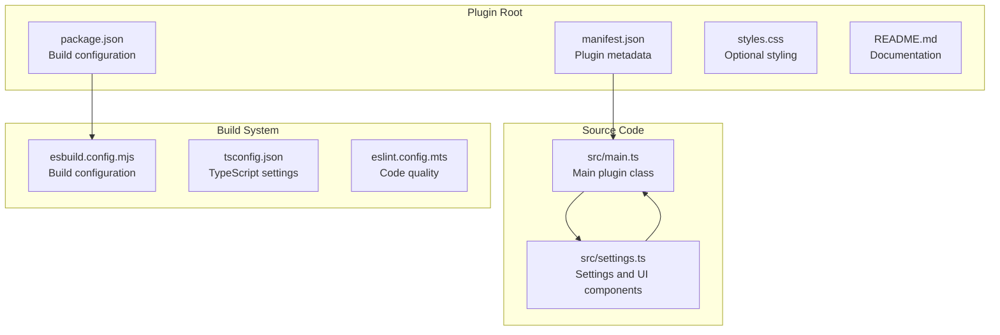
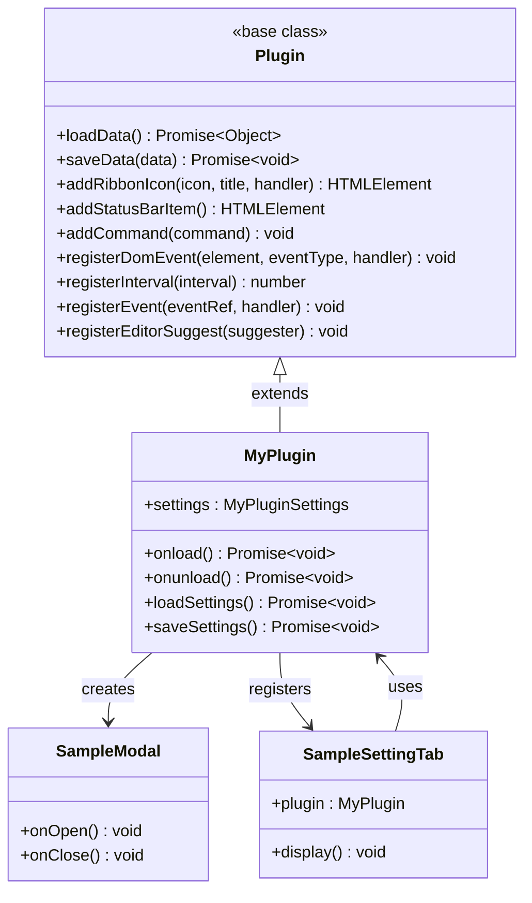
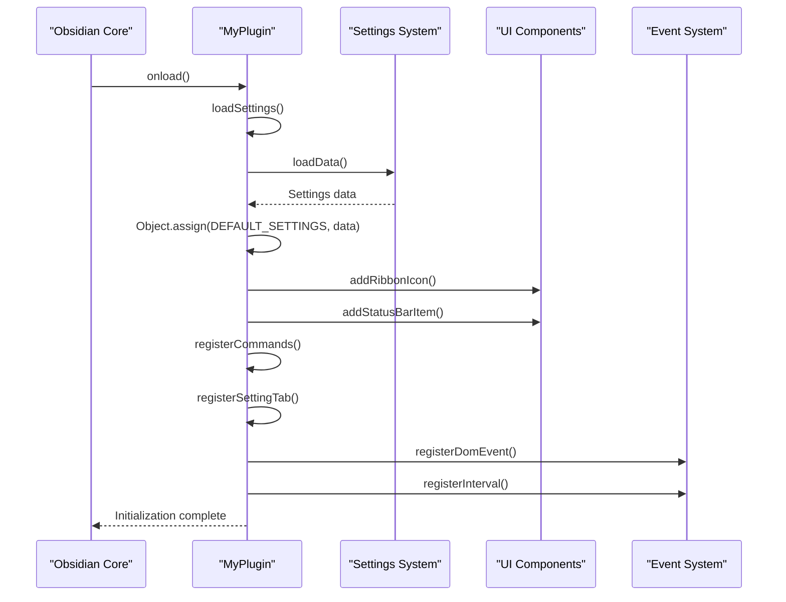
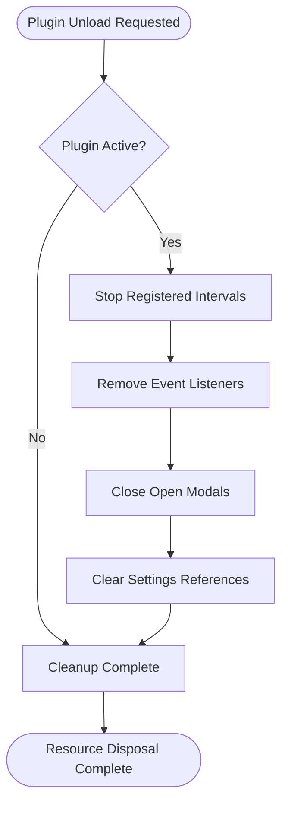
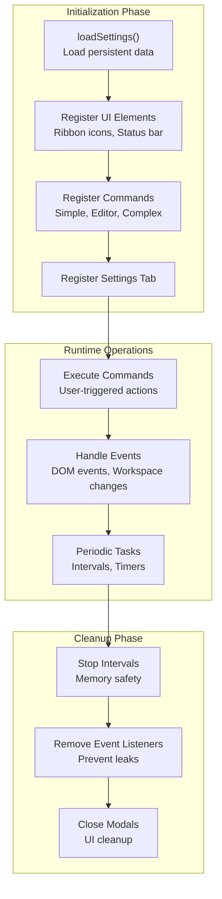
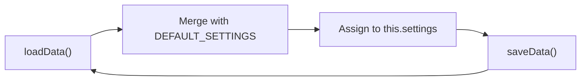
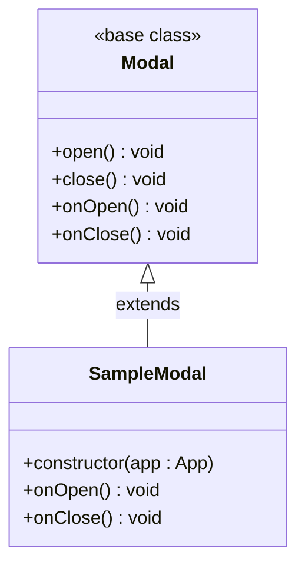
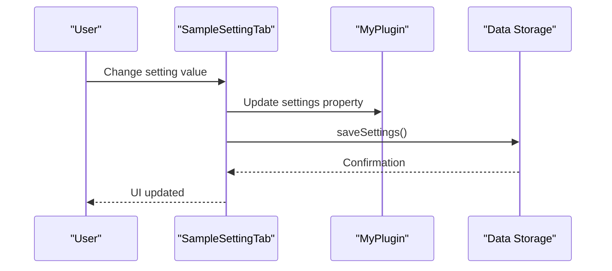
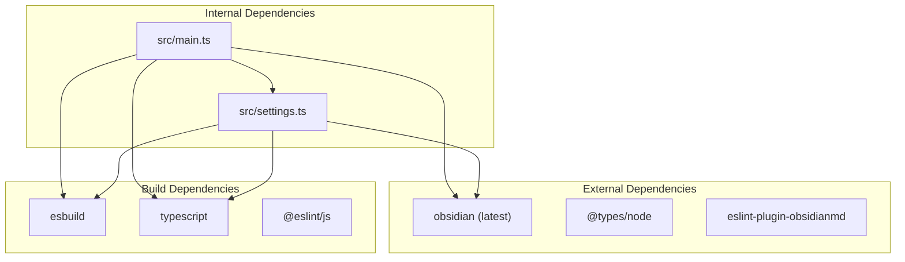

# Core Plugin Class

<cite>
**Referenced Files in This Document**
- [main.ts](file://src/main.ts)
- [settings.ts](file://src/settings.ts)
- [package.json](file://package.json)
- [manifest.json](file://manifest.json)
- [README.md](file://README.md)
- [styles.css](file://styles.css)
</cite>

## Table of Contents
1. [Introduction](#introduction)
2. [Project Structure](#project-structure)
3. [Core Components](#core-components)
4. [Architecture Overview](#architecture-overview)
5. [Detailed Component Analysis](#detailed-component-analysis)
6. [Dependency Analysis](#dependency-analysis)
7. [Performance Considerations](#performance-considerations)
8. [Troubleshooting Guide](#troubleshooting-guide)
9. [Conclusion](#conclusion)

## Introduction

This document provides comprehensive technical documentation for the core plugin class architecture in an Obsidian plugin. The focus is on the MyPlugin class that extends Obsidian's Plugin base class, detailing the plugin lifecycle, initialization process, and integration patterns with supporting components like SampleModal and SampleSettingTab.

The plugin serves as a foundational template demonstrating best practices for Obsidian plugin development, including proper lifecycle management, resource cleanup, and integration with Obsidian's API ecosystem.

## Project Structure

The plugin follows a clean, modular structure designed for maintainability and extensibility:

**Diagram sources**
- [main.ts:1-100](file://src/main.ts#L1-L100)
- [settings.ts:1-37](file://src/settings.ts#L1-L37)
- [package.json:1-30](file://package.json#L1-L30)
- [manifest.json:1-12](file://manifest.json#L1-L12)

**Section sources**
- [main.ts:1-100](file://src/main.ts#L1-L100)
- [settings.ts:1-37](file://src/settings.ts#L1-L37)
- [package.json:1-30](file://package.json#L1-L30)
- [manifest.json:1-12](file://manifest.json#L1-L12)

## Core Components

### MyPlugin Class Architecture

The MyPlugin class extends Obsidian's Plugin base class and implements the fundamental plugin lifecycle:

**Diagram sources**
- [main.ts:6-83](file://src/main.ts#L6-L83)
- [settings.ts:12-36](file://src/settings.ts#L12-L36)

### Plugin Lifecycle Methods

The plugin implements two critical lifecycle methods that manage the plugin's entire operational period:

#### onload Method
The onload method serves as the primary initialization entry point, orchestrating the complete setup process:

**Diagram sources**
- [main.ts:9-71](file://src/main.ts#L9-L71)

#### onunload Method
The onunload method provides the cleanup mechanism for proper resource disposal:

**Diagram sources**
- [main.ts:73-74](file://src/main.ts#L73-L74)

**Section sources**
- [main.ts:6-83](file://src/main.ts#L6-L83)

## Architecture Overview

The plugin architecture demonstrates a clean separation of concerns with clear boundaries between initialization, runtime operations, and cleanup phases:

**Diagram sources**
- [main.ts:9-71](file://src/main.ts#L9-L71)
- [main.ts:73-74](file://src/main.ts#L73-L74)

## Detailed Component Analysis

### Main Plugin Class Implementation

The MyPlugin class serves as the central coordinator for all plugin functionality:

#### Settings Management
The plugin implements robust settings persistence using Obsidian's data API:

**Diagram sources**
- [main.ts:76-82](file://src/main.ts#L76-L82)
- [settings.ts:8-10](file://src/settings.ts#L8-L10)

#### Command Registration System
The plugin demonstrates three distinct command patterns:

1. **Simple Commands**: Direct callback execution
2. **Editor Commands**: Direct editor manipulation
3. **Complex Commands**: Conditional execution based on app state

**Section sources**
- [main.ts:22-57](file://src/main.ts#L22-L57)

### Supporting Components

#### SampleModal Component
The SampleModal extends Obsidian's Modal class and demonstrates proper modal lifecycle management:

**Diagram sources**
- [main.ts:85-99](file://src/main.ts#L85-L99)

#### SampleSettingTab Component
The SampleSettingTab provides a settings interface integrated with the plugin's state:

**Diagram sources**
- [settings.ts:20-35](file://src/settings.ts#L20-L35)

**Section sources**
- [main.ts:85-99](file://src/main.ts#L85-L99)
- [settings.ts:12-36](file://src/settings.ts#L12-L36)

## Dependency Analysis

The plugin maintains minimal external dependencies while leveraging Obsidian's comprehensive API:

**Diagram sources**
- [package.json:26-28](file://package.json#L26-L28)
- [package.json:15-25](file://package.json#L15-L25)

**Section sources**
- [package.json:1-30](file://package.json#L1-L30)

## Performance Considerations

### Memory Management Patterns

The plugin implements several memory management best practices:

1. **Automatic Resource Cleanup**: Uses Obsidian's registration methods that automatically handle cleanup
2. **Proper Event Listener Management**: Ensures event listeners are removed during unloading
3. **Modal Lifecycle Management**: Properly closes modals during cleanup
4. **Interval Management**: Automatically clears intervals when plugin is unloaded

### Performance Optimization Strategies

- **Lazy Loading**: Settings are loaded asynchronously during initialization
- **Efficient DOM Manipulation**: Minimal DOM operations during frequent events
- **Conditional Command Execution**: Complex commands only execute when conditions are met
- **Resource Pooling**: Reuses existing resources rather than creating new ones

## Troubleshooting Guide

### Common Lifecycle Issues

#### Plugin Fails to Initialize
**Symptoms**: Plugin appears in settings but doesn't function
**Causes**: 
- Settings loading failures
- Missing dependencies in manifest.json
- Build configuration errors

**Solutions**:
- Verify manifest.json contains all required fields
- Check build output for compilation errors
- Ensure all dependencies are properly installed

#### Commands Not Appearing
**Symptoms**: Commands registered but not visible in Command Palette
**Causes**:
- Incorrect command ID format
- Complex command checkCallback returning false
- Missing permissions in manifest.json

**Solutions**:
- Verify command IDs are unique and properly formatted
- Test complex command conditions
- Check plugin permissions in manifest.json

#### Memory Leaks During Unload
**Symptoms**: Plugin continues consuming resources after disabling
**Causes**:
- Manual event listeners not removed
- Intervals not cleared
- Modals not properly closed

**Solutions**:
- Use registerDomEvent for DOM events
- Use registerInterval for timers
- Ensure proper modal lifecycle management

### Best Practices for Robust Plugin Development

1. **Always Use Registration Methods**: Prefer Obsidian's registration methods over manual event binding
2. **Implement Proper Cleanup**: Ensure onunload handles all allocated resources
3. **Validate Settings Early**: Check settings validity during loadSettings
4. **Handle Edge Cases**: Consider scenarios where plugin might be unloaded unexpectedly
5. **Test Thoroughly**: Verify plugin behavior across different Obsidian versions and platforms

**Section sources**
- [main.ts:73-74](file://src/main.ts#L73-L74)
- [README.md:15-27](file://README.md#L15-L27)

## Conclusion

The MyPlugin class demonstrates a comprehensive approach to Obsidian plugin development, showcasing proper lifecycle management, resource cleanup, and integration patterns. The architecture provides a solid foundation for building production-ready plugins while maintaining clean separation of concerns and following Obsidian's API best practices.

Key takeaways for plugin developers:
- Implement proper lifecycle methods with comprehensive cleanup
- Use Obsidian's registration methods for automatic resource management
- Design modular components with clear interfaces
- Test across different environments and Obsidian versions
- Follow established patterns for settings management and UI integration

This architecture serves as both a functional plugin and a reference implementation for the Obsidian plugin development community.