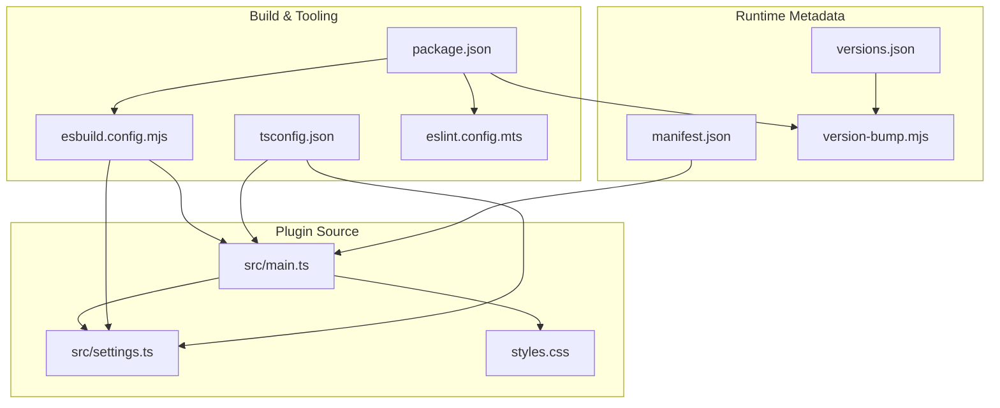
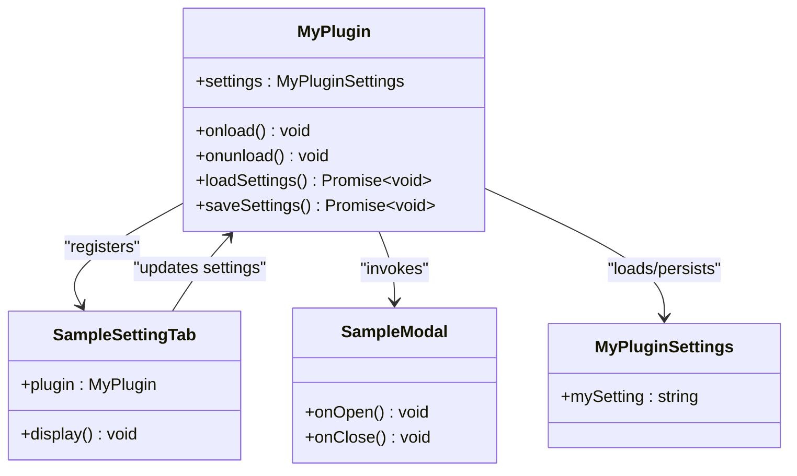
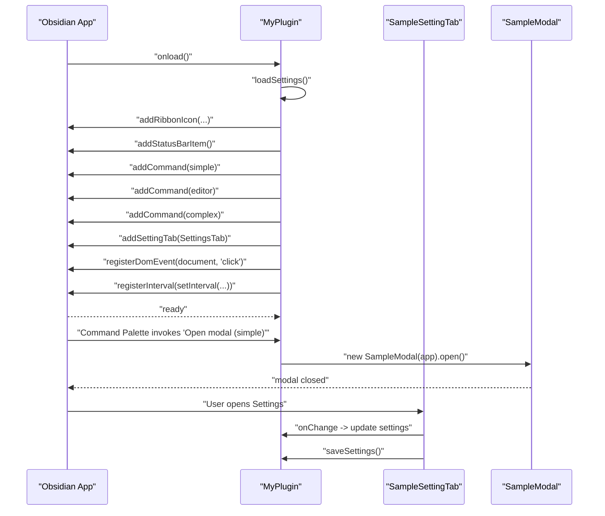
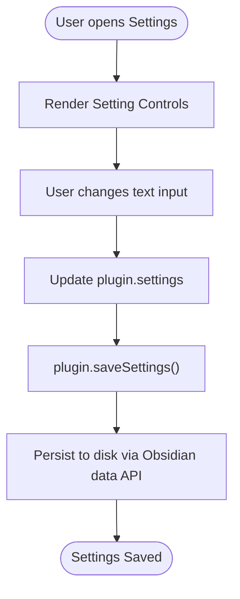
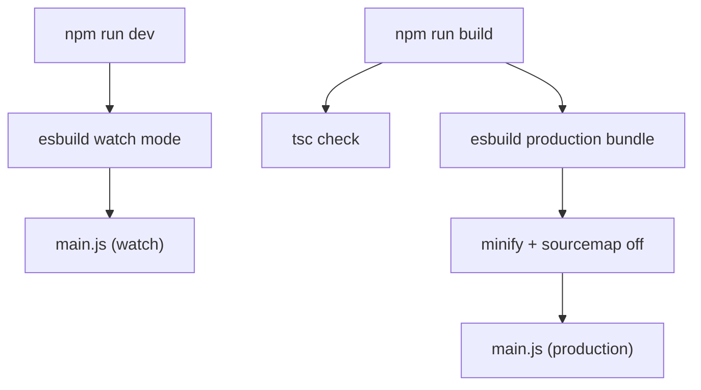
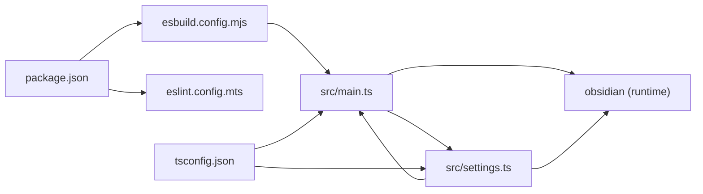

# Plugin Architecture

<cite>
**Referenced Files in This Document**
- [src/main.ts](file://src/main.ts)
- [src/settings.ts](file://src/settings.ts)
- [manifest.json](file://manifest.json)
- [package.json](file://package.json)
- [tsconfig.json](file://tsconfig.json)
- [esbuild.config.mjs](file://esbuild.config.mjs)
- [styles.css](file://styles.css)
- [README.md](file://README.md)
- [eslint.config.mts](file://eslint.config.mts)
- [version-bump.mjs](file://version-bump.mjs)
- [versions.json](file://versions.json)
</cite>

## Table of Contents
1. [Introduction](#introduction)
2. [Project Structure](#project-structure)
3. [Core Components](#core-components)
4. [Architecture Overview](#architecture-overview)
5. [Detailed Component Analysis](#detailed-component-analysis)
6. [Dependency Analysis](#dependency-analysis)
7. [Performance Considerations](#performance-considerations)
8. [Troubleshooting Guide](#troubleshooting-guide)
9. [Conclusion](#conclusion)
10. [Appendices](#appendices)

## Introduction
This document describes the architectural design of the Obsidian Sample Plugin, focusing on the main plugin class structure, TypeScript integration with Obsidian's API, and modular component organization. It explains how main.ts and settings.ts collaborate to deliver plugin functionality, details the plugin lifecycle and event handling patterns, and outlines memory cleanup strategies. The document also covers TypeScript configuration, integration with Obsidian's type definitions, and component interaction diagrams that illustrate data flow and separation of concerns between UI components, settings management, and core plugin logic.

## Project Structure
The plugin follows a minimal, modular structure designed for clarity and extensibility:
- Entry point: src/main.ts defines the main plugin class and registers commands, UI elements, and settings.
- Settings module: src/settings.ts encapsulates settings interfaces, defaults, and the settings tab UI.
- Build and tooling: esbuild.config.mjs bundles TypeScript sources into a single CommonJS output for Obsidian runtime.
- Type safety: tsconfig.json configures strict TypeScript compilation targeting ES6 with DOM libraries.
- Metadata: manifest.json declares plugin identity, versioning, and compatibility.
- Styling: styles.css provides optional plugin-wide CSS.
- Quality tooling: eslint.config.mts enforces code quality aligned with Obsidian plugin guidelines.
- Versioning: version-bump.mjs and versions.json manage version updates and compatibility mapping.

**Diagram sources**
- [src/main.ts:1-100](file://src/main.ts#L1-L100)
- [src/settings.ts:1-37](file://src/settings.ts#L1-L37)
- [esbuild.config.mjs:1-50](file://esbuild.config.mjs#L1-L50)
- [tsconfig.json:1-31](file://tsconfig.json#L1-L31)
- [package.json:1-30](file://package.json#L1-L30)
- [manifest.json:1-12](file://manifest.json#L1-L12)
- [versions.json:1-4](file://versions.json#L1-L4)
- [version-bump.mjs:1-18](file://version-bump.mjs#L1-L18)

**Section sources**
- [src/main.ts:1-100](file://src/main.ts#L1-L100)
- [src/settings.ts:1-37](file://src/settings.ts#L1-L37)
- [esbuild.config.mjs:1-50](file://esbuild.config.mjs#L1-L50)
- [tsconfig.json:1-31](file://tsconfig.json#L1-L31)
- [package.json:1-30](file://package.json#L1-L30)
- [manifest.json:1-12](file://manifest.json#L1-L12)
- [styles.css:1-9](file://styles.css#L1-L9)
- [eslint.config.mts:1-35](file://eslint.config.mts#L1-L35)
- [version-bump.mjs:1-18](file://version-bump.mjs#L1-L18)
- [versions.json:1-4](file://versions.json#L1-L4)

## Core Components
- Main plugin class: Extends Obsidian’s Plugin base class and orchestrates lifecycle, UI registration, commands, and settings persistence.
- Settings module: Defines the settings interface, default values, and a settings tab UI that binds to the plugin’s settings.
- Modal component: Demonstrates a simple modal dialog invoked by commands.
- Event and interval management: Uses Obsidian’s register* helpers to ensure automatic cleanup on unload.

Key responsibilities:
- Lifecycle management: Initialization in onload, cleanup in onunload.
- UI integration: Ribbon icons, status bar items, and commands.
- Settings integration: Loading defaults, persisting changes, and rendering a settings tab.
- Memory safety: Registering DOM events and intervals for automatic cleanup.

**Section sources**
- [src/main.ts:6-83](file://src/main.ts#L6-L83)
- [src/settings.ts:4-36](file://src/settings.ts#L4-L36)

## Architecture Overview
The plugin architecture centers on a single main class that composes smaller modules:
- The main plugin class loads settings, registers UI elements and commands, and manages lifecycle.
- The settings module provides a typed settings interface and a settings tab UI that updates persisted settings.
- The build pipeline compiles TypeScript to a CommonJS bundle suitable for Obsidian’s runtime.

**Diagram sources**
- [src/main.ts:6-83](file://src/main.ts#L6-L83)
- [src/settings.ts:4-36](file://src/settings.ts#L4-L36)

## Detailed Component Analysis

### Main Plugin Class (src/main.ts)
Responsibilities:
- Lifecycle: Initializes plugin resources during onload and performs cleanup during onunload.
- UI registration: Adds a ribbon icon, a status bar item, and commands (simple, editor, and complex).
- Event handling: Registers a global DOM event and a periodic interval, leveraging Obsidian’s automatic cleanup.
- Settings integration: Loads and persists settings via Obsidian’s data API.

Lifecycle and event handling patterns:
- onload: Loads settings, registers UI elements, commands, and a settings tab. Registers a DOM event and an interval.
- onunload: Placeholder for cleanup; Obsidian handles removal of registered UI and timers automatically.
- Settings persistence: loadSettings merges defaults with saved data; saveSettings persists current settings.

Memory cleanup strategies:
- registerDomEvent ensures the event listener is removed when the plugin is disabled.
- registerInterval clears the interval when the plugin is disabled.

**Diagram sources**
- [src/main.ts:9-71](file://src/main.ts#L9-L71)
- [src/settings.ts:20-36](file://src/settings.ts#L20-L36)

**Section sources**
- [src/main.ts:9-71](file://src/main.ts#L9-L71)
- [src/main.ts:73-74](file://src/main.ts#L73-L74)
- [src/main.ts:76-82](file://src/main.ts#L76-L82)

### Settings Module (src/settings.ts)
Responsibilities:
- Define the settings interface and default values.
- Provide a settings tab UI that renders a text field bound to the plugin’s settings.
- Persist changes immediately upon user input.

Separation of concerns:
- UI concerns: The settings tab renders controls and handles user input.
- Data concerns: The plugin class persists settings via Obsidian’s data API.
- Contract: The settings tab receives a reference to the plugin to update and save settings.

**Diagram sources**
- [src/settings.ts:20-36](file://src/settings.ts#L20-L36)
- [src/main.ts:76-82](file://src/main.ts#L76-L82)

**Section sources**
- [src/settings.ts:4-10](file://src/settings.ts#L4-L10)
- [src/settings.ts:12-36](file://src/settings.ts#L12-L36)

### TypeScript Integration and Configuration
TypeScript configuration:
- Targets ES6 with DOM and ES5/ES6/ES7 libraries for compatibility.
- Strict compiler options enforce robustness (strictNullChecks, strictBindCallApply, noImplicit* checks).
- Module resolution set to node for importing Obsidian and third-party modules.
- Source maps enabled for development builds.

Integration with Obsidian’s type definitions:
- Dependencies include the obsidian package, which provides TypeScript definitions for the Obsidian API.
- The plugin imports Obsidian types (App, Editor, MarkdownView, Modal, Notice, Plugin, PluginSettingTab, Setting) directly from the obsidian package.

**Section sources**
- [tsconfig.json:2-26](file://tsconfig.json#L2-L26)
- [package.json:26-28](file://package.json#L26-L28)
- [src/main.ts:1-2](file://src/main.ts#L1-L2)
- [src/settings.ts:1-2](file://src/settings.ts#L1-L2)

### Build Pipeline and Bundling
Build pipeline:
- esbuild configuration bundles src/main.ts into a single CommonJS output main.js.
- External dependencies (obsidian, electron, and codemirror packages) are excluded from the bundle to leverage the host environment.
- Development mode watches for changes; production mode disables inline sourcemaps and minifies output.
- The package.json scripts orchestrate development and production builds, along with linting and version bumping.

**Diagram sources**
- [esbuild.config.mjs:14-42](file://esbuild.config.mjs#L14-L42)
- [package.json:7-12](file://package.json#L7-L12)

**Section sources**
- [esbuild.config.mjs:1-50](file://esbuild.config.mjs#L1-L50)
- [package.json:7-12](file://package.json#L7-L12)

### Plugin Lifecycle Management
Lifecycle stages:
- Initialization: onload loads settings, registers UI, commands, and a settings tab, and registers DOM events and intervals.
- Runtime: Commands trigger UI actions (notices, modals), and settings changes are persisted immediately.
- Unload: onunload is currently empty; Obsidian automatically removes UI elements and clears intervals and event listeners registered via the plugin’s API.

Cleanup strategies:
- registerDomEvent and registerInterval ensure automatic cleanup when the plugin is disabled.
- No manual DOM cleanup is required in onunload for plugin-registered UI.

**Section sources**
- [src/main.ts:9-71](file://src/main.ts#L9-L71)
- [src/main.ts:73-74](file://src/main.ts#L73-L74)

### Event Handling Patterns
Patterns demonstrated:
- Simple command: Triggers a modal open.
- Editor command: Operates on the active editor instance.
- Complex command: Checks conditions before enabling and performing actions.
- Global DOM event: Registered via registerDomEvent and cleaned up automatically.
- Periodic interval: Registered via registerInterval and cleared automatically.

**Section sources**
- [src/main.ts:23-57](file://src/main.ts#L23-L57)
- [src/main.ts:64-69](file://src/main.ts#L64-L69)

### Settings Persistence and UI Integration
Settings integration:
- loadSettings merges default values with saved data to initialize plugin.settings.
- saveSettings persists the current settings object to disk.
- The settings tab updates plugin.settings and triggers saveSettings on change.

**Section sources**
- [src/main.ts:76-82](file://src/main.ts#L76-L82)
- [src/settings.ts:20-36](file://src/settings.ts#L20-L36)

## Dependency Analysis
Internal dependencies:
- src/main.ts depends on src/settings.ts for settings types, defaults, and the settings tab class.
- src/settings.ts depends on src/main.ts to update and save settings.

External dependencies:
- Obsidian runtime types and APIs via the obsidian package.
- esbuild for bundling and development/watch mode.
- TypeScript compiler and type definitions for type checking.
- ESLint for code quality enforcement.

**Diagram sources**
- [src/main.ts:1-2](file://src/main.ts#L1-L2)
- [src/settings.ts:1-2](file://src/settings.ts#L1-L2)
- [esbuild.config.mjs:1-50](file://esbuild.config.mjs#L1-L50)
- [package.json:1-30](file://package.json#L1-L30)
- [tsconfig.json:1-31](file://tsconfig.json#L1-L31)

**Section sources**
- [src/main.ts:1-2](file://src/main.ts#L1-L2)
- [src/settings.ts:1-2](file://src/settings.ts#L1-L2)
- [package.json:15-28](file://package.json#L15-L28)

## Performance Considerations
- Build-time minification: Production builds enable minification to reduce bundle size.
- Sourcemap strategy: Inline sourcemaps are used in development for debugging; disabled in production to reduce overhead.
- Externalization: Excluding obsidian and related heavy dependencies reduces bundle size and leverages the host environment.
- Interval and event cleanup: Automatic cleanup via register* helpers prevents memory leaks and unnecessary work after plugin disable.

[No sources needed since this section provides general guidance]

## Troubleshooting Guide
Common issues and resolutions:
- Settings not persisting: Verify loadSettings merges defaults and saved data, and saveSettings is called after changes.
- Commands not appearing: Ensure complex command checkCallback returns true when conditions are met and false otherwise.
- Events not firing: Confirm registerDomEvent is used for global events and that the plugin is enabled.
- Build errors: Check TypeScript strictness and module resolution settings in tsconfig.json; ensure dependencies are installed via npm install.
- Lint failures: Run npm run lint and address ESLint violations flagged by the Obsidian plugin rules.

**Section sources**
- [src/main.ts:76-82](file://src/main.ts#L76-L82)
- [src/main.ts:42-57](file://src/main.ts#L42-L57)
- [src/main.ts:64-69](file://src/main.ts#L64-L69)
- [tsconfig.json:2-26](file://tsconfig.json#L2-L26)
- [eslint.config.mts:6-34](file://eslint.config.mts#L6-L34)

## Conclusion
The Obsidian Sample Plugin demonstrates a clean, modular architecture centered on a main plugin class that integrates UI, commands, settings, and lifecycle management. TypeScript configuration and strict compiler options ensure robustness, while esbuild streamlines bundling for Obsidian’s runtime. The separation of concerns between the main plugin class, settings module, and UI components enables maintainability and extensibility. Automatic cleanup via Obsidian’s register* helpers simplifies memory management, and the build pipeline supports efficient development and production workflows.

[No sources needed since this section summarizes without analyzing specific files]

## Appendices

### Component Interaction Summary
- Main plugin class orchestrates UI registration, commands, and settings persistence.
- Settings tab updates plugin.settings and triggers saveSettings.
- Modal component provides a simple UI interaction invoked by commands.
- Event and interval registrations are automatically cleaned up on plugin disable.

**Section sources**
- [src/main.ts:9-71](file://src/main.ts#L9-L71)
- [src/settings.ts:20-36](file://src/settings.ts#L20-L36)

### Versioning and Compatibility
- Version bump automation updates manifest.json and versions.json with the current package version and minimum Obsidian version.
- versions.json maps plugin versions to minimum Obsidian app versions for compatibility.

**Section sources**
- [version-bump.mjs:3-17](file://version-bump.mjs#L3-L17)
- [versions.json:1-4](file://versions.json#L1-L4)
- [manifest.json:4-5](file://manifest.json#L4-L5)