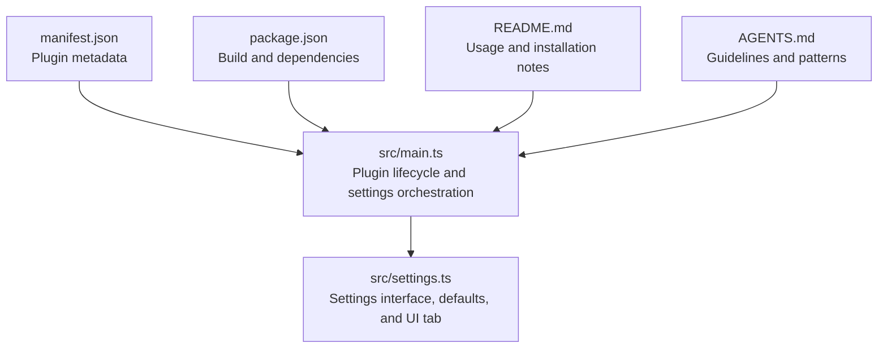
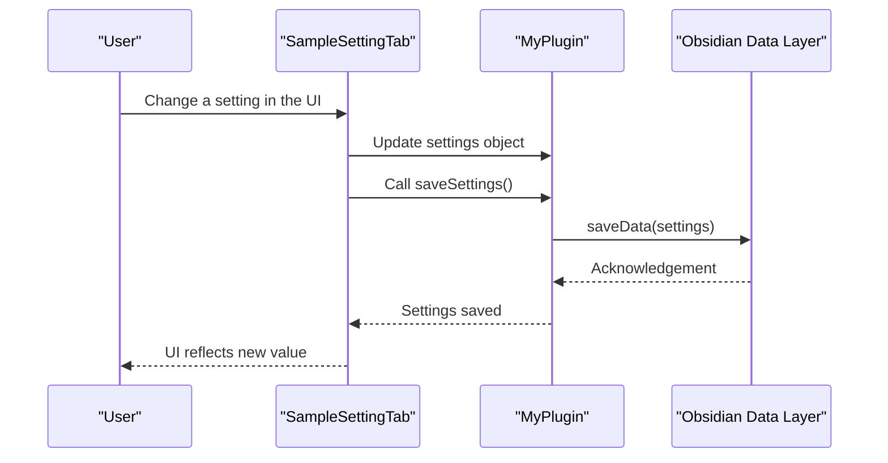
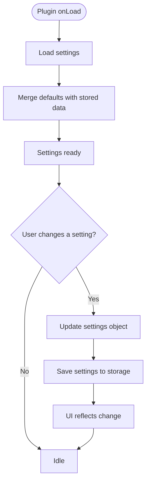
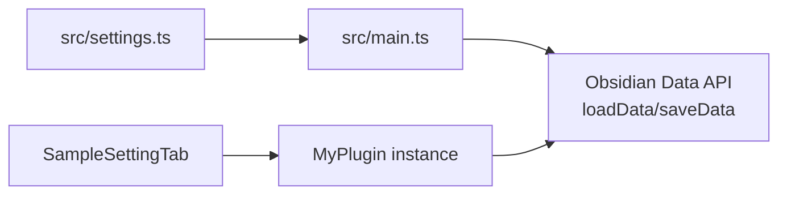

# Settings Management

<cite>
**Referenced Files in This Document**
- [src/main.ts](file://src/main.ts)
- [src/settings.ts](file://src/settings.ts)
- [manifest.json](file://manifest.json)
- [package.json](file://package.json)
- [README.md](file://README.md)
- [AGENTS.md](file://AGENTS.md)
</cite>

## Table of Contents
1. [Introduction](#introduction)
2. [Project Structure](#project-structure)
3. [Core Components](#core-components)
4. [Architecture Overview](#architecture-overview)
5. [Detailed Component Analysis](#detailed-component-analysis)
6. [Dependency Analysis](#dependency-analysis)
7. [Performance Considerations](#performance-considerations)
8. [Troubleshooting Guide](#troubleshooting-guide)
9. [Conclusion](#conclusion)
10. [Appendices](#appendices)

## Introduction
This document explains the settings management system for the plugin, focusing on the MyPluginSettings interface, DEFAULT_SETTINGS configuration, and the SampleSettingTab implementation. It covers how settings are persisted using loadData and saveData, how settings are loaded during plugin initialization, and how the settings UI integrates with data storage. It also documents the settings tab registration process, user interaction flow, and practical guidance for extending the settings architecture with new settings, validation, migration, backward compatibility, and best practices.

## Project Structure
The settings system is implemented across two primary files:
- src/main.ts: Plugin lifecycle, settings loading, saving, and settings tab registration.
- src/settings.ts: Settings interface, default values, and the settings tab UI.

**Diagram sources**
- [src/main.ts:1-100](file://src/main.ts#L1-L100)
- [src/settings.ts:1-37](file://src/settings.ts#L1-L37)
- [manifest.json:1-12](file://manifest.json#L1-L12)
- [package.json:1-30](file://package.json#L1-L30)
- [README.md:1-91](file://README.md#L1-L91)
- [AGENTS.md:1-252](file://AGENTS.md#L1-L252)

**Section sources**
- [src/main.ts:1-100](file://src/main.ts#L1-L100)
- [src/settings.ts:1-37](file://src/settings.ts#L1-L37)
- [manifest.json:1-12](file://manifest.json#L1-L12)
- [package.json:1-30](file://package.json#L1-L30)
- [README.md:1-91](file://README.md#L1-L91)
- [AGENTS.md:1-252](file://AGENTS.md#L1-L252)

## Core Components
- MyPluginSettings interface: Defines the shape of the plugin’s settings object.
- DEFAULT_SETTINGS: Provides default values for all settings keys.
- SampleSettingTab: Implements the settings UI tab and binds user input to the plugin’s settings object.
- MyPlugin: The plugin class that loads settings at startup, persists changes, and registers the settings tab.

Key behaviors:
- Settings loading: During plugin initialization, the plugin merges default values with stored data to produce the current settings object.
- Settings saving: When users change settings in the UI, the plugin saves the updated settings immediately.
- Settings tab registration: The settings tab is registered during plugin initialization so users can access it from the Obsidian settings UI.

**Section sources**
- [src/settings.ts:4-10](file://src/settings.ts#L4-L10)
- [src/settings.ts:12-36](file://src/settings.ts#L12-L36)
- [src/main.ts:6-83](file://src/main.ts#L6-L83)

## Architecture Overview
The settings architecture follows a straightforward pattern:
- The plugin loads settings at startup by merging defaults with persisted data.
- The settings UI tab reads from and writes to the plugin’s settings object.
- Each user change triggers an immediate save to persistent storage.

**Diagram sources**
- [src/settings.ts:20-36](file://src/settings.ts#L20-L36)
- [src/main.ts:76-82](file://src/main.ts#L76-L82)

## Detailed Component Analysis

### MyPluginSettings Interface
- Purpose: Defines the contract for the plugin’s settings object.
- Current fields: A single string field representing a user-configurable value.
- Extensibility: New settings can be added by expanding the interface and DEFAULT_SETTINGS.

Best practices:
- Keep the interface minimal and focused.
- Use descriptive names for settings keys.
- Avoid storing sensitive data in settings unless necessary.

**Section sources**
- [src/settings.ts:4-6](file://src/settings.ts#L4-L6)

### DEFAULT_SETTINGS Configuration
- Purpose: Supplies default values for all settings keys.
- Behavior: Ensures that missing or newly added keys are initialized with sensible defaults.
- Integration: Merged with persisted data during load to form the current settings object.

Extending defaults:
- Add new keys to the interface.
- Provide default values in DEFAULT_SETTINGS.
- Update the settings tab to render and bind the new field.

**Section sources**
- [src/settings.ts:8-10](file://src/settings.ts#L8-L10)

### SampleSettingTab Implementation
- Purpose: Renders the settings UI and binds user input to the plugin’s settings object.
- UI construction: Creates a labeled text input bound to the current value of the setting.
- Event handling: On change, updates the settings object and saves immediately.

User interaction flow:
- Open Obsidian settings.
- Navigate to the plugin’s settings tab.
- Edit the text field.
- Observe immediate persistence and UI refresh.

Validation and advanced controls:
- Extend the tab to add validation feedback and richer controls (e.g., toggles, dropdowns, number inputs).
- Debounce frequent saves if needed to reduce write frequency.

**Section sources**
- [src/settings.ts:12-36](file://src/settings.ts#L12-L36)

### Settings Persistence Mechanism
- Loading: The plugin merges DEFAULT_SETTINGS with data loaded from persistent storage to construct the current settings object.
- Saving: The plugin writes the current settings object to persistent storage immediately upon user changes.

**Diagram sources**
- [src/main.ts:76-78](file://src/main.ts#L76-L78)
- [src/main.ts:80-82](file://src/main.ts#L80-L82)
- [src/settings.ts:20-36](file://src/settings.ts#L20-L36)

**Section sources**
- [src/main.ts:76-82](file://src/main.ts#L76-L82)
- [src/settings.ts:20-36](file://src/settings.ts#L20-L36)

### Settings Loading During Plugin Initialization
- The plugin loads settings early in the lifecycle to ensure availability for other subsystems.
- The load routine ensures that missing keys are filled by defaults, preventing undefined values.

Integration points:
- Called during plugin initialization to populate the settings object before commands or UI components rely on it.

**Section sources**
- [src/main.ts:9-10](file://src/main.ts#L9-L10)
- [src/main.ts:76-78](file://src/main.ts#L76-L78)

### Relationship Between Settings UI and Data Storage
- The settings tab reads from the plugin’s settings object and writes back to it.
- Each change triggers a save to persistent storage, ensuring durability.
- The UI remains responsive because updates are immediate and synchronous with the save operation.

**Section sources**
- [src/settings.ts:20-36](file://src/settings.ts#L20-L36)
- [src/main.ts:80-82](file://src/main.ts#L80-L82)

### Settings Tab Registration Process
- The settings tab is registered during plugin initialization, making it discoverable in the Obsidian settings UI.
- Users can access the settings tab from the Obsidian settings page.

**Section sources**
- [src/main.ts:59-61](file://src/main.ts#L59-L61)

### User Interaction with the Settings Interface
- Users open Obsidian settings and navigate to the plugin’s settings tab.
- They edit the provided input field.
- Changes are saved immediately and reflected in the UI.

**Section sources**
- [README.md:10-11](file://README.md#L10-L11)
- [src/settings.ts:20-36](file://src/settings.ts#L20-L36)

### Examples: Adding New Settings, Validation, and Handling Changes
- Adding a new setting:
  - Define a new key in the settings interface.
  - Provide a default value in DEFAULT_SETTINGS.
  - Render a corresponding control in the settings tab and bind it to the new key.
  - Ensure the control triggers a save when changed.
- Implementing validation:
  - Validate user input in the onChange handler.
  - Provide feedback to the user (e.g., notices or inline messages).
  - Optionally prevent saving invalid values until corrected.
- Handling settings changes:
  - Update the settings object on each change.
  - Save immediately or debounce to balance responsiveness and performance.

**Section sources**
- [src/settings.ts:4-10](file://src/settings.ts#L4-L10)
- [src/settings.ts:20-36](file://src/settings.ts#L20-L36)
- [src/main.ts:80-82](file://src/main.ts#L80-L82)

### Settings Migration and Backward Compatibility
- Strategy:
  - When introducing new settings, add them to DEFAULT_SETTINGS so they are initialized for existing users.
  - When removing or renaming settings, implement a migration step that reads old keys, transforms them to new keys, and writes the updated settings.
  - Preserve isDesktopOnly and minAppVersion in manifest.json to ensure compatibility across Obsidian versions.
- Best practices:
  - Keep migration logic simple and idempotent.
  - Log migration actions for diagnostics.
  - Test migrations with real-world data to avoid regressions.

**Section sources**
- [src/main.ts:76-78](file://src/main.ts#L76-L78)
- [manifest.json:1-12](file://manifest.json#L1-L12)
- [AGENTS.md:96-101](file://AGENTS.md#L96-L101)

### Best Practices for Extensible Settings Architectures
- Keep settings modular:
  - Separate concerns into distinct files (e.g., settings.ts).
- Use strong typing:
  - Define interfaces for settings to catch errors early.
- Provide sensible defaults:
  - Ensure DEFAULT_SETTINGS covers all keys to avoid undefined behavior.
- Persist promptly:
  - Save immediately on change to minimize risk of data loss.
- Validate proactively:
  - Validate input in the UI and surface errors clearly.
- Plan for evolution:
  - Design for future additions and migrations.
- Keep the UI simple:
  - Group related settings and use clear labels and descriptions.

**Section sources**
- [src/settings.ts:4-10](file://src/settings.ts#L4-L10)
- [src/settings.ts:12-36](file://src/settings.ts#L12-L36)
- [AGENTS.md:131-140](file://AGENTS.md#L131-L140)

## Dependency Analysis
The settings system has clear, low-coupling dependencies:
- src/main.ts depends on src/settings.ts for types, defaults, and the settings tab class.
- The settings tab depends on the plugin instance to access and persist settings.
- The plugin uses Obsidian’s built-in loadData and saveData for persistence.

**Diagram sources**
- [src/settings.ts:1-37](file://src/settings.ts#L1-L37)
- [src/main.ts:1-100](file://src/main.ts#L1-L100)

**Section sources**
- [src/settings.ts:1-37](file://src/settings.ts#L1-L37)
- [src/main.ts:1-100](file://src/main.ts#L1-L100)

## Performance Considerations
- Immediate saves: Saving on every change ensures consistency but can increase disk writes. Consider debouncing saves for frequently updated fields.
- UI responsiveness: Keep UI updates lightweight; avoid heavy computations in onChange handlers.
- Memory footprint: Avoid storing large objects in settings; prefer compact representations.
- Startup cost: Settings loading is fast, but avoid heavy operations during onLoad.

[No sources needed since this section provides general guidance]

## Troubleshooting Guide
Common issues and resolutions:
- Settings not persisting:
  - Ensure loadData and saveData are awaited and that the UI is refreshed after changes.
- Settings reset unexpectedly:
  - Verify that DEFAULT_SETTINGS includes all keys and that the merge logic is intact.
- Settings tab not visible:
  - Confirm that the settings tab is registered during plugin initialization.
- Migration failures:
  - Implement idempotent migration logic and log migration steps for diagnostics.

**Section sources**
- [AGENTS.md:237-243](file://AGENTS.md#L237-L243)
- [src/main.ts:76-82](file://src/main.ts#L76-L82)
- [src/settings.ts:12-36](file://src/settings.ts#L12-L36)

## Conclusion
The settings management system is intentionally simple and robust: a typed interface, sensible defaults, a straightforward settings tab, and immediate persistence via Obsidian’s data API. This design enables easy extension, reliable persistence, and a smooth user experience. By following the outlined best practices and migration strategies, developers can evolve the settings architecture while maintaining backward compatibility and user trust.

[No sources needed since this section summarizes without analyzing specific files]

## Appendices

### Appendix A: Settings Lifecycle Summary
- Initialize plugin.
- Load settings by merging defaults with stored data.
- Register settings tab.
- On user change, update settings and save immediately.

**Section sources**
- [src/main.ts:9-10](file://src/main.ts#L9-L10)
- [src/main.ts:76-82](file://src/main.ts#L76-L82)
- [src/settings.ts:12-36](file://src/settings.ts#L12-L36)