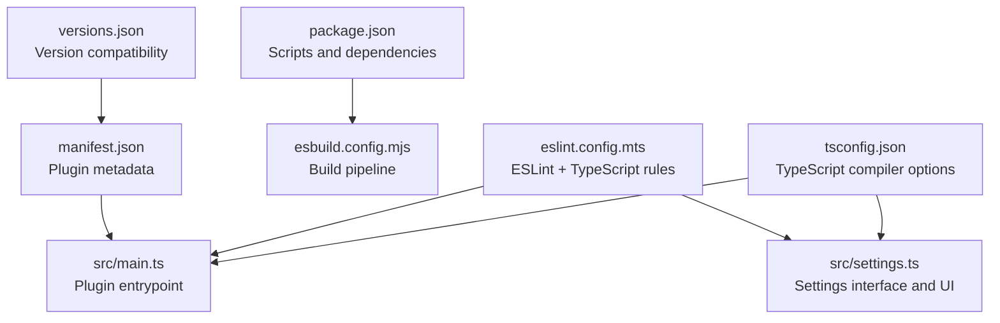
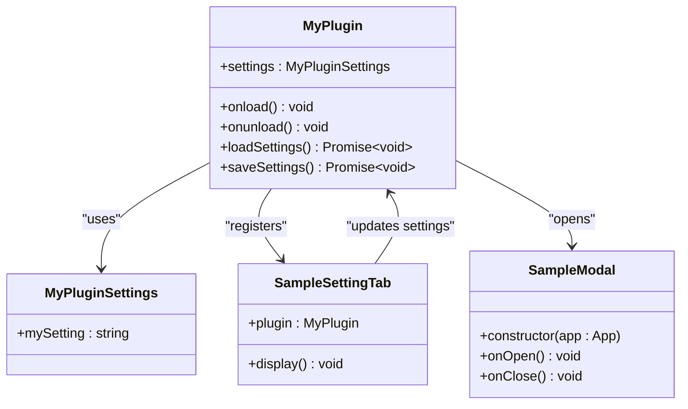
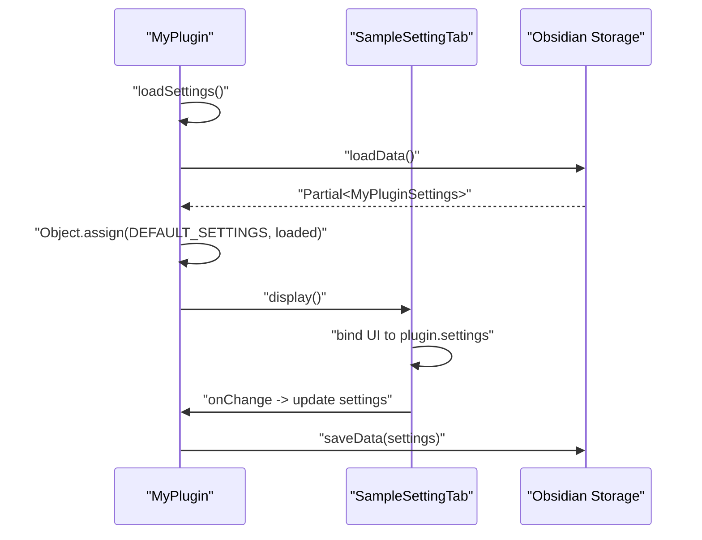
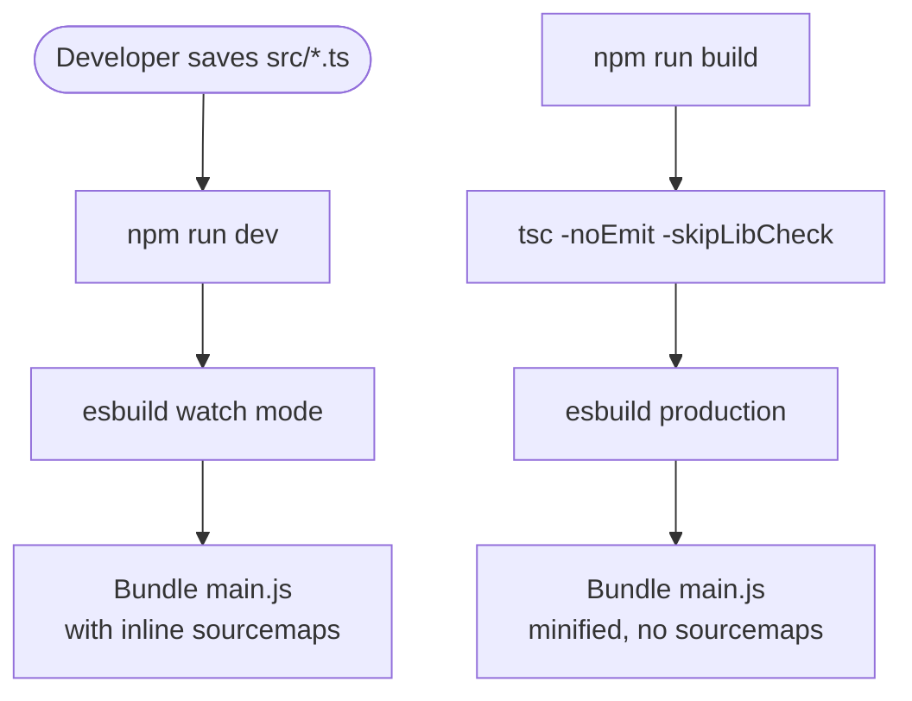
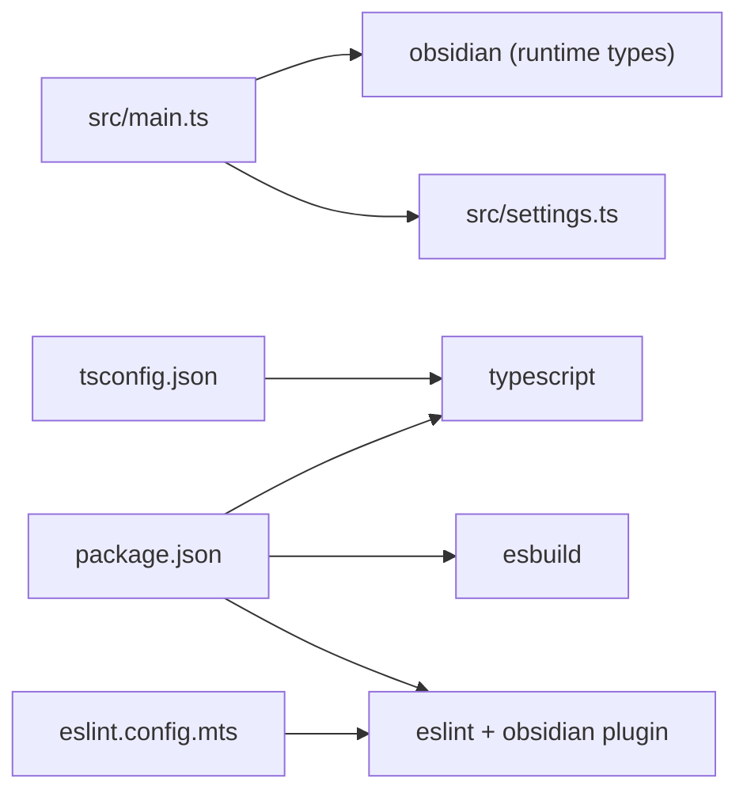

# TypeScript Integration

<cite>
**Referenced Files in This Document**
- [tsconfig.json](file://tsconfig.json)
- [package.json](file://package.json)
- [src/main.ts](file://src/main.ts)
- [src/settings.ts](file://src/settings.ts)
- [esbuild.config.mjs](file://esbuild.config.mjs)
- [eslint.config.mts](file://eslint.config.mts)
- [manifest.json](file://manifest.json)
- [README.md](file://README.md)
- [versions.json](file://versions.json)
</cite>

## Table of Contents
1. [Introduction](#introduction)
2. [Project Structure](#project-structure)
3. [Core Components](#core-components)
4. [Architecture Overview](#architecture-overview)
5. [Detailed Component Analysis](#detailed-component-analysis)
6. [Dependency Analysis](#dependency-analysis)
7. [Performance Considerations](#performance-considerations)
8. [Troubleshooting Guide](#troubleshooting-guide)
9. [Conclusion](#conclusion)

## Introduction
This document explains how TypeScript integrates with Obsidian’s plugin API in this repository. It covers the type-safe architecture built around Obsidian’s TypeScript interfaces, how plugin settings are modeled with strongly typed interfaces, and how the build pipeline ensures type safety during development and production. It also documents the compilation process, linting configuration, and practical patterns for type-safe plugin development.

## Project Structure
The project follows a minimal yet robust structure for TypeScript-based Obsidian plugins:
- Source code resides under src/, with the main plugin entrypoint and settings UI logic.
- Build tooling uses esbuild to bundle TypeScript sources into a single CommonJS module consumed by Obsidian.
- Type checking and linting are configured via TypeScript compiler options and ESLint with a dedicated plugin for Obsidian.

**Diagram sources**
- [tsconfig.json:1-31](file://tsconfig.json#L1-L31)
- [src/main.ts:1-100](file://src/main.ts#L1-L100)
- [src/settings.ts:1-37](file://src/settings.ts#L1-L37)
- [package.json:1-30](file://package.json#L1-L30)
- [esbuild.config.mjs:1-50](file://esbuild.config.mjs#L1-L50)
- [eslint.config.mts:1-35](file://eslint.config.mts#L1-L35)
- [manifest.json:1-12](file://manifest.json#L1-L12)
- [versions.json:1-4](file://versions.json#L1-L4)

**Section sources**
- [tsconfig.json:1-31](file://tsconfig.json#L1-L31)
- [package.json:1-30](file://package.json#L1-L30)
- [src/main.ts:1-100](file://src/main.ts#L1-L100)
- [src/settings.ts:1-37](file://src/settings.ts#L1-L37)
- [esbuild.config.mjs:1-50](file://esbuild.config.mjs#L1-L50)
- [eslint.config.mts:1-35](file://eslint.config.mts#L1-L35)
- [manifest.json:1-12](file://manifest.json#L1-L12)
- [versions.json:1-4](file://versions.json#L1-L4)

## Core Components
- TypeScript configuration defines strict compiler options and library targets suitable for Obsidian environments.
- The plugin entrypoint imports Obsidian’s core types and uses them to annotate plugin lifecycle, commands, and UI interactions.
- Settings are modeled with a dedicated interface and default values, enabling type-safe persistence and UI binding.
- The build pipeline bundles sources into a single CommonJS module while preserving sourcemaps for development.

Key TypeScript integration highlights:
- Strongly typed plugin class extending Obsidian’s Plugin base.
- Obsidian-provided types used for editor callbacks, workspace views, and modal dialogs.
- Settings interface and defaults enable safe merging and persistence.
- Strict compiler options enforce correctness and reduce runtime errors.

**Section sources**
- [src/main.ts:1-100](file://src/main.ts#L1-L100)
- [src/settings.ts:1-37](file://src/settings.ts#L1-L37)
- [tsconfig.json:1-31](file://tsconfig.json#L1-L31)

## Architecture Overview
The plugin architecture centers on a type-safe TypeScript layer that interacts with Obsidian’s runtime APIs. The main plugin class manages lifecycle, commands, UI integrations, and settings. The settings module defines the shape of persisted data and provides a settings tab UI.

**Diagram sources**
- [src/main.ts:6-83](file://src/main.ts#L6-L83)
- [src/settings.ts:4-36](file://src/settings.ts#L4-L36)

**Section sources**
- [src/main.ts:1-100](file://src/main.ts#L1-L100)
- [src/settings.ts:1-37](file://src/settings.ts#L1-L37)

## Detailed Component Analysis

### TypeScript Configuration and Type Safety
- Compiler options emphasize strictness and modern JavaScript features:
  - Strict null checks, implicit returns, and explicit this typing prevent common runtime pitfalls.
  - NoUncheckedIndexedAccess and isolatedModules align with Obsidian’s plugin constraints.
  - Target ES6 and lib DOM/ES5/ES6/ES7 ensure compatibility with Obsidian’s runtime.
- The baseUrl and include settings ensure TypeScript resolves modules from src and includes all TS files.

Benefits:
- Early detection of type mismatches and incorrect API usage.
- Improved developer experience with accurate IntelliSense and refactoring support.

**Section sources**
- [tsconfig.json:1-31](file://tsconfig.json#L1-L31)

### Plugin Entry Point and Obsidian Types
- The plugin class extends Obsidian’s Plugin and declares a typed settings property.
- Commands leverage Obsidian’s Editor and MarkdownView types for editor callbacks and state checks.
- UI integrations use Obsidian’s App, Modal, and Notice types for consistent behavior.

Type-safe patterns demonstrated:
- Annotated callback parameters for editor commands.
- Explicit typing for workspace view checks and command availability.
- Event registration with typed DOM events.

**Section sources**
- [src/main.ts:1-100](file://src/main.ts#L1-L100)

### Settings Interface and Runtime Behavior
- A dedicated interface defines the shape of plugin settings.
- Default values provide a baseline for safe merging with persisted data.
- The settings tab binds UI controls to the typed settings object and persists changes.

Runtime behavior:
- Settings are loaded and merged with defaults during plugin initialization.
- Changes propagate immediately to the plugin instance and are saved to disk.

**Diagram sources**
- [src/main.ts:76-82](file://src/main.ts#L76-L82)
- [src/settings.ts:20-35](file://src/settings.ts#L20-L35)

**Section sources**
- [src/settings.ts:1-37](file://src/settings.ts#L1-L37)
- [src/main.ts:1-100](file://src/main.ts#L1-L100)

### Build Pipeline and Compilation
- Development script runs esbuild in watch mode to rebuild on changes.
- Production script validates types with tsc before bundling.
- esbuild externalizes obsidian and electron to avoid bundling platform APIs.
- Sourcemaps are included in development for debugging.

**Diagram sources**
- [package.json:7-11](file://package.json#L7-L11)
- [esbuild.config.mjs:14-49](file://esbuild.config.mjs#L14-L49)

**Section sources**
- [package.json:1-30](file://package.json#L1-L30)
- [esbuild.config.mjs:1-50](file://esbuild.config.mjs#L1-L50)

### Linting and Quality Gates
- ESLint is configured with TypeScript-aware rules and an Obsidian-specific plugin.
- Global browser globals are enabled to match Obsidian’s runtime environment.
- Ignores exclude generated and build artifacts.

Practical impact:
- Consistent code style and early detection of potential issues.
- Enforced adherence to Obsidian plugin development best practices.

**Section sources**
- [eslint.config.mts:1-35](file://eslint.config.mts#L1-L35)

## Dependency Analysis
- Obsidian runtime types are provided by the obsidian package (installed as a dependency).
- TypeScript compiler and ESLint toolchain are dev dependencies.
- esbuild handles bundling and externalizes platform-specific modules.

**Diagram sources**
- [package.json:15-28](file://package.json#L15-L28)
- [tsconfig.json:1-31](file://tsconfig.json#L1-L31)
- [src/main.ts:1-2](file://src/main.ts#L1-L2)
- [src/settings.ts:1](file://src/settings.ts#L1)

**Section sources**
- [package.json:1-30](file://package.json#L1-L30)
- [tsconfig.json:1-31](file://tsconfig.json#L1-L31)
- [src/main.ts:1-2](file://src/main.ts#L1-L2)
- [src/settings.ts:1](file://src/settings.ts#L1)

## Performance Considerations
- Strict compiler options help catch performance-related issues early (e.g., unnecessary any types).
- esbuild’s tree shaking and minification reduce bundle size in production builds.
- Inline sourcemaps in development speed up debugging without extra files.
- Keeping external dependencies minimal (only obsidian and electron) reduces bundle bloat.

## Troubleshooting Guide
Common TypeScript-related issues and resolutions:
- Missing or outdated obsidian types:
  - Ensure the obsidian dependency is installed and up to date.
  - Verify that TypeScript can resolve obsidian.d.ts via the installed package.
- Type conflicts with third-party libraries:
  - Add the library to devDependencies and ensure its types are compatible.
  - If conflicts persist, consider using ambient type declarations or module augmentation carefully.
- Incorrect module resolution:
  - Confirm baseUrl and include settings in tsconfig.json.
  - Ensure all source files live under src and are included by the TypeScript project.
- Linting failures:
  - Run npm run lint to identify issues flagged by the Obsidian-specific ESLint plugin.
  - Fix reported violations or adjust rules if necessary.
- Build-time type errors:
  - Use the production build script to validate types before bundling.
  - Resolve type errors in source files before committing changes.

**Section sources**
- [package.json:15-28](file://package.json#L15-L28)
- [tsconfig.json:1-31](file://tsconfig.json#L1-L31)
- [eslint.config.mts:1-35](file://eslint.config.mts#L1-L35)
- [README.md:58-62](file://README.md#L58-L62)

## Conclusion
This repository demonstrates a clean, type-safe approach to Obsidian plugin development using TypeScript. By leveraging Obsidian’s official TypeScript definitions, structuring settings with explicit interfaces, and enforcing strict compiler options, the plugin achieves strong guarantees about correctness and maintainability. The build pipeline integrates type checking and bundling seamlessly, while ESLint enforces style and best practices aligned with Obsidian’s ecosystem.