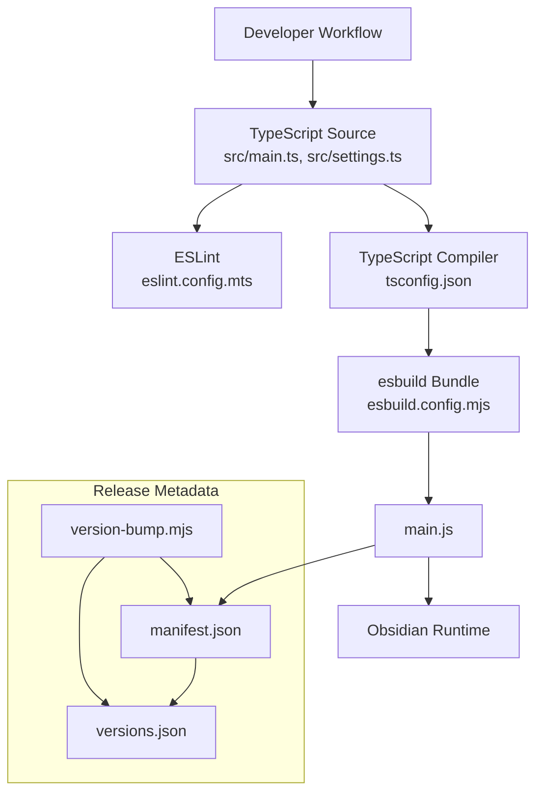
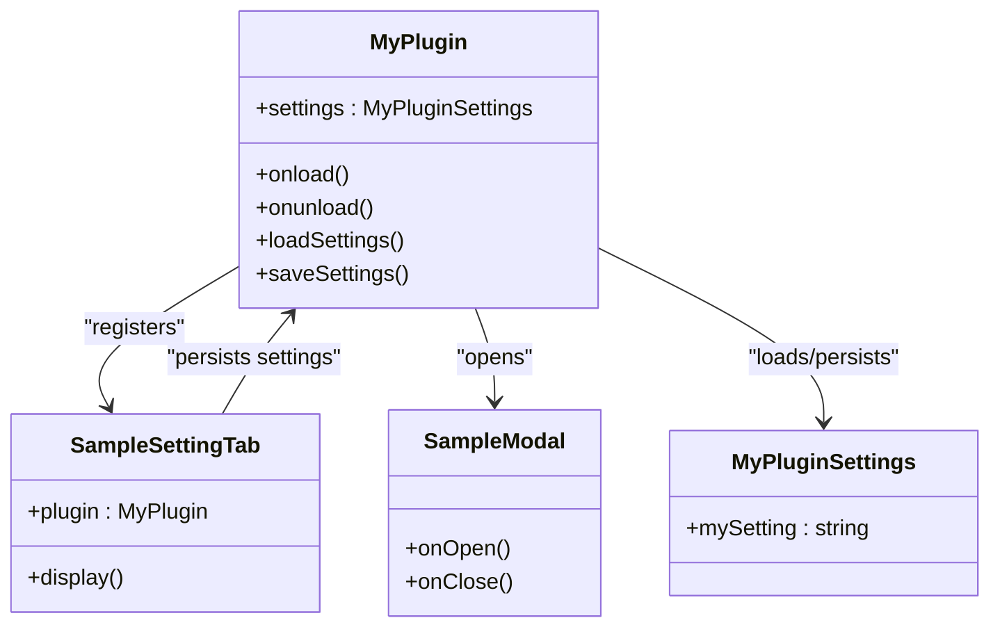
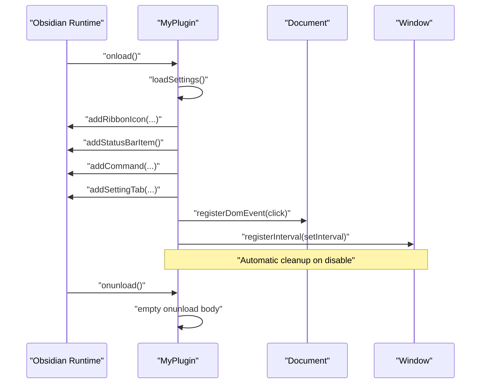
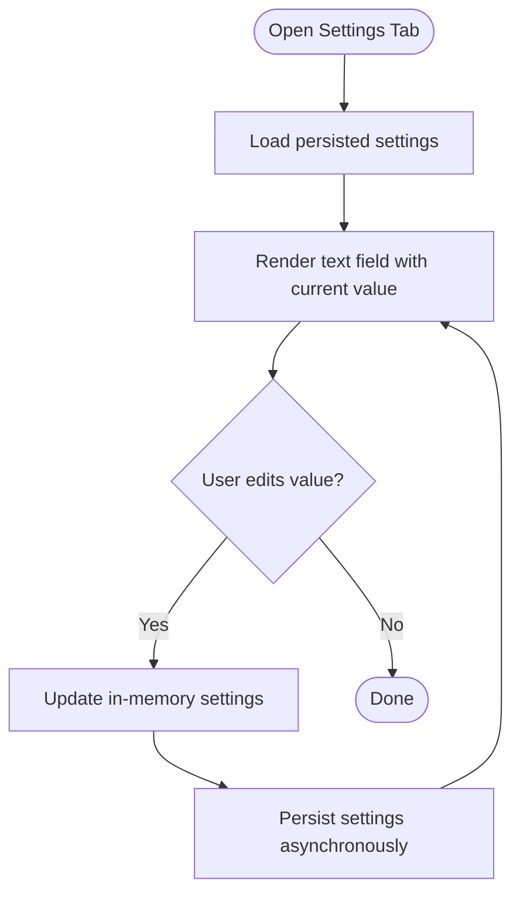
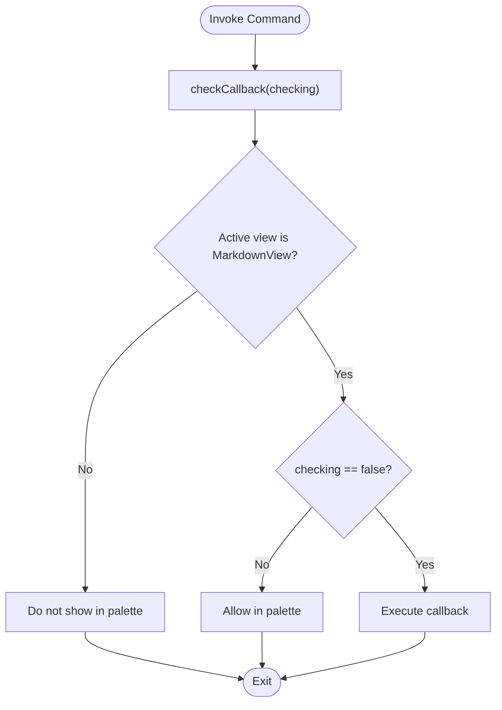
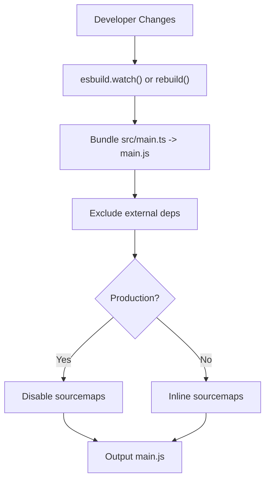
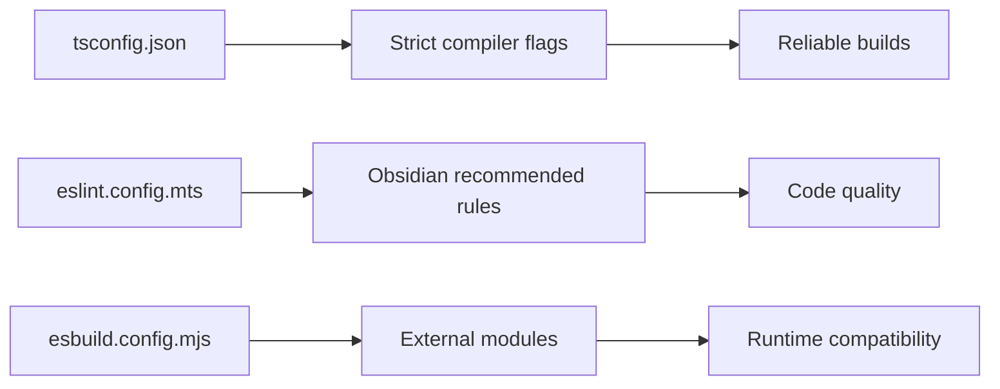

# Troubleshooting & Best Practices

<cite>
**Referenced Files in This Document**
- [README.md](file://README.md)
- [package.json](file://package.json)
- [esbuild.config.mjs](file://esbuild.config.mjs)
- [tsconfig.json](file://tsconfig.json)
- [eslint.config.mts](file://eslint.config.mts)
- [.github/workflows/lint.yml](file://.github/workflows/lint.yml)
- [manifest.json](file://manifest.json)
- [src/main.ts](file://src/main.ts)
- [src/settings.ts](file://src/settings.ts)
- [styles.css](file://styles.css)
- [version-bump.mjs](file://version-bump.mjs)
- [versions.json](file://versions.json)
- [.gitignore](file://.gitignore)
</cite>

## Table of Contents
1. [Introduction](#introduction)
2. [Project Structure](#project-structure)
3. [Core Components](#core-components)
4. [Architecture Overview](#architecture-overview)
5. [Detailed Component Analysis](#detailed-component-analysis)
6. [Dependency Analysis](#dependency-analysis)
7. [Performance Considerations](#performance-considerations)
8. [Troubleshooting Guide](#troubleshooting-guide)
9. [Best Practices](#best-practices)
10. [Security Considerations](#security-considerations)
11. [Submission and Compatibility](#submission-and-compatibility)
12. [Extending the Sample Plugin](#extending-the-sample-plugin)
13. [Conclusion](#conclusion)

## Introduction
This document provides comprehensive troubleshooting and best practices for Obsidian plugin development, using the sample plugin as a reference. It focuses on common issues during development (TypeScript compilation, build system, runtime loading), debugging techniques, logging strategies, error handling patterns, lifecycle and resource management, submission and compatibility, security, performance, and maintenance. It also includes practical guidance for extending the sample plugin while avoiding common pitfalls.

## Project Structure
The repository follows a minimal yet robust structure suitable for rapid iteration and reliable builds:
- Source code resides under src/, with the main plugin class and settings UI.
- Build is handled via esbuild with a dedicated config script.
- TypeScript configuration enforces strictness and modern targets.
- Linting is configured with TypeScript-aware rules and an Obsidian-specific plugin.
- Release metadata is managed via manifest.json and versions.json, with a helper script to synchronize versions.

**Diagram sources**
- [src/main.ts:1-100](file://src/main.ts#L1-L100)
- [src/settings.ts:1-37](file://src/settings.ts#L1-L37)
- [esbuild.config.mjs:1-50](file://esbuild.config.mjs#L1-L50)
- [tsconfig.json:1-31](file://tsconfig.json#L1-L31)
- [eslint.config.mts:1-35](file://eslint.config.mts#L1-L35)
- [manifest.json:1-12](file://manifest.json#L1-L12)
- [versions.json:1-4](file://versions.json#L1-L4)
- [version-bump.mjs:1-18](file://version-bump.mjs#L1-L18)

**Section sources**
- [README.md:1-91](file://README.md#L1-L91)
- [package.json:1-30](file://package.json#L1-L30)
- [esbuild.config.mjs:1-50](file://esbuild.config.mjs#L1-L50)
- [tsconfig.json:1-31](file://tsconfig.json#L1-L31)
- [eslint.config.mts:1-35](file://eslint.config.mts#L1-L35)
- [manifest.json:1-12](file://manifest.json#L1-L12)
- [versions.json:1-4](file://versions.json#L1-L4)
- [version-bump.mjs:1-18](file://version-bump.mjs#L1-L18)
- [.gitignore:1-23](file://.gitignore#L1-L23)

## Core Components
- Plugin entry and lifecycle: The main plugin class initializes UI elements, commands, settings tab, DOM event listeners, and intervals. It persists settings via loadSettings/saveSettings.
- Settings UI: A dedicated settings tab exposes a single text field backed by persisted settings.
- Build pipeline: esbuild bundles TypeScript sources into a single CommonJS module, excludes Electron and Codemirror internals, and supports watch mode for development.
- Linting and type safety: TypeScript compiler options enforce strictness; ESLint configuration targets browser globals and applies Obsidian-specific recommended rules.

Key implementation references:
- Plugin lifecycle and UI registrations: [src/main.ts:9-71](file://src/main.ts#L9-L71)
- Settings model and defaults: [src/settings.ts:4-10](file://src/settings.ts#L4-L10)
- Settings tab rendering and persistence: [src/settings.ts:20-35](file://src/settings.ts#L20-L35)
- Build configuration and externals: [esbuild.config.mjs:14-42](file://esbuild.config.mjs#L14-L42)
- TypeScript strictness flags: [tsconfig.json:2-26](file://tsconfig.json#L2-L26)
- ESLint configuration: [eslint.config.mts:6-34](file://eslint.config.mts#L6-L34)

**Section sources**
- [src/main.ts:1-100](file://src/main.ts#L1-L100)
- [src/settings.ts:1-37](file://src/settings.ts#L1-L37)
- [esbuild.config.mjs:1-50](file://esbuild.config.mjs#L1-L50)
- [tsconfig.json:1-31](file://tsconfig.json#L1-L31)
- [eslint.config.mts:1-35](file://eslint.config.mts#L1-L35)

## Architecture Overview
The plugin architecture centers around the main plugin class, which orchestrates UI additions, commands, settings, and lifecycle hooks. The build system produces a single bundled module consumed by Obsidian.

**Diagram sources**
- [src/main.ts:6-83](file://src/main.ts#L6-L83)
- [src/settings.ts:12-36](file://src/settings.ts#L12-L36)

**Section sources**
- [src/main.ts:1-100](file://src/main.ts#L1-L100)
- [src/settings.ts:1-37](file://src/settings.ts#L1-L37)

## Detailed Component Analysis

### Plugin Lifecycle and Resource Management
- Initialization: Ribbon icon, status bar item, commands, settings tab, DOM event registration, and intervals are registered during onload.
- Cleanup: The onunload hook is currently empty; consider clearing intervals and removing DOM listeners here to prevent leaks.
- Event and interval management: The plugin registers a DOM click handler and a periodic interval; both are automatically cleared when the plugin is disabled due to proper registration APIs.

**Diagram sources**
- [src/main.ts:9-74](file://src/main.ts#L9-L74)

**Section sources**
- [src/main.ts:9-74](file://src/main.ts#L9-L74)

### Settings Persistence and UI
- Settings model and defaults define the persisted state shape.
- The settings tab renders a text field bound to the plugin’s settings and saves immediately upon change.
- Settings are loaded via loadData and saved via saveData.

**Diagram sources**
- [src/settings.ts:20-35](file://src/settings.ts#L20-L35)
- [src/main.ts:76-82](file://src/main.ts#L76-L82)

**Section sources**
- [src/settings.ts:1-37](file://src/settings.ts#L1-L37)
- [src/main.ts:76-82](file://src/main.ts#L76-L82)

### Commands and Conditional Execution
- Three commands are registered: a simple command, an editor command, and a complex command with a check callback.
- The complex command conditionally enables itself based on the active view type.

**Diagram sources**
- [src/main.ts:39-57](file://src/main.ts#L39-L57)

**Section sources**
- [src/main.ts:23-57](file://src/main.ts#L23-L57)

### Build Pipeline and Bundling
- esbuild bundles src/main.ts into main.js, marks the bundle as CommonJS, and excludes Electron and CodeMirror modules.
- Watch mode is enabled for development; production mode rebuilds without watch.
- Sourcemaps are generated in development and disabled in production.

**Diagram sources**
- [esbuild.config.mjs:14-49](file://esbuild.config.mjs#L14-L49)

**Section sources**
- [esbuild.config.mjs:1-50](file://esbuild.config.mjs#L1-L50)

## Dependency Analysis
- TypeScript strictness: The compiler enforces strict null checks, strict bind/call/apply, and unknown-in-catch variables.
- ESLint: Browser globals are enabled; Obsidian-specific recommended rules apply; several files are ignored from linting.
- Build toolchain: esbuild with external exclusions ensures compatibility with Obsidian’s runtime environment.

**Diagram sources**
- [tsconfig.json:2-26](file://tsconfig.json#L2-L26)
- [eslint.config.mts:6-34](file://eslint.config.mts#L6-L34)
- [esbuild.config.mjs:20-34](file://esbuild.config.mjs#L20-L34)

**Section sources**
- [tsconfig.json:1-31](file://tsconfig.json#L1-L31)
- [eslint.config.mts:1-35](file://eslint.config.mts#L1-L35)
- [esbuild.config.mjs:1-50](file://esbuild.config.mjs#L1-L50)

## Performance Considerations
- Keep intervals and timers minimal; prefer throttled or debounced handlers for frequent events.
- Avoid heavy synchronous operations in onload; defer expensive initialization to lazy activation.
- Use registerInterval and registerDomEvent to ensure automatic cleanup and reduce leak risks.
- Minimize DOM manipulation; batch updates and avoid unnecessary reflows.
- Prefer lightweight UI components and avoid large asset files; include only essential CSS.

## Troubleshooting Guide

### TypeScript Compilation Errors
Common symptoms:
- Strict null checks or implicit-any errors.
- Unknown globals or missing DOM types.
- Module resolution failures.

Remedies:
- Align target and lib settings with Obsidian’s runtime expectations.
- Ensure moduleResolution and isolatedModules are set appropriately.
- Verify that globals (browser) are enabled for linting and that tsconfig references are correct.

References:
- [tsconfig.json:2-26](file://tsconfig.json#L2-L26)
- [eslint.config.mts:8-22](file://eslint.config.mts#L8-L22)

**Section sources**
- [tsconfig.json:1-31](file://tsconfig.json#L1-L31)
- [eslint.config.mts:1-35](file://eslint.config.mts#L1-L35)

### Build System Problems
Common symptoms:
- Missing external dependencies or bundling failures.
- Sourcemap issues in development.
- Production build differences.

Remedies:
- Confirm Electron and CodeMirror modules are excluded as externals.
- Use production flag to toggle rebuild vs watch and sourcemap generation.
- Ensure the entry point matches the source file.

References:
- [esbuild.config.mjs:14-42](file://esbuild.config.mjs#L14-L42)

**Section sources**
- [esbuild.config.mjs:1-50](file://esbuild.config.mjs#L1-L50)

### Runtime Plugin Loading Failures
Common symptoms:
- Plugin fails to appear in settings or throws errors on load.
- Commands not visible in the palette.
- Settings tab not accessible.

Remedies:
- Verify manifest fields (id, name, version, minAppVersion).
- Ensure main.js is present and built with the correct target/format.
- Confirm settings tab registration and that settings are persisted.

References:
- [manifest.json:1-12](file://manifest.json#L1-L12)
- [src/main.ts:60-61](file://src/main.ts#L60-L61)
- [src/main.ts:76-82](file://src/main.ts#L76-L82)

**Section sources**
- [manifest.json:1-12](file://manifest.json#L1-L12)
- [src/main.ts:60-61](file://src/main.ts#L60-L61)
- [src/main.ts:76-82](file://src/main.ts#L76-L82)

### Debugging Techniques and Logging Strategies
- Use console logging sparingly; prefer Notice for user-visible feedback.
- Leverage registerInterval and registerDomEvent to isolate timing and event-related issues.
- Add targeted logs in command callbacks and settings onChange handlers.

References:
- [src/main.ts:13-16](file://src/main.ts#L13-L16)
- [src/main.ts:64-69](file://src/main.ts#L64-L69)
- [src/settings.ts:31-34](file://src/settings.ts#L31-L34)

**Section sources**
- [src/main.ts:13-16](file://src/main.ts#L13-L16)
- [src/main.ts:64-69](file://src/main.ts#L64-L69)
- [src/settings.ts:31-34](file://src/settings.ts#L31-L34)

### Error Handling Patterns
- Wrap asynchronous operations in try/catch blocks where appropriate.
- Validate inputs in commands and settings handlers.
- Use defensive checks in checkCallback to avoid crashes when conditions are not met.

References:
- [src/main.ts:42-56](file://src/main.ts#L42-L56)
- [src/settings.ts:31-34](file://src/settings.ts#L31-L34)

**Section sources**
- [src/main.ts:42-56](file://src/main.ts#L42-L56)
- [src/settings.ts:31-34](file://src/settings.ts#L31-L34)

## Best Practices
- Lifecycle management: Always clean up intervals, timeouts, and DOM listeners in onunload.
- Memory cleanup: Remove event listeners and cancel timers to prevent leaks.
- Resource management: Defer heavy tasks; avoid blocking the UI thread.
- Settings: Persist incrementally and defensively; validate values before saving.
- Commands: Use checkCallback to gate visibility and execution based on active views.
- UI: Keep modal and status bar updates minimal; avoid excessive DOM manipulation.

## Security Considerations
- Avoid injecting untrusted content into the DOM.
- Sanitize inputs from settings and user actions.
- Do not expose sensitive data in logs or notices.
- Validate and restrict file system access if applicable.

## Submission and Compatibility
- Version management: Update manifest.json version and minAppVersion; use the version-bump helper to synchronize versions.json entries.
- Compatibility: Maintain backward-compatible entries in versions.json for older Obsidian versions.
- Release checklist: Include manifest.json, main.js, and styles.css in releases; ensure manifest.json appears at both root and release assets.

References:
- [README.md:29-38](file://README.md#L29-L38)
- [version-bump.mjs:1-18](file://version-bump.mjs#L1-L18)
- [versions.json:1-4](file://versions.json#L1-L4)
- [manifest.json:1-12](file://manifest.json#L1-L12)

**Section sources**
- [README.md:29-38](file://README.md#L29-L38)
- [version-bump.mjs:1-18](file://version-bump.mjs#L1-L18)
- [versions.json:1-4](file://versions.json#L1-L4)
- [manifest.json:1-12](file://manifest.json#L1-L12)

## Extending the Sample Plugin
- Add new commands: Register commands with appropriate callbacks and gating logic.
- Extend settings: Define new fields in the settings interface and defaults; render controls in the settings tab.
- Integrate UI: Use modals and status bar items thoughtfully; ensure cleanup in onunload.
- Manage resources: Always register timers and DOM events via the plugin APIs to benefit from automatic cleanup.

Avoid:
- Hardcoding absolute paths or external dependencies not marked as externals.
- Performing heavy operations synchronously during onload.
- Skipping settings persistence after user input.

References:
- [src/main.ts:23-57](file://src/main.ts#L23-L57)
- [src/settings.ts:4-10](file://src/settings.ts#L4-L10)
- [src/settings.ts:20-35](file://src/settings.ts#L20-L35)

**Section sources**
- [src/main.ts:23-57](file://src/main.ts#L23-L57)
- [src/settings.ts:4-10](file://src/settings.ts#L4-L10)
- [src/settings.ts:20-35](file://src/settings.ts#L20-L35)

## Conclusion
By following the patterns demonstrated in this sample plugin—strict TypeScript configuration, robust build and linting, careful lifecycle and resource management, and disciplined settings persistence—you can develop reliable Obsidian plugins. Use the troubleshooting and best practice guidelines to diagnose and resolve common issues, maintain compatibility across Obsidian versions, and deliver a secure, performant, and user-friendly plugin.